# Europa.vim 設計ドキュメント (日本語版)

> [!NOTE]
> [英語版](./DESIGN.md)と内容の乖離がある場合、英語版を正しい記述とします。

## 1. 概要

### 1.1 差別化点

| 軸 | Europa の選択 | 既存プラグインとの違い |
| --- | --- | --- |
| 対象 | Vim/Neovim 両対応 | molten-nvim/magma-nvim/jupynium.nvim は Neovim 専用 |
| ホスト言語 | Deno (TypeScript) | molten/magma/jupyter-vim は Python ランタイムをホストに要求 |
| カーネル接続 | Jupyter Server REST + WebSocket (Phase 3) → ZMQ 直結 (Phase 4 opt-in) | molten/magma は jupyter_client (ZMQ + Python lib)、Phase 2 は kernel 接続なし (ローカル閲覧のみ) |
| ファイル形式 | `.ipynb` 一級市民 | jupytext は変換専用、jukit は `.jukit/` 副作用ディレクトリ |
| 画像描画 | プレースホルダ既定 + 外部ビューア (Phase 2) + Sixel experimental opt-in → Kitty Unicode Placeholder (Phase 3) → image.nvim 連携 (Phase 4) | image.nvim/snacks.image は Neovim 専用、jukit/jupyter-vim は画像非対応 |
| Python 依存 | ユーザー環境 (cwd 配下の `.venv/` / `venv/`、`VIRTUAL_ENV`、`CONDA_PREFIX` も自動検出、6.5 参照) の `jupyter kernel` を spawn のみ。自前で `pip install` しない | molten は `pip install pynvim jupyter_client` 等を要求 |

### 1.2 機能スコープ (フェーズ別)

- Phase 0: 最小スパイク (flake.nix / pre-commit 基本 / deno.json / 最小 CI / 空 vimdoc 生成 / `.ipynb` smoke)
- Phase 1: Phase 2 着手前の整備 (renovate / 自前 lint / `doc/europa-<slug>.txt` 全章テンプレ / CONTRIBUTING / spec ↔ TSDoc 対応の運用準備)
- Phase 2: `.ipynb` を開いてセル構造とリッチ出力を閲覧 (kernel 接続なし、ローカル閲覧/保存のみ)
- Phase 3: セル実行、Kernel 管理、画像 inline 表示の本格化
- Phase 4: ZMQ 直結モード (既存 connection_file への attach)、Vega-Lite/PDF 等の高度な MIME
- Phase 5: ipywidgets (comm 対応)、編集系の拡張

### 1.3 設計原則 (SoT)

Europa.vim は階層的な Source of Truth 設計をとる。上位の SoT を変えれば下位が機械的に追従し、上位を変えなければ下位も変わらない。TypeScript の型、コメント、生成された vimdoc は派生物であって、それ自体を直接編集して整合をとることはしない。

#### SoT 階層

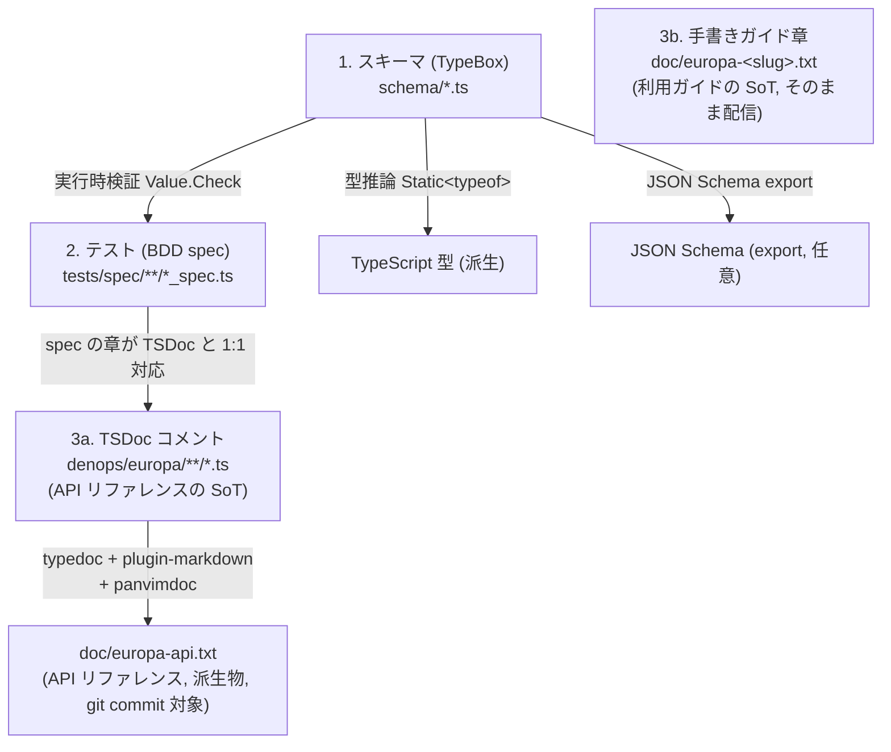

| 順位 | SoT 種別 | 配置 | 派生物 | 検証手段 |
| --- | --- | --- | --- | --- |
| 1 | TypeBox スキーマ | `schema/*.ts` | TS 型 (推論)、JSON Schema (export 任意) | `Value.Check` 実行時検証 |
| 2 | BDD spec | `tests/spec/**/*_spec.ts` | (CI が PASS/FAIL を提示) | `deno test` |
| 3a | TSDoc コメント (API リファレンス) | `denops/europa/**/*.ts` | `doc/europa-api.txt` | typedoc + panvimdoc + golden file diff |
| 3b | 手書きガイド章 | `doc/europa-<slug>.txt` (vim help 形式, そのまま配信) | 各章が独立した help ファイルとして `doc/` 配下に置かれる | 手書き; 結合ステップなし |

#### 6 つの原則

1. データ型は手書きしない。永続化、wire、RenderPlan などのデータ型は TypeBox スキーマから `Static<typeof Schema>` で推論する。`KernelClient`、`CellMarker`、`Dispatcher` のような振る舞い契約は TypeBox で表現できないので `contracts/*.ts` に集約する。これ以外の場所で `interface` や `type X = ...` を新設すると lint が warning を出す。例外はホワイトリスト経由でのみ認める。
2. テストが仕様にあたる。BDD spec と TSDoc の章は `@spec-id` で対応させる。見出し一致は誤検知が多いので使わない。spec 側に `@spec-id europa.notebook.parse.normalize` のコメントを書き、対応する TSDoc にも同じ ID を埋める。対応関係は CI で機械的に検証する。テストが存在しない仕様は実装に着手しない。
3. コメントは why と API 仕様だけにする。TSDoc の `@param`、`@returns`、`@example`、`@throws` は API 仕様の SoT として残す。それ以外のコード内コメントは複雑なロジックの why に限る。
4. 手書きドキュメントはルート直下の `README.md`、`DESIGN.md`、`CONTRIBUTING.md` と、vim help の索引 `doc/europa-api.txt`、ガイド章 `doc/europa-<slug>.txt` だけに置く。これ以外の場所への手書き md と txt は禁止する。API リファレンスは TSDoc から `doc/europa-api.txt` に自動生成する。Denops 本家も `doc/denops.txt` を手書きしている。ユーザー向けガイドは vim 文化に沿った手書き、開発者向け API は TSDoc 自動生成、という二系統で読者を分けたいから。
5. 生成物は git commit して、CI で diff を強制する。生成 vimdoc 物は `doc/europa-api.txt` のみで、CI で `deno task gen:vimdoc && git diff --exit-code doc/europa-api.txt` を実行する。生成物がズレた PR は fail させる。
6. 依存更新は renovate/dependabot 前提で運用する。typedoc、typedoc-plugin-markdown、TypeBox は version を pin する。minor と patch は groupName でまとめて自動 PR、major は手動 review。bump の影響は生成物 golden ファイルテストで検出する。

#### 実装上の方針

- 新機能はスキーマ、テスト、TSDoc 付き実装の順で書く。逆順は禁止。
- vim help は二層構造にする。ユーザー向けガイド章 (Introduction、Requirements、Setup、Configuration、Commands、Mappings、Examples、Kernel、FAQ、About) は `doc/europa-<slug>.txt` に手書きし、独立した help ファイルとしてそのまま配信する。`doc/europa-api.txt` は手書きの索引で、各章へのリンクをまとめる。API リファレンスは対応する TS モジュールの TSDoc から `doc/europa-api.txt` に自動生成する。`@packageDocumentation`、`@module`、`@category` は API リファレンス側の章立てに使い、利用ガイドの章立てには使わない。
- 生成と検証のパイプラインは `deno task` に集約する。`gen:vimdoc`、`test:spec`、`test:golden`、`validate`、`ci` を `deno.json` の tasks にまとめる。手動ステップは作らない。
- 自動 PR は `.github/workflows/ci.yml` で `deno task check` を走らせ、生成物 diff と golden ファイル diff を両方チェックする。typedoc や panvimdoc の bump で出力が変わったら、意図的な fixture 更新 PR として人間が承認する。

## 2. 全体アーキテクチャ

### 2.1 3層構造

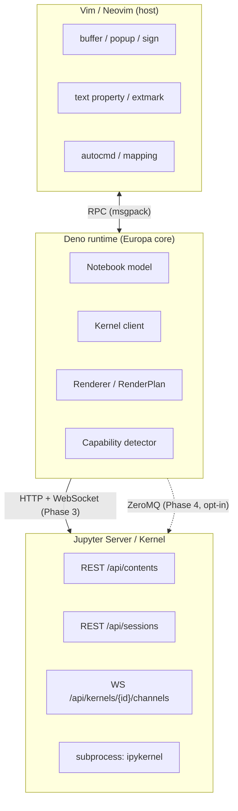

### 2.2 ランタイム要件

| 層 | 要件 |
| --- | --- |
| Vim | 9.1.1646+ (text property `text_below` 対応バージョン) |
| Neovim | 0.11.3+ |
| Deno | 2.3.0+ |
| Denops | denops.vim 本体 + `@denops/std` |
| ユーザー環境 | `jupyter` コマンド (= `jupyter_server` + `ipykernel` を含む実装) |

Deno 側からは `Deno.Command("jupyter", ["server", "--no-browser", ...])` または `Deno.Command("jupyter", ["kernel", "--kernel=python3"])` で外部プロセスを起動する。

### 2.3 接続方式の戦略 (C 案 = 両対応のフェーズ分け)

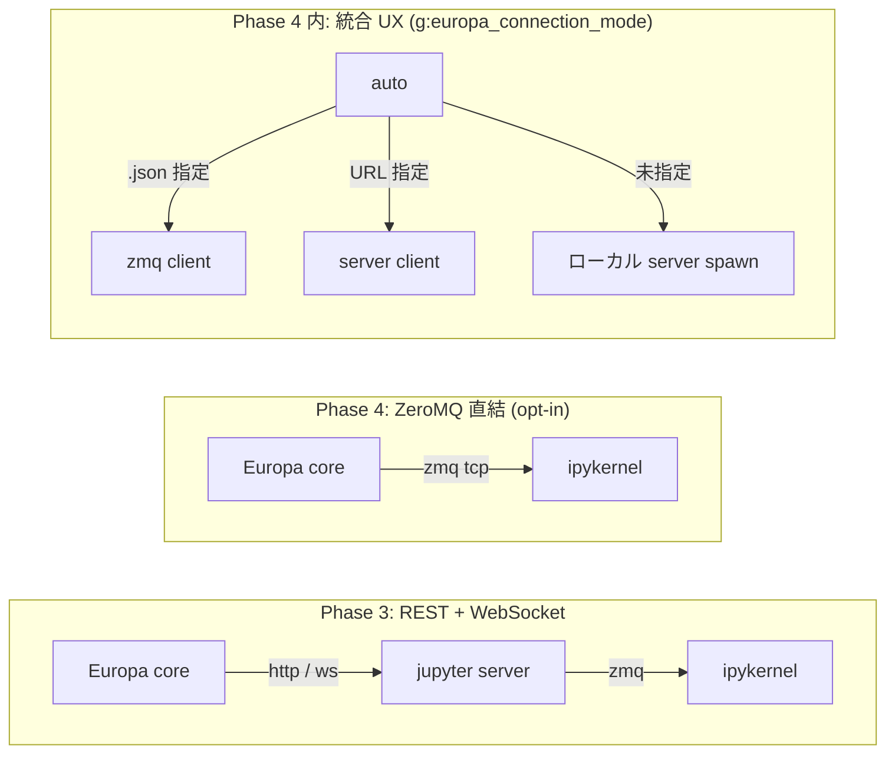

- Phase 2 では kernel 接続を行わず、ローカルの `.ipynb` 閲覧/保存のみを提供する (kernel 関連モジュールは未実装)。
- Phase 3: Plugin 起動時に jupyter server を spawn (or 既存サーバへ接続)。Python 依存はユーザー既存環境のみ。
- Phase 4: npm:zeromq (v6) を Deno の Node 互換で利用。「既存の connection_file へ attach する」ユースケース向け。リモート kernel への直結も可能 (HMAC key の取り回しに注意)。
- Phase 4 内: 接続モードを設定で切り替え可能に統一 (`g:europa_connection_mode = 'server' | 'zmq' | 'auto'`)。

## 3. モジュール構成

### 3.1 ディレクトリツリー

SoT 階層 (1 スキーマ、2 テスト、3 TSDoc) に対応させるため、`schema/`、`tests/`、`scripts/` をトップレベル直下に置く。こうしておくと、Deno コードからもテストからも生成スクリプトからもスキーマへの距離が等しく、型は `schema/` にしか存在しないという制約を物理配置で支えられる。

```
schema/                        ← SoT 1: TypeBox スキーマ (データ型のみ、Static<typeof> で推論)
  notebook.ts                  ← nbformat v4 (NotebookSchema, *CellSchema, OutputSchema, MimeBundleSchema)
  message.ts                   ← Jupyter wire protocol (HeaderSchema, ExecuteRequestSchema, ...)
  config.ts                    ← g:europa_* options
  capabilities.ts              ← host / terminal capability
  render-plan.ts               ← RenderPlan 中間表現
  session.ts                   ← Session, KernelInfo
contracts/                     ← 振る舞い契約 (interface、TypeBox 不可な実行時契約)
  kernel-client.ts             ← KernelClient interface (Phase 3)
  cell-marker.ts               ← CellMarker interface (Vim/Neovim 抽象)
  dispatcher.ts                ← Dispatcher interface (静的 P2 / 動的 P3 両対応)
  session-runtime.ts           ← SessionRuntime (Session + WebSocket?/ZmqClient? の augment 型)
tests/                         ← SoT 2: BDD spec + golden fixture
  spec/                        ← describe/it 形式、章は TSDoc と 1:1
    notebook/{parse,serialize,cell}_spec.ts
    kernel/{client,server-client,wire}_spec.ts
    render/{builder,dispatcher,text,markdown,json,html,image,ansi}_spec.ts
    view/{cell-marker,viewer,popup,highlight}_spec.ts
    session/{state,events}_spec.ts
  golden/                      ← 期待値 fixture (.ipynb のみ)
    ipynb/                     ← 公式 .ipynb サンプル + 自前 fixture
      hello.ipynb
      multi-line-source.ipynb
      pandas-output.ipynb
      kitty-image.ipynb
  (vimdoc は doc/europa-api.txt 自体を期待値として diff チェック、別 expected ファイルは持たない)
  fixtures/                    ← テストヘルパ
    mock-host.ts               ← Vim/Neovim ホストモック (denops の Denops 型をモック)
    mock-kernel.ts             ← Jupyter Server モック (WebSocket 含む)
denops/europa/                 ← SoT 3: TSDoc コメント付き実装
  main.ts                      ← @packageDocumentation: Introduction + Quick Start
  config.ts                    ← @module config: 設定読込実装
  capabilities.ts              ← @module capabilities: host / terminal 検出
  notebook/
    parse.ts                   ← @category Notebook: .ipynb -> Notebook (Value.Check で検証)
    serialize.ts               ← @category Notebook: Notebook -> .ipynb (1-space indent, LF)
    cell.ts                    ← @category Notebook: Cell 操作 (id 採番, source 連結, ...)
  kernel/                      ← (Phase 3 以降で新規作成)
    client.ts                  ← @module kernel: KernelClient interface
    server-client.ts           ← @category Kernel: REST + WebSocket 実装
    zmq-client.ts              ← @category Kernel: ZeroMQ 実装 (Phase 4)
    server-process.ts          ← @category Kernel: jupyter server プロセス管理
    auth.ts                    ← @category Kernel: token / subprotocol
    wire/
      protocol-v1.ts           ← @category Kernel: v1.kernel.websocket.jupyter.org
      protocol-default.ts     ← @category Kernel: デフォルトプロトコル
  render/
    builder.ts                 ← @module render: Notebook -> RenderPlan の組み立て
    dispatcher.ts              ← @category Render: MIME -> renderer 振り分け
    text.ts                    ← @category Render: text/plain, stream, error
    markdown.ts                ← @category Render: text/markdown
    json.ts                    ← @category Render: application/json
    html.ts                    ← @category Render: text/html (タグストリップ)
    image.ts                   ← @category Render: 画像 (Sixel/Kitty/Placeholder)
    ansi.ts                    ← @category Render: ANSI escape -> hl_group 変換
  view/
    cell-marker.ts             ← @module view: セル境界 interface
    cell-marker-vim.ts         ← @category View: text property 実装
    cell-marker-nvim.ts        ← @category View: extmark 実装
    viewer.ts                  ← @category View: 閲覧バッファ (modifiable=false)
    popup.ts                   ← @category View: @denops/std/popup ラッパ
    highlight.ts               ← @category View: hl group 定義 (Europa* prefix)
  session/
    state.ts                   ← @module session: SessionState 管理
    events.ts                  ← @category Session: autocmd / mapping ハンドラ
plugin/
  europa.vim                   ← User DenopsPluginPost:europa で init notify
  commands.vim                 ← :Europa* (TSDoc は main.ts 側に @category Commands で集約)
  mappings.vim                 ← <Plug>(europa-*) (TSDoc は main.ts 側に @category Mappings)
autoload/
  europa.vim                   ← 補助関数 (denops#request 経由)
ftdetect/
  ipynb.vim                    ← *.ipynb -> filetype=europa
syntax/
  europa.vim                   ← セル境界の syntax (補助)
doc/
  europa.txt                   ← 手書き索引 (各 europa-<slug> へのリンク)
  europa-introduction.txt      ← 概要、ユースケース
  europa-requirements.txt      ← Vim/Neovim/Deno/jupyter 要件
  europa-setup.txt             ← インストール手順
  europa-configuration.txt     ← g:europa_* 設定
  europa-commands.txt          ← :Europa* コマンド一覧
  europa-mappings.txt          ← <Plug>(europa-*) マップ
  europa-examples.txt          ← 一連の使用例
  europa-kernel.txt            ← kernel ライフサイクルとプロトコル
  europa-faq.txt               ← よくある質問
  europa-about.txt             ← License / Credits
  europa-api.txt               ← API リファレンス (TSDoc から自動生成、CI で diff 強制)
scripts/                       ← 生成パイプライン
  gen-vimdoc.ts                ← typedoc + concat-md + panvimdoc を統合する deno script
  gen-schema-json.ts           ← TypeBox -> JSON Schema export (任意、必要なら生成)
  validate-fixtures.ts         ← tests/golden/ipynb/* が schema/notebook.ts に適合するか検証
  concat-md.ts                 ← typedoc 出力 *.md の章順序を整形
.github/workflows/
  ci.yml                       ← deno test + gen:vimdoc diff + golden file 整合
deno.json                      ← tasks + imports (denops, typebox, std, npm:typedoc)
deno.lock                      ← 依存ロック (renovate 対象)
tsconfig.json                  ← typedoc 用 (compilerOptions のみ、Deno 本体は無視)
typedoc.json                   ← typedoc 設定 (entryPoints, plugin)
panvimdoc.config               ← panvimdoc 設定 (toc, doc-mapping, vim-version)
renovate.json                  ← renovate config (groupName, automerge ルール)
.gitignore
README.md                      ← エントリポイント、リンク集
DESIGN.md                      ← 設計の SoT (このファイル)
CONTRIBUTING.md                ← 開発参加ガイド (deno task 一覧 含む)
```

#### 配置原則

1. schema/ は トップレベル直下: Deno コード / テスト / 生成スクリプトすべてから等距離。`denops/europa/` の下に置かない
2. type 定義は schema/ にしか存在しない: `denops/europa/**/*.ts` が型を export してはいけない (lint で禁止)
3. markdown はリポジトリルートのみ (3 ファイル): `README.md` / `DESIGN.md` / `CONTRIBUTING.md`
4. `doc/europa-api.txt` は git commit する: 生成物だが PR で diff レビュー可能にするため。`.gitignore` には入れない
5. `tests/golden/` は SoT に近い扱い: typedoc/panvimdoc/TypeBox の bump で生成物が変わったら、人間が承認する fixture 更新 PR を作る

### 3.2 Phase 別実装マップ

各モジュールが Phase 2 (MVP / 閲覧) / 2 (実行 + 編集) / 3 (ZMQ + 拡張 MIME) / 4 (widgets) でどこまで必要かを整理する。

凡例:
- `O` = その Phase で初期実装
- `+ ...` = その Phase で機能追加・拡張
- 空欄 = その Phase では touch しない

#### schema/ (SoT 1)

| ファイル | P2 (MVP) | P3 (実行) | P4 (拡張) | P5 (widgets) |
| --- | --- | --- | --- | --- |
| `notebook.ts` | O (nbformat v4 TypeBox) | | | + widget 型 |
| `message.ts` | | O (Jupyter wire protocol) | | + comm |
| `config.ts` | O | + kernel 関連 | + zmq 関連 | |
| `capabilities.ts` | O | | | |
| `render-plan.ts` | O | | | |
| `session.ts` | O (viewer-only) | + kernel | + zmq attach | + comm |

#### tests/spec/ (SoT 2)

| ファイル | P2 | P3 | P4 | P5 |
| --- | --- | --- | --- | --- |
| `notebook/*_spec.ts` | O | + edit ops | | |
| `kernel/*_spec.ts` | | O | + zmq | + comm |
| `render/*_spec.ts` | O (静的) | + 動的更新 | + Sixel→Kitty 切替 | |
| `view/*_spec.ts` | O | + writable | | |
| `session/*_spec.ts` | O | + kernel 紐付け | | |

#### tests/golden/ + tests/fixtures/

| ファイル | P2 | P3 | P4 | P5 |
| --- | --- | --- | --- | --- |
| `golden/ipynb/*.ipynb` | O (公式 + 自前) | + 実行済み | | + widget |
| `fixtures/mock-host.ts` | O | + writable mode | | |
| `fixtures/mock-kernel.ts` | | O (WebSocket モック) | + ZMQ モック | + comm |

#### scripts/

| ファイル | P2 | P3 | P4 | P5 |
| --- | --- | --- | --- | --- |
| `gen-vimdoc.ts` | O (typedoc + concat-md + panvimdoc) | | | |
| `gen-schema-json.ts` | O (任意 export) | | | |
| `validate-fixtures.ts` | O (ipynb fixture が schema/notebook.ts に適合するか検証) | | | |
| `concat-md.ts` | O (typedoc 出力 *.md の章順序整形) | | | |

#### infra (deno.json, tsconfig.json, typedoc.json, panvimdoc.config, renovate.json, .github/workflows/)

| ファイル | P2 | P3 | P4 | P5 |
| --- | --- | --- | --- | --- |
| `deno.json` | O (tasks + imports) | + kernel deps | + zmq deps | |
| `deno.lock` | O | + bump | + bump | |
| `tsconfig.json` | O (typedoc 用 compilerOptions) | | | |
| `typedoc.json` | O (entryPoints + plugin-markdown) | + 章追加 | | |
| `panvimdoc.config` | O | | | |
| `renovate.json` | O (groupName + automerge ルール) | | | |
| `.github/workflows/ci.yml` | O (test + gen:vimdoc diff チェック) | + integration test | | |

#### ルート

| ファイル | P2 (MVP) | P3 (実行) | P4 (拡張) | P5 (widgets) |
| --- | --- | --- | --- | --- |
| `main.ts` | O (init / open / dispatcher) | + execute / kernel ops | + attach (zmq) | + comm |
| `config.ts` | O (基本オプション) | + kernel 関連 | + zmq 関連 | |
| `capabilities.ts` | O (host / terminal / version) | | | |

#### denops/europa/notebook/ (実装、TSDoc 付き)

| ファイル | P2 | P3 | P4 | P5 |
| --- | --- | --- | --- | --- |
| `parse.ts` | O (`Value.Check(NotebookSchema, ...)` で schema 検証) | | | |
| `serialize.ts` | O | | | |
| `cell.ts` | id 採番 / source 連結 | + insert / delete / move / split / join | | |

(型は `schema/notebook.ts` から import。手書き `interface` は禁止)

#### kernel/

| ファイル | P2 | P3 | P4 | P5 |
| --- | --- | --- | --- | --- |
| `client.ts` | | O (interface) | | |
| `server-client.ts` | | O (REST + WebSocket) | | |
| `zmq-client.ts` | | | O (ZeroMQ) | |
| `server-process.ts` | | O (jupyter server spawn) | | |
| `auth.ts` | | O (token / subprotocol) | | |
| `wire/protocol-v1.ts` | | O (offset table、`schema/message.ts` を import) | | |
| `wire/protocol-default.ts` | | O (テキスト JSON、`schema/message.ts` を import) | | |

#### render/

| ファイル | P2 | P3 | P4 | P5 |
| --- | --- | --- | --- | --- |
| `builder.ts` | O (Notebook -> RenderPlan の組み立て) | + 動的更新 | | + comm |
| `dispatcher.ts` | O (静的) | + 動的更新 (iopub batch) | | + comm |
| `text.ts` | O (text/plain, stream, error) | + ANSI 色 | | |
| `markdown.ts` | basic (見出し色のみ) | + inline rendering | | |
| `json.ts` | O (pretty + treesitter) | | | |
| `html.ts` | O (tag strip) | | + pandoc / w3m | |
| `image.ts` | O (Sixel) | + Kitty Unicode Placeholder | + image.nvim / snacks 連携 / iTerm2 | |
| `ansi.ts` | strip のみ | + full color → hl_group | | |

#### view/

| ファイル | P2 | P3 | P4 | P5 |
| --- | --- | --- | --- | --- |
| `cell-marker.ts` | O (interface) | | | |
| `cell-marker-vim.ts` | O (text property) | | | |
| `cell-marker-nvim.ts` | O (extmark) | | | |
| `viewer.ts` | viewer (read-only) | + writable mode | | |
| `popup.ts` | O (denops_std/popup ラッパ) | | | |
| `highlight.ts` | O (hl group 定義) | | | |

#### session/

| ファイル | P2 | P3 | P4 | P5 |
| --- | --- | --- | --- | --- |
| `state.ts` | viewer-only | + kernel 紐付け | + zmq attach | + comm |
| `events.ts` | BufReadCmd / BufWriteCmd | + execute commands | | |

#### plugin / autoload / その他

| ファイル | P2 | P3 | P4 | P5 |
| --- | --- | --- | --- | --- |
| `plugin/europa.vim` | O | | | |
| `plugin/commands.vim` | view commands | + exec commands | + attach | + widgets |
| `plugin/mappings.vim` | O (`<Plug>(europa-*)` 定義) | + run-cell | | |
| `autoload/europa.vim` | O (補助関数) | | | |
| `ftdetect/ipynb.vim` | O | | | |
| `syntax/europa.vim` | basic (cell 区切り) | | | |
| `doc/europa-api.txt` | O | + 実行系 | + ZMQ | + widgets |

### 3.3 Phase 2 MVP の最小ファイル集合

SoT 階層 (1 スキーマ / 2 テスト / 3 TSDoc) に対応する形でファイル群を整理する。

#### SoT 1: スキーマ (5 ファイル)

```
schema/{notebook,capabilities,config,render-plan,session}.ts
```
(`schema/message.ts` は Phase 3 で追加)

#### SoT 2: テスト (約 25 spec + golden + fixtures)

```
tests/
  spec/
    notebook/{parse,serialize,cell}_spec.ts
    render/{builder,dispatcher,text,markdown,json,html,image,ansi}_spec.ts
    view/{cell-marker,cell-marker-vim,cell-marker-nvim,viewer,popup,highlight}_spec.ts
    session/{state,events}_spec.ts
    capabilities_spec.ts
    config_spec.ts
  golden/
    ipynb/*.ipynb              (公式サンプル + 自前 fixture, 5-10 ファイル)
    (vimdoc は doc/europa-api.txt 自体を期待値として diff するため、別 expected ファイルは持たない)
  fixtures/
    mock-host.ts
```

#### SoT 3: TSDoc 付き実装 (22 ファイル)

```
denops/europa/
  main.ts                                  (@packageDocumentation)
  config.ts capabilities.ts                (@module config / capabilities)
  notebook/{parse,serialize,cell}.ts
  render/{builder,dispatcher,text,markdown,json,html,image,ansi}.ts
  view/{cell-marker,cell-marker-vim,cell-marker-nvim,viewer,popup,highlight}.ts
  session/{state,events}.ts
plugin/{europa,commands,mappings}.vim
autoload/europa.vim
ftdetect/ipynb.vim
syntax/europa.vim
```

#### 派生物 + パイプライン (12 ファイル)

```
doc/europa-api.txt                             (生成物、git commit)
scripts/{gen-vimdoc,concat-md,validate-fixtures,gen-schema-json}.ts
deno.json deno.lock tsconfig.json typedoc.json panvimdoc.config renovate.json
.github/workflows/ci.yml
```

#### Phase 2 で作らないもの (Phase 3 以降で初出)

- `denops/europa/kernel/` 配下すべて (Phase 3 で 7 ファイル)
- `schema/message.ts` (Phase 3)
- `tests/spec/kernel/` (Phase 3)
- `tests/fixtures/mock-kernel.ts` (Phase 3)
- `denops/europa/kernel/zmq-client.ts` (Phase 4)

### 3.4 Phase 2 内の実装順 (SoT 駆動)

各機能ブロックは「スキーマ書く → BDD spec 書く (fail) → 実装書く (PASS させる) → vimdoc 再生成」の順で進める。逆順は禁止。

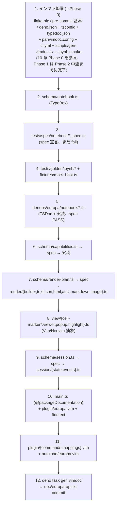

各ステップの SoT 操作と完了基準:

| ステップ | SoT 操作 | 完了基準 (= "この時点で何が動くか") |
| --- | --- | --- |
| 1 | (インフラのみ、Phase 0 で完了が前提、Phase 1 は Phase 2 中盤までに完了) | `nix develop` で環境起動、`deno task check` が空 PASS、`.ipynb` smoke が動作、`deno task gen:vimdoc` が空 vimdoc を生成、`git diff --exit-code doc/europa-api.txt` が PASS |
| 2 | schema/notebook.ts 追加 | TypeBox スキーマで `Static<typeof CodeCellSchema>` が型として推論できる、`gen-schema-json.ts` で JSON Schema export 可能 |
| 3 | tests/spec/notebook/ 追加 | `deno test` が「未実装で fail する」 spec を 5-10 件持つ (Test-First) |
| 4 | tests/golden/ipynb/ 追加 | 公式 Jupyter サンプルの parse/serialize round-trip diff 0 期待を spec で表現 |
| 5 | notebook/ 実装 | spec が PASS、golden file の round-trip が成立 |
| 6 | capabilities.ts | host (vim/nvim) と terminal protocol の検出ができる |
| 7 | render/ 実装 | RenderPlan が組み立てられる、stream/error/json/markdown が生成される |
| 8 | view/ 実装 | RenderPlan を Vim/Neovim バッファに反映できる (MVP の最初の動くもの) |
| 9 | session/ 実装 | bufnr ↔ notebook ↔ kernel の関係が管理できる (Phase 2 では kernel = なし) |
| 10 | main.ts + plugin entry | `:edit foo.ipynb` で Notebook が開く、`@packageDocumentation` が typedoc に拾われる |
| 11 | commands + mappings | `:Europa*` 系のコマンドが動く |
| 12 | vimdoc 生成 | `:help europa` が引ける、CI が `git diff --exit-code doc/europa-api.txt` で PASS |

MVP の最短経路はステップ 8 まで (= 「.ipynb を開いてセル構造とテキスト出力 + 簡易 markdown が見える」)。リッチ MIME (image, full markdown rendering) と session 管理 (9) は段階的な積み増し。

### 3.5 SoT パイプライン (deno task)

Europa.vim の生成・検証パイプラインはすべて `deno.json` の `tasks` に集約する。手動ステップは作らない。CI と pre-commit hook は `deno task check` を呼ぶだけにする。

#### deno task 一覧

| task 名 | 内容 | 入力 | 出力 |
| --- | --- | --- | --- |
| `gen:types` | TypeBox スキーマから JSON Schema を export (任意) | `schema/*.ts` | `tmp/schema/*.json` |
| `gen:vimdoc` | typedoc → concat-md → panvimdoc を統合実行 | TSDoc コメント | `doc/europa-api.txt` |
| `test:spec` | BDD spec の実行 | `tests/spec/**/*_spec.ts` | PASS / FAIL |
| `test:golden` | golden file 整合チェック (ipynb round-trip + `doc/europa-api.txt` diff) | `tests/golden/ipynb/*` + `doc/europa-api.txt` | PASS / FAIL |
| `test:fixtures` | `tests/golden/ipynb/*` が `schema/notebook.ts` に適合するか検証 | `tests/golden/ipynb/*` | PASS / FAIL |
| `test:conformance` (Phase 3+) | 実 Jupyter Server を起動して wire protocol 適合性を検証 | `tests/conformance/**/*` | PASS / FAIL |
| `validate` | 全 schema 整合性チェック (循環参照、未定義参照) | `schema/*.ts` | PASS / FAIL |
| `lint` | `deno lint` + 「型は schema/ にしか存在しない」rule + 「コメントは why のみ」rule | `**/*.ts` | PASS / FAIL |
| `fmt:check` | `deno fmt --check` | `**/*.ts` | PASS / FAIL |
| `ci` | 上記すべてを順次実行 + `git diff --exit-code doc/europa-api.txt` | (全部) | PASS / FAIL |

#### 想定する `deno.json` (抜粋)

```jsonc
{
  "tasks": {
    "gen:types":     "deno run -A scripts/gen-schema-json.ts",
    "gen:vimdoc":    "deno run -A scripts/gen-vimdoc.ts",
    "test:spec":         "deno test -A tests/spec/",
    "test:golden":       "deno test -A tests/spec/ --filter 'golden'",
    "test:fixtures":     "deno run -A scripts/validate-fixtures.ts",
    "test:conformance":  "deno test -A tests/conformance/",
    "validate":      "deno check schema/ && deno run -A scripts/validate-schema.ts",
    "lint":          "deno lint && deno run -A scripts/lint-no-handwritten-types.ts",
    "fmt:check":     "deno fmt --check",
    "ci": "deno task fmt:check && deno task lint && deno task validate && deno task gen:vimdoc && deno task test:fixtures && deno task test:spec && deno task test:golden && git diff --exit-code doc/europa-api.txt"
  },
  "imports": {
    // 依存は exact pin (caret 不可)。renovate が minor/patch も含めて全自動 PR を作る前提。
    "@sinclair/typebox":         "npm:@sinclair/typebox@0.34.0",
    "@denops/std":               "jsr:@denops/std@7.6.0",
    "@std/assert":               "jsr:@std/assert@1.0.0",
    "@std/testing/bdd":          "jsr:@std/testing@1.0.0/bdd",
    "typedoc":                   "npm:typedoc@0.27.0",
    "typedoc-plugin-markdown":   "npm:typedoc-plugin-markdown@4.4.0"
  },
  "nodeModulesDir": "auto"
}
```

#### `scripts/gen-vimdoc.ts` のフロー

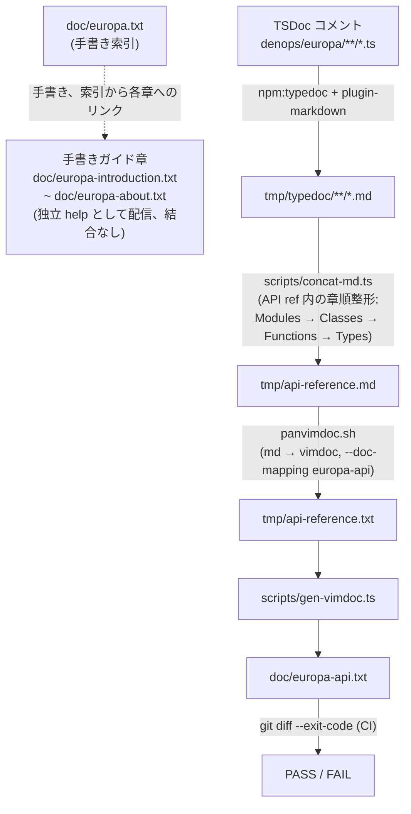

#### CI ワークフロー (`.github/workflows/ci.yml` の要点)

```yaml
name: CI
on: [push, pull_request]
jobs:
  ci:
    runs-on: ubuntu-latest
    steps:
      - uses: actions/checkout@v4
      - uses: denoland/setup-deno@v2
        with:
          deno-version: "2.x"
      - name: Install pandoc (for panvimdoc)
        run: sudo apt-get install -y pandoc
      - name: Cache deno deps
        uses: actions/cache@v4
        with:
          path: ~/.deno
          key: ${{ runner.os }}-deno-${{ hashFiles('deno.lock') }}
      - run: deno task check
```

#### renovate / dependabot との連携

依存更新の bot PR が来たとき:

1. CI で `deno task check` が走る
2. `deno task gen:vimdoc` が新しい `doc/europa-api.txt` を生成
3. 生成物に diff が出ると `git diff --exit-code` が fail
4. PR は merge できない状態になる
5. 対応分岐:
   - bump が breaking でない (出力フォーマット変わらず) → renovate の post-upgrade hook で `doc/europa-api.txt` を再生成・自動 commit
   - bump が breaking → fixture 更新 PR として人間が承認 (`tests/golden/vimdoc/europa-api.txt.expected` を更新)

`renovate.json` の post-upgrade hook 例:

```json
{
  "postUpgradeTasks": {
    "commands": ["deno task gen:vimdoc"],
    "fileFilters": ["doc/europa-api.txt"],
    "executionMode": "branch"
  },
  "packageRules": [
    {
      "groupName": "vimdoc-toolchain",
      "matchPackageNames": ["typedoc", "typedoc-plugin-markdown", "@sinclair/typebox"],
      "matchUpdateTypes": ["minor", "patch"],
      "automerge": false
    },
    {
      "groupName": "vimdoc-toolchain-major",
      "matchPackageNames": ["typedoc", "typedoc-plugin-markdown"],
      "matchUpdateTypes": ["major"],
      "automerge": false,
      "addLabels": ["needs-manual-review"]
    }
  ]
}
```

#### lint rule (自前)

`scripts/lint-no-handwritten-types.ts` は以下を検出する:

1. `denops/europa/**/*.ts` で `interface` または `type X = ...` (TypeBox 由来でない) が export されている
2. TSDoc 以外のコメント (`//` `/* */`) で 3 行以上の連続したものは "why" を要求 (空でないか、`@` で始まらないか)
3. `docs/` ディレクトリへの追加 (`docs/` ディレクトリ自体が存在することも禁止)。手書き vim help は `doc/europa.txt` (索引) と `doc/europa-<slug>.txt` のみ許容

これらは lint で fail させ、CI が止める。つまり「設計原則 = 機械的に守れる」が SoT 設計の要諦。

### 3.6 各モジュールの責務

このセクションはモジュール責務の俯瞰。各モジュールの詳細仕様 (関数の `@param` / `@returns` / `@example` 等) は対応する TSDoc が SoT であり、`doc/europa-api.txt` から参照する。二重管理を避けるため、ここで詳細を再記述しない。

#### SoT 1: schema/

| モジュール | 責任 | 主要 export | 依存 | 対応 spec |
| --- | --- | --- | --- | --- |
| `notebook.ts` | nbformat v4 スキーマ | `NotebookSchema`, `*CellSchema`, `OutputSchema`, `MimeBundleSchema` | `@sinclair/typebox` | (利用先で間接検証) |
| `session.ts` | Session/Kernel 状態スキーマ | `SessionSchema`, `KernelInfoSchema`, `KernelStateSchema` | `notebook.ts` | (利用先) |
| `render-plan.ts` | RenderPlan 中間表現スキーマ | `RenderPlanSchema`, `HighlightSchema`, `VirtTextSchema`, `ImagePlacementSchema`, `ClickableSchema` | `@sinclair/typebox` | (利用先) |
| `config.ts` | `g:europa_*` options スキーマ | `EuropaConfigSchema` | `@sinclair/typebox` | `tests/spec/config_spec.ts` |
| `capabilities.ts` | host/terminal capability スキーマ | `CapabilitiesSchema`, `ImageProtocolSchema`, `HostKindSchema` | `@sinclair/typebox` | `tests/spec/capabilities_spec.ts` |
| `message.ts` (P3) | Jupyter wire protocol スキーマ | `KernelMessageSchema`, `HeaderSchema`, `ExecuteRequestSchema`, ... | `@sinclair/typebox` | `tests/spec/kernel/wire_spec.ts` |

特記事項:
- すべてスキーマ定義のみ。ロジック・I/O 禁止 (lint で reject)
- TSDoc は `*Schema` には付けない (利用先の関数 TSDoc に書く)
- 各 `*Schema` には対応する `Static<typeof>` 型を併せて export する

#### SoT 3: denops/europa/ (ルート)

| モジュール | 責任 | 主要 export | 依存 | TSDoc タグ |
| --- | --- | --- | --- | --- |
| `main.ts` | Plugin entry point + dispatcher 定義 + Introduction/Quick Start を `@packageDocumentation` で記述 | `main(denops)`、dispatcher record | `@denops/std`、各モジュールの facade | `@packageDocumentation` |
| `config.ts` | `g:europa_*` の読込と Config の構築。Configuration 章扉 | `loadConfig(denops)` | `@denops/std/variable`, `schema/config.ts` | `@module config` |
| `capabilities.ts` | host (vim/nvim) と terminal protocol の検出。DA1 query タイムアウト fallback | `detectCapabilities(denops)` | `@denops/std`, `schema/capabilities.ts` | `@module capabilities` |

#### SoT 3: denops/europa/notebook/

| モジュール | 責任 | 主要 export | 依存 | TSDoc タグ |
| --- | --- | --- | --- | --- |
| `parse.ts` | `.ipynb` string → Notebook (正規化 + `Value.Check`) | `parseNotebook(content)` | `schema/notebook.ts`, `@sinclair/typebox/value` | `@category Notebook` |
| `serialize.ts` | Notebook → `.ipynb` string (1-space indent, LF, 末尾 LF) | `serializeNotebook(nb)` | `schema/notebook.ts` | `@category Notebook` |
| `cell.ts` | Cell 操作 (id 採番, source 連結 / Phase 3 で insert/delete/move/split/join) | `assignCellId`, `joinSource`, ... | `schema/notebook.ts` | `@category Notebook` |

特記事項:
- `parse.ts` は TypeBox 検証必須。`Value.Check(NotebookSchema, normalized)` が false なら `NotebookParseError` を throw
- `cell.ts` の Phase 2 export は `assignCellId` と `joinSource` のみ。編集系は Phase 3

#### SoT 3: denops/europa/kernel/ (Phase 3 以降)

| モジュール | 責任 | 主要 export | 依存 | TSDoc タグ |
| --- | --- | --- | --- | --- |
| `client.ts` | KernelClient interface 定義 (実行時オブジェクト augment 例外) | `KernelClient` interface | `schema/message.ts`, `schema/session.ts` | `@module kernel` |
| `server-client.ts` | REST + WebSocket 実装 | `ServerKernelClient` class | `client.ts`, `wire/`, `auth.ts` | `@category Kernel` |
| `zmq-client.ts` (P4) | ZeroMQ 直結実装 | `ZmqKernelClient` class | `client.ts`, `wire/`, `npm:zeromq` | `@category Kernel` |
| `server-process.ts` | `jupyter server` の spawn / 生存管理 (SIGTERM 確実 kill) | `spawnJupyterServer`, `shutdownJupyterServer` | `Deno.Command` | `@category Kernel` |
| `auth.ts` | token 管理 / WebSocket subprotocol 構築 | `buildSubprotocols(token)`, `buildAuthHeader(token)` | `schema/config.ts` | `@category Kernel` |
| `wire/protocol-v1.ts` | `v1.kernel.websocket.jupyter.org` の encode/decode | `encodeV1`, `decodeV1` | `schema/message.ts` | `@category Kernel` |
| `wire/protocol-default.ts` | デフォルトプロトコル (テキスト JSON) の encode/decode | `encodeDefault`, `decodeDefault` | `schema/message.ts` | `@category Kernel` |

特記事項:
- `client.ts` の `KernelClient` interface は実行時メソッド契約 (`AsyncIterable<KernelMessage>` 等) を持つため、TypeBox では表現せず手書き型として例外許容
- `server-process.ts` は Deno が終了する際に `Deno.addSignalListener("SIGTERM" | "SIGINT", ...)` で確実に kill する

#### SoT 3: denops/europa/render/

| モジュール | 責任 | 主要 export | 依存 | TSDoc タグ |
| --- | --- | --- | --- | --- |
| `builder.ts` | Notebook → RenderPlan の組み立て | `buildRenderPlan(notebook, capabilities)` | `schema/render-plan.ts`, `dispatcher.ts` | `@module render` |
| `dispatcher.ts` | output → MIME 振分け、優先順位選択 | `dispatchOutput(output, capabilities)` | 各 renderer | `@category Render` |
| `text.ts` | text/plain, stream, error の text 化 | `renderText`, `renderStream`, `renderError` | `ansi.ts` | `@category Render` |
| `markdown.ts` | text/markdown の簡易レンダ (P2: 見出し色のみ、P3: 本格 inline render) | `renderMarkdown` | (P3 で md パーサ追加) | `@category Render` |
| `json.ts` | application/json pretty print | `renderJson` | (なし) | `@category Render` |
| `html.ts` | text/html タグストリップ (P4: pandoc 経由) | `renderHtml` | (なし) | `@category Render` |
| `image.ts` | image/* (P2: Sixel, P3: Kitty Unicode Placeholder, P4: image.nvim/iTerm2) | `renderImage` | `capabilities.ts`, ImageMagick subprocess | `@category Render` |
| `ansi.ts` | ANSI escape のパース + hl_group 変換 (P2: strip, P3: full color) | `stripAnsi`, `parseAnsi` (P3) | (なし) | `@category Render` |

特記事項:
- `dispatcher.ts` の Phase 2 は静的処理 (Notebook 一回スキャン → RenderPlan)。Phase 3 で動的処理 (iopub batch で部分更新) を追加
- `image.ts` は ImageMagick subprocess (`sips` / `ffmpeg` / `magick` のフォールバック) を呼ぶため、`Deno.Command` 権限が必要

#### SoT 3: denops/europa/view/

| モジュール | 責任 | 主要 export | 依存 | TSDoc タグ |
| --- | --- | --- | --- | --- |
| `cell-marker.ts` | セル境界の Vim/Neovim 抽象 interface | `CellMarker` interface, `createCellMarker` factory | `@denops/std` | `@module view` |
| `cell-marker-vim.ts` | Vim text property による実装 | `VimCellMarker` class | `cell-marker.ts`, `@denops/std/function/vim` | `@category View` |
| `cell-marker-nvim.ts` | Neovim extmark による実装 | `NvimCellMarker` class | `cell-marker.ts`, `@denops/std/function/nvim` | `@category View` |
| `viewer.ts` | RenderPlan を Vim/Neovim バッファに反映 (P2: read-only, P3: writable) | `applyRenderPlan(bufnr, plan)` | `cell-marker.ts`, `popup.ts`, `highlight.ts` | `@category View` |
| `popup.ts` | popup/floating window の `@denops/std/popup` ラッパ | `openViewerPopup`, `closePopup` | `@denops/std/popup` | `@category View` |
| `highlight.ts` | hl group の定義 (`Europa*` prefix、`hi default link`) | `defineHighlights(denops)` | `@denops/std` | `@category View` |

特記事項:
- `cell-marker.ts` は interface のみ。実装は Vim/Neovim 別ファイルに分離 (`createCellMarker` factory が `denops.meta.host` で振り分ける)
- `viewer.ts` Phase 2 は `modifiable=false` の閲覧専用バッファ

#### SoT 3: denops/europa/session/

| モジュール | 責任 | 主要 export | 依存 | TSDoc タグ |
| --- | --- | --- | --- | --- |
| `state.ts` | bufnr <-> notebook <-> kernel の対応管理 (`SessionRuntime` 型) | `SessionStore` class, `SessionRuntime` type | `schema/session.ts` | `@module session` |
| `events.ts` | Vim 側 autocmd / mapping ハンドラ | `setupAutocmds(denops)`, `setupMappings(denops)` | `@denops/std/autocmd`, `state.ts` | `@category Session` |

特記事項:
- `state.ts` の `SessionRuntime` は `Session` (TypeBox) + `WebSocket?` / `ZmqClient?` の augment (4.4 で記述した例外的手書き型)
- `events.ts` Phase 2 は `BufReadCmd *.ipynb` / `BufWriteCmd *.ipynb` のみ。Phase 3 で `:Europa*` 系を追加

#### plugin/, autoload/, ftdetect/, syntax/

| ファイル | 責任 | TSDoc 集約先 |
| --- | --- | --- |
| `plugin/europa.vim` | `User DenopsPluginPost:europa` で `init` notify | (Vim script、TSDoc なし) |
| `plugin/commands.vim` | `:Europa*` command 定義 | `denops/europa/main.ts` の `@category Commands` |
| `plugin/mappings.vim` | `<Plug>(europa-*)` 定義 | `denops/europa/main.ts` の `@category Mappings` |
| `autoload/europa.vim` | `denops#request` 経由のレスポンス補助関数 | (Vim script) |
| `ftdetect/ipynb.vim` | `*.ipynb` -> `filetype=europa` | (Vim script) |
| `syntax/europa.vim` | セル境界 syntax (補助、optional) | (Vim script) |

特記事項:
- Vim script のコメントは vimdoc 生成パイプラインに含めない (Phase 2)
- Mappings / Commands の解説は TS 側 (`main.ts`) の TSDoc に集約することで、SoT を 1 箇所に保つ

#### scripts/ (生成パイプライン)

| スクリプト | 責任 | 入力 | 出力 |
| --- | --- | --- | --- |
| `gen-vimdoc.ts` | typedoc → concat-md → panvimdoc で API Reference を生成し、`doc/europa-api.txt` を出力 (手書きガイド章 `doc/europa-<slug>.txt` は触らない) | TSDoc | `doc/europa-api.txt` |
| `gen-schema-json.ts` | TypeBox -> JSON Schema export | `schema/*.ts` | `tmp/schema/*.json` |
| `concat-md.ts` | typedoc 出力 *.md を API Reference 内の章順 (Modules → Classes → Functions → Types) に整形 | `tmp/typedoc/**/*.md` | `tmp/api-reference.md` |
| `validate-fixtures.ts` | `tests/golden/ipynb/*` が `schema/notebook.ts` に適合するか検証 | fixture | PASS / FAIL |
| `lint-no-handwritten-types.ts` | 自前 lint: 「型は schema/ にしか存在しない」「コメントは why のみ」 | `**/*.ts` | PASS / FAIL |

#### infra (configuration files)

| ファイル | 責任 |
| --- | --- |
| `deno.json` | tasks + imports + nodeModulesDir (renovate 対象) |
| `deno.lock` | 依存ロック (renovate 対象) |
| `tsconfig.json` | typedoc 用 compilerOptions (Deno 本体の type check は対象外) |
| `typedoc.json` | typedoc 設定 (entryPoints, plugin-markdown options) |
| `panvimdoc.config` | panvimdoc 設定 (toc, doc-mapping, vim-version) |
| `renovate.json` | renovate config (groupName, automerge, post-upgrade hook) |
| `.github/workflows/ci.yml` | `deno task check` 実行 |

#### 責務記述の SoT 性

このセクションの表に書ける情報は責務の俯瞰 (どのファイルが何の責任を持つか / どの spec が対応するか / どの TSDoc タグを付けるか) に限定する。個別関数の挙動・引数・戻り値は TSDoc が SoT であり、`doc/europa-api.txt` で参照される。DESIGN.md には書かない。

### 3.7 主要 I/F の TypeScript シグネチャ

このセクションは設計レベルの contract 宣言。詳細仕様 (`@param` / `@returns` / `@throws` / `@example`) は TSDoc が SoT で、ここでは「どの interface / 関数 / RPC が存在するか」を明示する。実装着手時にこれらの宣言を TS ファイルへ移し、TSDoc を付ける。

#### 3.7.1 dispatcher RPC (Vim ↔ Deno の contract)

`denops/europa/main.ts` の `denops.dispatcher` で公開する RPC:

```typescript
// 引数は unknown で受け取り、内部で TypeBox の Value.Check で検証する
export type EuropaDispatcher = {
  init():                                                                   Promise<void>;
  open(path: unknown):                                                      Promise<void>;
  save(bufnr: unknown):                                                     Promise<void>;
  previewOutput(bufnr: unknown, cellIdx: unknown, outputIdx: unknown):      Promise<void>;
  // Phase 3 (編集 + 実行)
  insertCell(bufnr: unknown, type: unknown, position: unknown):             Promise<void>;
  deleteCell(bufnr: unknown, cellId: unknown):                              Promise<void>;
  moveCell(bufnr: unknown, cellId: unknown, direction: unknown):            Promise<void>;
  splitCell(bufnr: unknown, cellId: unknown, line: unknown):                Promise<void>;
  joinCell(bufnr: unknown, cellId: unknown):                                Promise<void>;
  editCell(bufnr: unknown, cellId: unknown):                                Promise<void>;
  runCell(bufnr: unknown, cellId: unknown):                                 Promise<void>;
  runAll(bufnr: unknown):                                                   Promise<void>;
  startKernel(bufnr: unknown, name: unknown):                               Promise<void>;
  restartKernel(bufnr: unknown):                                            Promise<void>;
  interruptKernel(bufnr: unknown):                                          Promise<void>;
  // Phase 4 (ZMQ attach)
  attachKernel(bufnr: unknown, connectionFile: unknown):                    Promise<void>;
};
```

呼び出し方:
- 同期待ち: `let v = denops#request('europa', 'open', ['foo.ipynb'])`
- 非同期: `call denops#notify('europa', 'open', ['foo.ipynb'])`

#### 3.7.2 KernelClient interface (Phase 3)

実行時メソッド契約 (`AsyncIterable` を含むため TypeBox 不可)。例外的な手書き interface (4.4 参照):

**Phase 3.3 実装スコープ**: `start`、`shutdown`、`onMessage`、`execute`、`kernelInfo`、`interrupt`、`restart` の 7 メソッドを実装済み。`complete` / `inspect` は Phase 3 item 9+ の予約。

```typescript
// Phase 3.3 interface (contracts/kernel-client.ts)
export interface KernelClient {
  start(opts: { kernelName: string; cwd?: string; signal?: AbortSignal }): Promise<KernelRuntime>;
  shutdown():                                                               Promise<void>;
  onMessage(handler: (msg: KernelMessage) => void):                        () => void;
  execute(code: string, opts?: { signal?: AbortSignal; msgId?: string }):  AsyncIterable<KernelMessage>;
  kernelInfo():                                                             Promise<KernelInfoReply>;
  interrupt():                                                              Promise<void>;
  restart():                                                                Promise<void>;

  // Phase 3 item 9+ 予約:
  // complete(code: string, cursorPos: number):        Promise<CompleteReply>;
  // inspect(code: string, cursorPos: number, detail: 0|1): Promise<InspectReply>;
}
```

実装:
- `ServerKernelClient` (Phase 3.2): REST + WebSocket 経由 (subprocess または外部 attach)
- `ZmqKernelClient` (Phase 4): npm:zeromq 経由

#### 3.7.3 CellMarker interface (Vim/Neovim 抽象)

```typescript
import type { Denops } from "@denops/std";

export type MarkerId = string | number;

export interface CellMarker {
  init(denops: Denops):                                                    Promise<void>;
  setHead(bufnr: number, line: number, label: string):                     Promise<MarkerId>;
  setOutputBoundary(bufnr: number, line: number, label?: string):          Promise<MarkerId>;
  clear(bufnr: number, ids?: MarkerId[]):                                  Promise<void>;
  refresh(bufnr: number):                                                  Promise<void>;
}

// factory: denops.meta.host で振り分け
export function createCellMarker(denops: Denops): CellMarker;
```

#### 3.7.4 SessionStore (`denops/europa/session/state.ts`)

```typescript
import type { Session, KernelInfo } from "../../schema/session.ts";

// SoT (Session) + 実行時オブジェクト augment (4.4 参照)
export type SessionRuntime = Session & {
  kernelRuntime?: {
    info: KernelInfo;
    socket?: WebSocket;        // Phase 3
    zmq?: ZmqClient;           // Phase 4
  };
};

export class SessionStore {
  get(bufnr: number):                                                      SessionRuntime | undefined;
  add(session: SessionRuntime):                                            void;
  update(bufnr: number, patch: Partial<SessionRuntime>):                   void;
  remove(bufnr: number):                                                   void;
  byKernel(kernelId: string):                                              SessionRuntime[];   // 多対多
  all():                                                                   readonly SessionRuntime[];
}
```

#### 3.7.5 主要関数のシグネチャ早見

```typescript
// schema/* からの型 import
import type { Notebook, Cell, Output } from "../../schema/notebook.ts";
import type { RenderPlan, ImagePlacement } from "../../schema/render-plan.ts";
import type { Capabilities } from "../../schema/capabilities.ts";
import type { EuropaConfig } from "../../schema/config.ts";

// notebook/
export function parseNotebook(content: string):                            Notebook;            // throws NotebookParseError
export function serializeNotebook(nb: Notebook):                           string;
export function assignCellId():                                            string;              // uuid v4
export function joinSource(source: string | string[]):                     string;

// capabilities.ts
export function detectCapabilities(denops: Denops):                        Promise<Capabilities>;

// config.ts
export function loadConfig(denops: Denops):                                Promise<EuropaConfig>;

// render/
export function buildRenderPlan(nb: Notebook, caps: Capabilities):         RenderPlan;
export function dispatchOutput(output: Output, caps: Capabilities):        RenderFragment;
export function renderText(text: string):                                  RenderFragment;
export function renderStream(name: "stdout" | "stderr", text: string):     RenderFragment;
export function renderError(traceback: string[]):                          RenderFragment;
export function renderJson(value: unknown):                                RenderFragment;
export function renderHtml(html: string):                                  RenderFragment;
export function renderMarkdown(source: string):                            RenderFragment;
export function renderImage(
  data: string,                  // base64
  mime: string,
  caps: Capabilities,
):                                                                         Promise<{ placeholder: string[]; placement?: ImagePlacement }>;
export function stripAnsi(text: string):                                   string;
export function parseAnsi(text: string):                                   ParsedAnsi;          // Phase 3

// view/
export function applyRenderPlan(denops: Denops, bufnr: number, plan: RenderPlan): Promise<void>;
export function defineHighlights(denops: Denops):                          Promise<void>;
export function openViewerPopup(denops: Denops, opts: ViewerOpts):         Promise<number>;
```

`RenderFragment` は内部型 (RenderPlan の構成要素): `{ lines: string[]; highlights: Highlight[]; virtText: VirtText[]; imagePlacements?: ImagePlacement[]; clickables?: Clickable[] }`。

#### 3.7.6 autoload 関数 (Vim script 側、`autoload/europa.vim`)

```vim
" autoload/europa.vim
function! europa#open(path) abort                                                  " calls denops#notify('europa', 'open', [a:path])
function! europa#save() abort
function! europa#preview_output(cell_idx, output_idx) abort
function! europa#insert_cell(type, position) abort                                 " Phase 3
function! europa#delete_cell() abort                                                " Phase 3
function! europa#run_cell() abort                                                   " Phase 3
function! europa#run_all() abort                                                    " Phase 3
function! europa#start_kernel(name) abort                                           " Phase 3
function! europa#restart_kernel() abort                                             " Phase 3
function! europa#interrupt_kernel() abort                                           " Phase 3
function! europa#attach_kernel(connection_file) abort                               " Phase 4
```

これらは `:Europa*` コマンドや `<Plug>(europa-*)` から呼ばれる。一覧と意味は `denops/europa/main.ts` の `@category Commands` / `@category Mappings` TSDoc に集約する。

#### 3.7.7 contract 変更時のルール

- 関数シグネチャを変更するときは TSDoc も同じ PR で更新する。CI による静的整合チェックは Phase 2 では未整備のため、人間レビューでカバーする
- 新規 dispatcher RPC を追加するときは、3.7.1 の表、`main.ts` の TSDoc、`autoload`、`plugin/commands.vim` を 1 PR でまとめて更新する
- TypeBox スキーマと TS interface の対応は `tests/spec/contract_spec.ts` で検証 (例: `Static<typeof NotebookSchema>` が `parseNotebook` の戻り値型と一致する)

### 3.8 モジュール依存グラフ

#### 3.8.1 依存方向の原則

1. 下層は上層を知らない: schema は notebook を知らない、notebook は render を知らない
2. 同層内の依存は最小化: 例えば `notebook/parse.ts` は `notebook/serialize.ts` に依存しない
3. schema/* は依存ゼロ (`@sinclair/typebox` のみ)
4. plugin (Vim script) は denops/europa/* に依存するが、その逆はない
5. tests/ は schema/ + denops/europa/* に依存、その逆はない (実装はテストを知らない)
6. scripts/ は schema/ + denops/europa/* に依存、その逆はない (生成系は実装を読むが、実装は生成系を知らない)

#### 3.8.2 Phase 2 の層構造

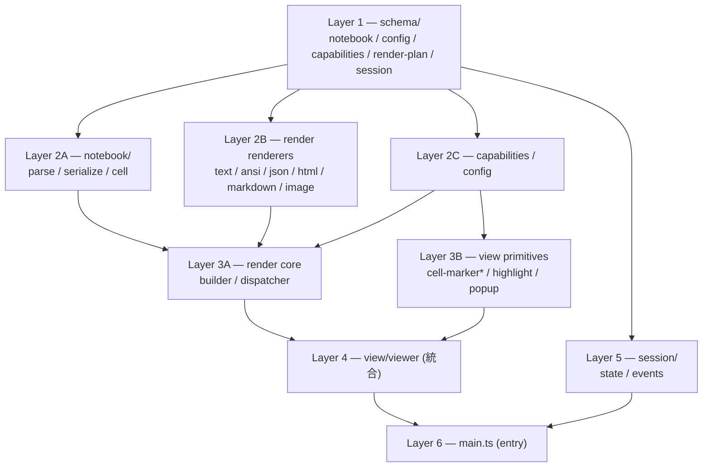

#### 3.8.3 Phase 3 で追加される層 (差分)

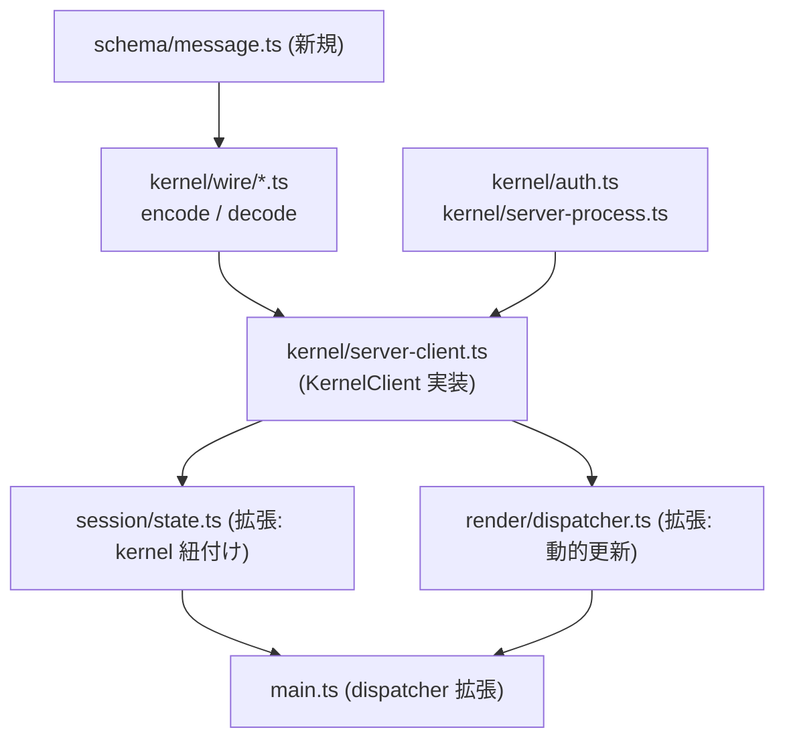

#### 3.8.4 循環参照を防ぐ仕組み

| 仕組み | 検出対象 | タイミング |
| --- | --- | --- |
| `deno check` | TypeScript コンパイル時の循環 import warning | `deno task validate` |
| `scripts/validate-schema.ts` | schema 同士の参照に循環がないか | `deno task validate` |
| `scripts/lint-no-handwritten-types.ts` | 「schema 以外で型を書かない」(層越え型流出を検出) | `deno task lint` |
| layer 規約 (PR レビュー) | 表 3.8.5 に書かれていない方向の import | 人間レビュー |

#### 3.8.5 依存方向マトリクス

「OK」のセルが許可された依存方向。空欄は禁止。

| ↓ from / → to | schema | notebook | renderers | caps/config | render core | view primitives | viewer | session | main |
| --- | :---: | :---: | :---: | :---: | :---: | :---: | :---: | :---: | :---: |
| **schema** | - | | | | | | | | |
| **notebook** | OK | - | | | | | | | |
| **renderers** | OK | | - | | | | | | |
| **caps/config** | OK | | | - | | | | | |
| **render core** | OK | OK | OK | OK | - | | | | |
| **view primitives** | OK | | | OK | | - | | | |
| **viewer** | OK | | | OK | OK | OK | - | | |
| **session** | OK | OK | | | | | OK | - | |
| **main** | OK | OK | | OK | OK | OK | OK | OK | - |

例えば `notebook/parse.ts` から `view/viewer.ts` を import すると NG (notebook 行 × viewer 列が空欄)。逆に `view/viewer.ts` から `notebook/*` を import するのは依存方向としては妥当だが、設計的には render core を経由するのが筋 (notebook 直触りは avoid)。

#### 3.8.6 SoT 階層との対応

3.8 の依存グラフは 1.3 の SoT 階層と整合している:

| SoT 階層 | 該当 Layer |
| --- | --- |
| SoT 1 (スキーマ) | Layer 1 (schema/) |
| SoT 2 (テスト) | (Layer 横断、すべての実装に依存) |
| SoT 3 (TSDoc 付き実装) | Layer 2-6 |
| 派生物 (vimdoc) | (Layer 全体を読む scripts/gen-vimdoc.ts) |

「上位 SoT は下位の派生物を生成する」関係と「上位 Layer は下位 Layer に依存する」関係は同じ向きになる (SoT が上、依存先が下)。

### 3.9 テスト構成 (SoT 2)

#### 3.9.1 テスト 4 階層

| 階層 | 目的 | フレームワーク | 配置 |
| --- | --- | --- | --- |
| **Unit (BDD spec)** | 各モジュールの公開関数の挙動 | `@std/testing/bdd` + `@std/assert` | `tests/spec/**/*_spec.ts` |
| **Schema validation** | スキーマと実装の対応 | TypeBox `Value.Check` | `tests/spec/contract_spec.ts` |
| **Golden file** | `.ipynb` round-trip + vimdoc 生成物 | diff チェック | `tests/golden/**/*` + `*_golden_spec.ts` |
| **Conformance** (P3+) | Jupyter wire protocol への適合 | 実 Jupyter サーバ起動 | `tests/conformance/` |

#### 3.9.2 BDD spec の規約

各 spec ファイルは `describe` / `it` で章立てし TSDoc の章と 1:1 で対応させる (これが SoT 2 の本質)。

```typescript
// tests/spec/notebook/parse_spec.ts
import { describe, it } from "@std/testing/bdd";
import { assertEquals, assertThrows } from "@std/assert";
import { parseNotebook } from "../../../denops/europa/notebook/parse.ts";
import { Value } from "@sinclair/typebox/value";
import { NotebookSchema } from "../../../schema/notebook.ts";

describe("notebook/parse", () => {
  describe("Source normalization", () => {
    // 対応: denops/europa/notebook/parse.ts の TSDoc "Source normalization" 章
    it("connects multi-line source array into single string", async () => {
      const content = await Deno.readTextFile(
        "tests/golden/ipynb/multi-line-source.ipynb",
      );
      const result = parseNotebook(content);
      assertEquals(result.cells[0].source, "import os\nprint('hi')\n");
    });
  });

  describe("Cell ID assignment (nbformat 4.5+)", () => {
    it("auto-assigns missing cell.id (uuid v4)",   () => { /* ... */ });
    it("preserves existing cell.id",               () => { /* ... */ });
    it("rejects invalid cell.id pattern",          () => { /* ... */ });
  });

  describe("Schema validation", () => {
    it("throws NotebookParseError on invalid nbformat", () => {
      assertThrows(() => parseNotebook("{}"), NotebookParseError);
    });
    it("passes Value.Check(NotebookSchema, ...) on valid input", () => {
      const nb = parseNotebook(validContent);
      assertEquals(Value.Check(NotebookSchema, nb), true);
    });
  });
});
```

規約:
- ファイル名: `<module>_spec.ts` (Ruby/RSpec 流)
- 最上位 `describe` ラベル: module 名 (`notebook/parse`)
- 第二階層 `describe`: TSDoc の章名と完全一致 (typedoc 出力 md の見出しに対応)
- `it`: 単一の振る舞いのみ、AAA (Arrange-Act-Assert) パターン

#### 3.9.3 Golden file テスト (`.ipynb` round-trip + vimdoc)

```typescript
// tests/spec/notebook/golden_spec.ts
import { describe, it } from "@std/testing/bdd";
import { assertEquals } from "@std/assert";
import {
  parseNotebook,
  serializeNotebook,
} from "../../../denops/europa/notebook/...";

const goldenIpynbDir = new URL("../../golden/ipynb/", import.meta.url);

// byte-equal ではなく 意味的同値 (canonicalize 後の構造一致) を検証する。
// parse 時の正規化 (source[]→string 連結 / cell.id 補完 / nbformat_minor 昇格) で
// 元ファイルと byte-equal にはならないため。
describe("golden:notebook/canonicalize-roundtrip", () => {
  for await (const entry of Deno.readDir(goldenIpynbDir)) {
    if (!entry.name.endsWith(".ipynb")) continue;
    it(`semantically equivalent after round-trip: ${entry.name}`, async () => {
      const original = await Deno.readTextFile(
        new URL(entry.name, goldenIpynbDir),
      );
      // 1 回目の parse (canonicalize 込み)
      const nb1 = parseNotebook(original);
      // serialize → parse で 2 周目
      const serialized = serializeNotebook(nb1);
      const nb2 = parseNotebook(serialized);
      // canonical form は冪等: nb1 と nb2 が完全に一致する
      assertEquals(nb2, nb1);
    });
  }
});
```

vimdoc は `doc/europa-api.txt` 自体を期待値として扱う (別 expected ファイルは持たない)。`deno task check` の流れで `gen:vimdoc` が `doc/europa-api.txt` を再生成し、`git diff --exit-code` で repo の `doc/europa-api.txt` との diff 0 を検証する:

```bash
# CI 順序 (3.5 SoT パイプラインと整合)
deno task gen:vimdoc                      # doc/europa-api.txt を再生成 (test:golden の前)
deno task test:fixtures && deno task test:spec && deno task test:golden
git diff --exit-code doc/europa-api.txt       # 期待値との diff 0 を検証
```

これによって typedoc / panvimdoc の bump で出力が変わると CI が fail し、人間が承認する `doc/europa-api.txt` 更新 PR が必要になる。`tests/golden/vimdoc/` ディレクトリは作らない (`doc/europa-api.txt` 自体が SoT のため二重化を避ける)。

#### 3.9.4 .ipynb fixture の出所

| 種類 | 出所 | 例 |
| --- | --- | --- |
| 公式 Jupyter サンプル | `jupyter/notebook` リポジトリの sample | `hello.ipynb`, `index.ipynb` |
| nbformat 公式テスト | `jupyter/nbformat` の `tests/data/` | `test4plus.ipynb`, `test5.ipynb` |
| 自前 fixture | Europa の特殊ケース | `multi-line-source.ipynb`, `error-cell.ipynb`, `sixel-image.ipynb` |
| エッジケース | Phase 別追加 | `huge-output-cell.ipynb`, `widget-view.ipynb` (P5) |

`scripts/validate-fixtures.ts` が全 fixture について `Value.Check(NotebookSchema, ...)` を pass することを CI で確認する。

#### 3.9.5 Vim/Neovim ホストのモック (`tests/fixtures/mock-host.ts`)

`Denops` は実際の Vim/Neovim と RPC するため、ユニットテストではモックを使う。

```typescript
// tests/fixtures/mock-host.ts (interface 例、TypeBox 不可な実行時契約)
import type { Denops } from "@denops/std";

export interface MockHost extends Denops {
  callLog:    Array<{ fn: string; args: unknown[] }>;
  cmdLog:     string[];
  evalLog:    string[];

  expectCall(fn: string, args: unknown[], result: unknown):  void;
  expectCmd(cmd: string):                                    void;
  expectEval(expr: string, result: unknown):                 void;

  setHost(host: "vim" | "nvim", version?: string):           void;
}

export function createMockHost(opts?: { host?: "vim" | "nvim" }): MockHost;
```

使用例:

```typescript
import { createMockHost } from "../../fixtures/mock-host.ts";

it("opens a notebook viewer buffer with modifiable=false", async () => {
  const denops = createMockHost({ host: "nvim" });
  denops.expectCall("nvim_create_buf",     [false, true],                  42);
  denops.expectCall("nvim_buf_set_option", [42, "modifiable", false],      null);

  await openViewer(denops, "foo.ipynb");

  assertEquals(denops.callLog.length, 2);
});
```

#### 3.9.6 Jupyter Server のモック (`tests/fixtures/mock-kernel.ts`、Phase 3)

Phase 3 で `kernel/server-client.ts` のテスト用に WebSocket + REST モックを用意:

```typescript
// tests/fixtures/mock-kernel.ts (Phase 3)
export interface MockJupyterServer {
  start(port?: number):  Promise<{ url: string; token: string }>;
  stop():                Promise<void>;

  // テストから期待 message を queue
  queueIopubMessage(msg: KernelMessage):                      void;
  queueShellReply(parentMsgId: string, reply: KernelMessage): void;

  // 受信した execute_request 等の検証
  receivedMessages: KernelMessage[];
}

export function createMockJupyterServer(): MockJupyterServer;
```

Phase 3 ではこれと並行して、実 Jupyter Server を起動する conformance test (`tests/conformance/`) も整備する。

#### 3.9.7 spec と TSDoc の 1:1 対応 (重要)

SoT 2 の核として、spec の `describe` 章と TSDoc の章 (`@module` / `@category` / 主要 heading) は 1:1 対応を強制する。

検証手段:

| 手段 | Phase 2 | Phase 3+ |
| --- | --- | --- |
| 人間レビュー | ✓ | ✓ |
| `scripts/validate-spec-tsdoc-mapping.ts` (自動化) | ✗ (手作業の負荷を見極める) | ✓ |

自動化スクリプトは:
1. `denops/europa/**/*.ts` の TSDoc から章名を抽出 (typedoc JSON 経由)
2. `tests/spec/**/*_spec.ts` の `describe` ラベルを AST から抽出
3. 不一致を CI で fail

#### 3.9.8 Phase 別のテスト追加

| Phase | 新規テスト |
| --- | --- |
| 1 | Unit (notebook / capabilities / render / view / session) + Golden (ipynb / vimdoc) + Schema validation |
| 2 | Unit (kernel / wire) + Conformance (実 Jupyter サーバ) + 動的 dispatcher テスト + mock-kernel |
| 3 | ZMQ client unit + Sixel→Kitty Unicode Placeholder 切替テスト + iTerm2 OSC1337 |
| 4 | comm message テスト + ipywidgets フロー (mock + 実 widget) |

#### 3.9.9 テスト実行の deno task (3.5 と整合)

| task | 範囲 | 期待時間 (Phase 2 想定) |
| --- | --- | --- |
| `deno task test:spec` | Unit + Schema validation | < 5s |
| `deno task test:golden` | Golden file diff | < 10s |
| `deno task test:fixtures` | fixtures が schema 適合 | < 2s |
| `deno task check` | 全部 + gen:vimdoc + git diff | < 30s |

CI 上で `deno task check` が 30s 以内で終わることを目標 (= 開発フィードバックループの速度)。Phase 3 で Conformance test を追加すると 1-2 分まで延びる見込み。

## 4. データモデル (SoT 1: TypeBox スキーマ)

データ型はすべて `schema/*.ts` に TypeBox スキーマとして定義し、TS 型は `Static<typeof XxxSchema>` で推論する。対象は永続化、wire、RenderPlan、Config、Capabilities など。`schema/` 配下で手書き `interface` や `type X = ...` を新設するのは禁止で、lint で検出する。

振る舞い契約は `contracts/*.ts` に分離する。`KernelClient`、`CellMarker`、`Dispatcher` のように `AsyncIterable<...>` を含む実行時メソッド契約は TypeBox で表現できないため、ディレクトリごと別に切る。データ SoT (schema) と振る舞い SoT (contracts) を物理的に分けるのが狙い。

実行時オブジェクトを混ぜる augment 型 (`SessionRuntime = Session & { socket?: WebSocket }` のようなもの) も `contracts/session-runtime.ts` に置く。

### 4.1 Notebook (`schema/notebook.ts`)

`nbformat v4.x` に対応する TypeBox スキーマ。

```typescript
import { Type, Static } from "@sinclair/typebox";

export const MimeBundleSchema = Type.Record(
  Type.String(),
  Type.Union([Type.String(), Type.Record(Type.String(), Type.Unknown())]),
);
export type MimeBundle = Static<typeof MimeBundleSchema>;

export const StreamOutputSchema = Type.Object({
  output_type: Type.Literal("stream"),
  name: Type.Union([Type.Literal("stdout"), Type.Literal("stderr")]),
  text: Type.String(),  // string[] は parse 時に連結済み
});

export const DisplayDataOutputSchema = Type.Object({
  output_type: Type.Literal("display_data"),
  data: MimeBundleSchema,
  metadata: Type.Record(Type.String(), Type.Unknown()),
  transient: Type.Optional(
    Type.Object({ display_id: Type.Optional(Type.String()) }),
  ),
});

export const ExecuteResultOutputSchema = Type.Object({
  output_type: Type.Literal("execute_result"),
  execution_count: Type.Integer(),
  data: MimeBundleSchema,
  metadata: Type.Record(Type.String(), Type.Unknown()),
});

export const ErrorOutputSchema = Type.Object({
  output_type: Type.Literal("error"),
  ename: Type.String(),
  evalue: Type.String(),
  traceback: Type.Array(Type.String()),  // ANSI エスケープ含む
});

export const OutputSchema = Type.Union([
  StreamOutputSchema,
  DisplayDataOutputSchema,
  ExecuteResultOutputSchema,
  ErrorOutputSchema,
]);
export type Output = Static<typeof OutputSchema>;

export const CellMetadataSchema = Type.Object({
  collapsed: Type.Optional(Type.Boolean()),
  scrolled: Type.Optional(
    Type.Union([Type.Boolean(), Type.Literal("auto")]),
  ),
  format: Type.Optional(Type.String()),
}, { additionalProperties: true });

const CellIdSchema = Type.String({
  minLength: 1,
  maxLength: 64,
  pattern: "^[A-Za-z0-9_-]+$",
});

export const CodeCellSchema = Type.Object({
  cell_type: Type.Literal("code"),
  id: CellIdSchema,
  source: Type.String(),  // 内部表現は string で正規化
  metadata: CellMetadataSchema,
  execution_count: Type.Union([Type.Integer(), Type.Null()]),
  outputs: Type.Array(OutputSchema),
});
export type CodeCell = Static<typeof CodeCellSchema>;

export const MarkdownCellSchema = Type.Object({
  cell_type: Type.Literal("markdown"),
  id: CellIdSchema,
  source: Type.String(),
  metadata: CellMetadataSchema,
  attachments: Type.Optional(Type.Record(Type.String(), MimeBundleSchema)),
});
export type MarkdownCell = Static<typeof MarkdownCellSchema>;

export const RawCellSchema = Type.Object({
  cell_type: Type.Literal("raw"),
  id: CellIdSchema,
  source: Type.String(),
  metadata: CellMetadataSchema,
});
export type RawCell = Static<typeof RawCellSchema>;

export const CellSchema = Type.Union([
  CodeCellSchema,
  MarkdownCellSchema,
  RawCellSchema,
]);
export type Cell = Static<typeof CellSchema>;

export const NotebookMetadataSchema = Type.Object({
  kernelspec: Type.Optional(Type.Object({
    name: Type.String(),
    display_name: Type.String(),
    language: Type.Optional(Type.String()),
  })),
  language_info: Type.Optional(Type.Record(Type.String(), Type.Unknown())),
}, { additionalProperties: true });

export const NotebookSchema = Type.Object({
  nbformat: Type.Literal(4),
  nbformat_minor: Type.Integer({ minimum: 0 }),
  metadata: NotebookMetadataSchema,
  cells: Type.Array(CellSchema),
});
export type Notebook = Static<typeof NotebookSchema>;
```

実装メモ (parse / serialize 側、`denops/europa/notebook/`):

- 読み込み時の正規化 (`parse.ts`、TypeBox 検証より前):
  - `source` が string[] なら空文字列で連結して string に
  - `outputs[].text` も同様
  - `cell.id` 欠落なら uuid v4 で採番 (`nbformat_minor` を 5 へ昇格)
  - 正規化後に `Value.Check(NotebookSchema, normalized)` で検証 (false なら `NotebookParseError` を throw)
- 書き戻し時 (`serialize.ts`):
  - `JSON.stringify(notebook, null, 1)` (1-space indent, LF) を採用
  - 末尾 LF 必須
- 正規化は冪等にする (canonicalize idempotency)。`parse(original)` の結果と `parse(serialize(parse(original)))` の結果は完全一致する。round-trip テスト (3.9.3) で検証する。`source[]→string` や `cell.id` 補完で元ファイルと byte-equal にはならないため、byte-equal の round-trip は要求せず、意味的同値で検証する。
- MIME バンドル:
  - `application/json` は object のまま (二重エンコードしない)
  - `image/png` 等は base64 文字列
  - `metadata[mime].width`, `metadata[mime].height` を尊重 (画像サイズ)

### 4.2 Session (`schema/session.ts`)

buffer と notebook と kernel の対応を管理する。

```typescript
import { Type, Static } from "@sinclair/typebox";
import { NotebookSchema } from "./notebook.ts";

export const KernelStateSchema = Type.Union([
  Type.Literal("starting"),
  Type.Literal("idle"),
  Type.Literal("busy"),
  Type.Literal("dead"),
]);
export type KernelState = Static<typeof KernelStateSchema>;

export const KernelInfoSchema = Type.Object({
  id: Type.String({ format: "uuid" }),       // jupyter server の kernel id
  name: Type.String(),                       // python3 など
  state: KernelStateSchema,
  // socket / zmq client は実行時オブジェクトのため schema 外
});
export type KernelInfo = Static<typeof KernelInfoSchema>;

export const CellMapEntrySchema = Type.Object({
  cellIndex: Type.Integer({ minimum: 0 }),
  bufLineStart: Type.Integer({ minimum: 0 }),
  bufLineEnd: Type.Integer({ minimum: 0 }),
});
export type CellMapEntry = Static<typeof CellMapEntrySchema>;

export const SessionSchema = Type.Object({
  id: Type.String({ format: "uuid" }),
  bufnr: Type.Integer(),
  notebookPath: Type.String(),
  notebook: NotebookSchema,                  // Deno 側が SoT (in-memory)
  kernel: Type.Optional(KernelInfoSchema),
  cellMap: Type.Array(CellMapEntrySchema),
});
export type Session = Static<typeof SessionSchema>;
```

実行時付随オブジェクト (例外的な手書き型、`denops/europa/session/state.ts`):

```typescript
import type { Session, KernelInfo } from "../../schema/session.ts";
import type { ZmqClient } from "../kernel/zmq-client.ts";  // Phase 4

// SoT (Session) + 実行時オブジェクト
export type SessionRuntime = Session & {
  kernelRuntime?: {
    info: KernelInfo;
    socket?: WebSocket;        // Phase 2
    zmq?: ZmqClient;           // Phase 4
  };
};
```

複数 buffer を 1 kernel に紐付け、または 1 buffer を複数 kernel に紐付け可能 (molten-nvim 流の多対多)。

### 4.3 RenderPlan (`schema/render-plan.ts`)

cell の outputs を MIME 解釈してから、buffer 反映する前の中間表現。md-render.nvim の `MdRender.Content` を踏襲。

```typescript
import { Type, Static } from "@sinclair/typebox";

export const HighlightSchema = Type.Object({
  line: Type.Integer({ minimum: 0 }),
  col: Type.Integer({ minimum: 0 }),
  endCol: Type.Integer(),                    // -1 で行末まで
  hlGroup: Type.String(),                    // "EuropaCellHeader" 等
  hlEol: Type.Optional(Type.Boolean()),
});
export type Highlight = Static<typeof HighlightSchema>;

export const VirtTextPositionSchema = Type.Union([
  Type.Literal("right_align"),
  Type.Literal("eol"),
  Type.Literal("below"),
  Type.Literal("above"),
]);

export const VirtTextSchema = Type.Object({
  line: Type.Integer({ minimum: 0 }),
  text: Type.String(),
  position: VirtTextPositionSchema,
  hlGroup: Type.Optional(Type.String()),
});
export type VirtText = Static<typeof VirtTextSchema>;

export const ImagePlacementSchema = Type.Object({
  line: Type.Integer({ minimum: 0 }),
  col: Type.Integer({ minimum: 0 }),
  rows: Type.Integer({ minimum: 1 }),        // 確保するセル行数
  cols: Type.Integer({ minimum: 1 }),
  path: Type.String(),                       // PNG file path
  sourceMime: Type.String(),
});
export type ImagePlacement = Static<typeof ImagePlacementSchema>;

export const ClickActionSchema = Type.Union([
  Type.Object({
    type: Type.Literal("open_url"),
    payload: Type.String(),
  }),
  Type.Object({
    type: Type.Literal("scroll_to_cell"),
    payload: Type.String(),
  }),
  Type.Object({
    type: Type.Literal("toggle_fold"),
    payload: Type.String(),
  }),
]);

export const ClickableSchema = Type.Object({
  line: Type.Integer({ minimum: 0 }),
  colStart: Type.Integer({ minimum: 0 }),
  colEnd: Type.Integer(),
  action: ClickActionSchema,
});
export type Clickable = Static<typeof ClickableSchema>;

export const RenderPlanSchema = Type.Object({
  lines: Type.Array(Type.String()),          // 完成テキスト (セル装飾含む)
  highlights: Type.Array(HighlightSchema),
  virtText: Type.Array(VirtTextSchema),
  imagePlacements: Type.Array(ImagePlacementSchema),
  clickables: Type.Array(ClickableSchema),
  cellMap: Type.Array(Type.Object({
    cellIndex: Type.Integer({ minimum: 0 }),
    bufLineStart: Type.Integer({ minimum: 0 }),
    bufLineEnd: Type.Integer({ minimum: 0 }),
  })),
});
export type RenderPlan = Static<typeof RenderPlanSchema>;
```

`render/builder.ts` で組み立て、`render/dispatcher.ts` で MIME ごとに振り分けた結果がここに集約される。`view/viewer.ts` が受け取り、Vim/Neovim 別の API でバッファに反映する。

### 4.4 派生される TS 型のまとめ

| スキーマファイル | 主要スキーマ | 推論される TS 型 |
| --- | --- | --- |
| `schema/notebook.ts` | `NotebookSchema`, `*CellSchema`, `OutputSchema`, `MimeBundleSchema` | `Notebook`, `Cell`, `CodeCell`, `MarkdownCell`, `RawCell`, `Output`, `MimeBundle` |
| `schema/session.ts` | `SessionSchema`, `KernelInfoSchema`, `KernelStateSchema` | `Session`, `KernelInfo`, `KernelState`, `CellMapEntry` |
| `schema/render-plan.ts` | `RenderPlanSchema`, `HighlightSchema`, `VirtTextSchema`, `ImagePlacementSchema`, `ClickableSchema` | `RenderPlan`, `Highlight`, `VirtText`, `ImagePlacement`, `Clickable` |
| `schema/config.ts` | `EuropaConfigSchema` | `EuropaConfig` |
| `schema/capabilities.ts` | `CapabilitiesSchema`, `ImageProtocolSchema`, `HostKindSchema` | `Capabilities`, `ImageProtocol`, `HostKind` |
| `schema/message.ts` (Phase 3) | `KernelMessageSchema`, `HeaderSchema`, ... | `KernelMessage`, `Header`, ... |

#### 振る舞い契約 (`contracts/*.ts`)

データ型では表現できないメソッド契約を持つ interface は `contracts/` ディレクトリに集約する。

| ファイル | 型 | 理由 |
| --- | --- | --- |
| `contracts/session-runtime.ts` | `SessionRuntime` | `WebSocket` / `ZmqClient` は実行時オブジェクトで TypeBox 不可 |
| `contracts/kernel-client.ts` (Phase 3) | `KernelClient` interface | `AsyncIterable<KernelMessage>` 等のメソッド契約は schema で表現しづらい |
| `contracts/cell-marker.ts` | `CellMarker` interface | Vim/Neovim host 別の実装契約 |
| `contracts/dispatcher.ts` | `Dispatcher` interface | 静的 (P2) / 動的 (P3) 両対応の振る舞い契約 |

`schema/` 配下と `denops/europa/` 配下では手書き interface を新設しない (lint で reject)。新たな振る舞い契約が必要になったら `contracts/` に追加し、3.7 と本表を同時に更新する。

### 4.5 EuropaConfig (`schema/config.ts`)

`g:europa_*` 全設定を TypeBox で定義する。`loadConfig(denops)` は Vim 側の変数を読み、`Value.Check(EuropaConfigSchema, ...)` で検証して欠落値はデフォルトで補完する。

```typescript
import { Type, Static } from "@sinclair/typebox";

export const ConnectionModeSchema = Type.Union([
  Type.Literal("server"),
  Type.Literal("zmq"),
  Type.Literal("auto"),
]);

export const EuropaConfigSchema = Type.Object({
  // 接続 (Phase 3+)
  connection_mode:           ConnectionModeSchema,
  jupyter_url:               Type.String({ format: "uri" }),
  jupyter_token:             Type.String({ default: "" }),
  jupyter_ws_subprotocol:    Type.Union([
                               Type.Literal("default"),
                               Type.Literal("v1"),
                               Type.Literal("auto"),
                             ]),
  // Kernel (Phase 3+)
  default_kernel:            Type.String({ default: "python3" }),
  auto_start_kernel:         Type.Boolean({ default: false }),
  // Python 環境 (Phase 3+ で利用、設定項目は Phase 1 で schema に確保)
  jupyter_executable:        Type.String({ default: "" }),   // 絶対パス指定。空なら自動検出 (6.5 参照)
  python_env_detect:         Type.Union([
                               Type.Literal("auto"),         // 自動検出 (既定)
                               Type.Literal("disabled"),     // PATH のみ使う
                             ]),
  // 描画
  image_backend:             Type.Union([
                               Type.Literal("placeholder"),
                               Type.Literal("sixel"),
                               Type.Literal("kitty_placeholder"),
                               Type.Literal("iterm2_osc1337"),
                               Type.Literal("auto"),
                             ]),
  mime_priority:             Type.Array(Type.String()),
  max_output_lines:          Type.Integer({ minimum: 1, default: 100 }),
  cell_border_chars:         Type.Array(Type.String(), { minItems: 5, maxItems: 5 }),
  // 動作
  auto_save:                 Type.Boolean({ default: false }),
  use_subprocess:            Type.Boolean({ default: true }),
  da1_probe:                 Type.Boolean({ default: false }),  // Phase 3+ で明示 opt-in
});
export type EuropaConfig = Static<typeof EuropaConfigSchema>;
```

### 4.6 Capabilities (`schema/capabilities.ts`)

host (Vim/Neovim) と terminal protocol の検出結果を表すスキーマ。`detectCapabilities(denops)` は denops から `host` を取り、`Deno.env` 経由で `imageProtocol` を検出する (Phase 2 では `imageProtocol = 'placeholder'` 固定、Phase 3 以降で env 検出 + 明示 opt-in な DA1 query)。

```typescript
import { Type, Static } from "@sinclair/typebox";

export const HostKindSchema = Type.Union([
  Type.Literal("vim"),
  Type.Literal("nvim"),
]);
export type HostKind = Static<typeof HostKindSchema>;

export const ImageProtocolSchema = Type.Union([
  Type.Literal("placeholder"),         // Phase 2 既定
  Type.Literal("sixel"),               // Phase 2 experimental opt-in / Phase 3 安定化
  Type.Literal("kitty_placeholder"),   // Phase 3
  Type.Literal("iterm2_osc1337"),      // Phase 4
]);
export type ImageProtocol = Static<typeof ImageProtocolSchema>;

export const CapabilitiesSchema = Type.Object({
  host:                  HostKindSchema,
  hostVersion:           Type.Object({
                           major: Type.Integer(),
                           minor: Type.Integer(),
                           patch: Type.Integer(),
                         }),
  imageProtocol:         ImageProtocolSchema,
  cellPx:                Type.Optional(Type.Object({
                           width:  Type.Integer({ minimum: 1 }),
                           height: Type.Integer({ minimum: 1 }),
                         })),
  osc8:                  Type.Boolean(),
  hasVirtTextBelow:      Type.Boolean(),     // Vim 9.1+ or Neovim
  hasFloatingWindow:     Type.Boolean(),     // popup_create or nvim_open_win
});
export type Capabilities = Static<typeof CapabilitiesSchema>;
```

## 5. ファイル操作モデル

### 5.1 案 a: `.ipynb` 直接 + 仮想ビュー (推奨)

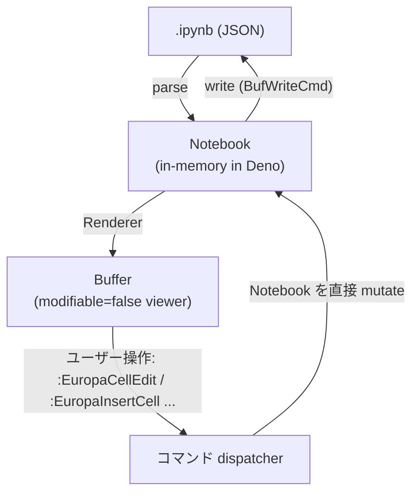

特徴:
- Deno が source of truth、Vim は表示専用 viewer
- 大規模 `.ipynb` でも Vim にロードする必要がない (= virtual document 方式)
- 編集はコマンド経由 (セル単位の追加/削除/移動/編集)
- セル内のソース編集は別バッファ (`:EuropaEditCell` で `__europa_cell_<id>__` バッファを開く) → 保存時に Notebook に書き戻し

利点:
- 出力 / metadata / attachments を完全に保持
- 「ipynb を一級市民にする」差別化が活きる
- molten 流の extmark セル境界で UX を組める

欠点:
- 編集 UX が独特 (普通の Vim 編集ではない)
- 「ファイル全体を vim で gg/G/dd できる」直感は崩れる

主要操作:

| 操作 | コマンド | 内部処理 |
| --- | --- | --- |
| ファイルを開く | `:edit foo.ipynb` (autocmd) | parse -> Notebook -> RenderPlan -> Buffer |
| セル編集 | `:EuropaEditCell` (cursor 位置の cell) | 別バッファ open, 保存で source 更新, 親 Buffer 再描画 |
| セル追加 | `:EuropaInsertCell [code\|markdown\|raw]` | Notebook.cells に push, 再描画 |
| セル削除 | `:EuropaDeleteCell` | Notebook.cells から remove |
| セル移動 | `:EuropaMoveCellUp/Down` | swap |
| セル結合 | `:EuropaJoinCell` | source 連結 |
| ファイル保存 | `:write` (autocmd) | Notebook -> JSON -> ファイル書き込み |

### 5.2 案 b: jupytext 風変換

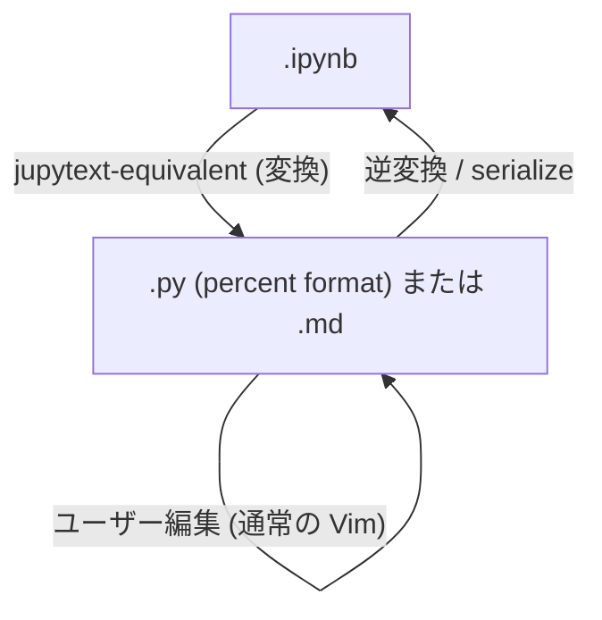

特徴:
- ユーザーには `.py` または `.md` として見せる (Vim の通常編集 UX)
- 保存時に `.ipynb` へ逆変換
- jupytext CLI を呼ぶ案と、Deno 側で変換ロジックを実装する案がある

利点:
- 編集 UX が普通の Vim
- 既存の Vim プラグイン (LSP, treesitter, fold) が効く

欠点:
- 出力を `.ipynb` 側に保持しつつ source は `.py` で管理する必要があり、二重ファイル運用または `.ipynb` 内出力を破棄する選択を迫られる
- jupytext.nvim と機能が被る (差別化弱い)
- markdown cell の attachments、cell.metadata.collapsed/scrolled を完全に表現できない

実装方針 (採用しないが書き残す):
- `.ipynb` を開いたら `.europa.py` (一時) を作って Vim にはこちらを表示
- 保存時に `.europa.py` の内容を Notebook の対応する code cell の source に書き戻し
- `.ipynb` の出力は touch しない (= 実行は Phase 3 で別系統)

### 5.3 案 c: 仮想バッファ (セルごとに分離)

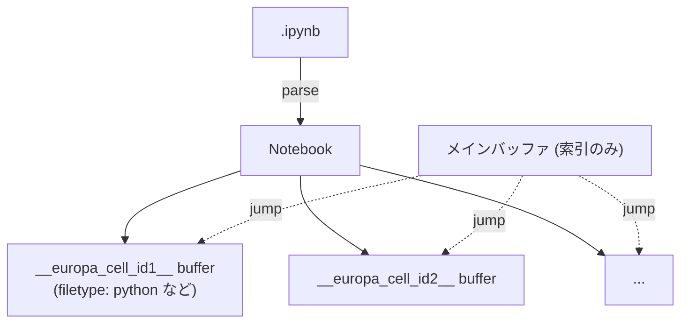

特徴:
- セルが Vim の「個別バッファ」として存在
- 索引バッファでセル一覧、ジャンプはバッファ切替

利点:
- セル単位での編集が明確に分離 (LSP が cell 単位で動く)
- 各セルを別 filetype として扱える (`python` for code cell, `markdown` for markdown cell)

欠点:
- バッファ数が爆発 (中規模 Notebook で数十 buffer)
- セル間の文脈 (上のセルの import を参照したい等) が見えにくい
- セル順序の管理が複雑 (バッファに順序の概念がない)

### 5.4 比較と推奨

| 軸 | 案 a (直接 + 仮想ビュー) | 案 b (jupytext 風) | 案 c (仮想バッファ) |
| --- | --- | --- | --- |
| 出力保持 | ◎ | △ (二重ファイル運用) | ◎ |
| metadata 保持 | ◎ | △ | ◎ |
| 編集 UX | △ (独特) | ◎ (普通の Vim) | ○ (cell ごと普通) |
| LSP / treesitter 統合 | △ (cell ごとに別バッファ起動が必要) | ◎ | ◎ |
| 大規模 ipynb 性能 | ◎ (virtual document) | ○ | △ (バッファ大量) |
| 画像 / リッチ出力表示 | ◎ (viewer に集約) | △ (.py に出力なし) | △ (cell バッファ別) |
| 差別化 | ◎ (jupytext.nvim と被らない) | △ (jupytext.nvim と被る) | ○ |
| 実装複雑度 | 中 | 低 (jupytext 流用) | 高 |

採用するのは案 a。

理由:
1. ユーザー要件「セル構造とリッチ出力を閲覧」に対し、案 a の viewer モデルが最も直接的
2. 出力 / metadata / attachments を完全保持できるのは案 a と案 c のみ
3. 案 c はバッファ管理が複雑で、Vim 標準操作と相性が悪い
4. 案 b は jupytext.nvim と機能重複し、Europa 独自性が薄れる

ただし、案 a の中で「セル個別の編集は別バッファ (`:EuropaEditCell` で開く)」というハイブリッドを採用することで、案 c の利点 (cell 単位の LSP) も拾う。

## 6. カーネル接続設計

### 6.1 KernelClient 抽象

```typescript
// kernel/client.ts
interface KernelClient {
  start(opts: { kernelName: string; cwd?: string }): Promise<void>;
  shutdown(): Promise<void>;
  restart(): Promise<void>;
  interrupt(): Promise<void>;
  execute(code: string, opts?: ExecuteOptions): AsyncIterable<KernelMessage>;
  kernelInfo(): Promise<KernelInfoReply>;
  complete(code: string, cursorPos: number): Promise<CompleteReply>;
  inspect(code: string, cursorPos: number, detail: 0 | 1): Promise<InspectReply>;
  onMessage(handler: (msg: KernelMessage) => void): () => void;  // unsubscribe fn
}
```

実装:
- `kernel/server-client.ts` (Phase 3): jupyter server の REST + WebSocket
- `kernel/zmq-client.ts` (Phase 4): npm:zeromq で 5 ソケット接続

### 6.2 Phase 3: REST + WebSocket

#### Notebook open のフロー

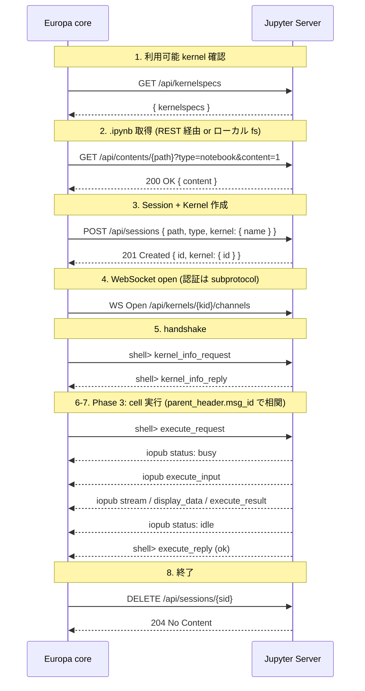

#### WebSocket サブプロトコル選択

JupyterLab 流のフォールバック:

```typescript
const ws = new WebSocket(url, [
  "v1.kernel.websocket.jupyter.org",       // 優先 (offset table 形式)
  "v1.token.websocket.jupyter.org",        // フォールバック (token 認証)
  `v1.token.websocket.jupyter.org.${TOKEN}`,
]);
ws.addEventListener("open", () => {
  // ws.protocol で合意したサブプロトコルを取得
  // 不一致ならデフォルトプロトコル (テキスト JSON 単体) で振る舞う
});
```

#### メッセージ送受信

`wire/protocol-v1.ts` で v1 protocol (offset table) のエンコード/デコード、`wire/protocol-default.ts` でデフォルト (一発 JSON) を実装。共通のメッセージ型は `wire/message.ts`。

### 6.3 Phase 4: ZeroMQ 直結 (opt-in)

```
:EuropaAttach /path/to/connection.json
```

- `connection_file` (JSON) を読んで 5 ソケットを connect (kernel が bind 側、Europa が connect 側)
- npm:zeromq v6 を Deno の Node 互換で利用 (`--allow-ffi`, `nodeModulesDir: "auto"`)
- HMAC sha256 署名計算は `node:crypto` の `createHmac` で
- メッセージ frame は `[identities..., "<IDS|MSG>", hmac, header, parent, metadata, content, buffers...]`
- 配布リスク: prebuilt が無いプラットフォームではユーザーに `npm install` (= node-gyp ビルド) を要求することになる

### 6.4 認証

トークンは設定 `g:europa_jupyter_token` で指定するか、環境変数 `JUPYTER_TOKEN` を読む。優先順:

1. `g:europa_jupyter_token` 設定値
2. `$JUPYTER_TOKEN`
3. ローカル spawn 時は `--ServerApp.token=<random>` で乱数生成

REST には `Authorization: token <TOKEN>` を全付与 (XSRF 回避)。WebSocket は subprotocol 経由 (URL に token を露出させない)。

### 6.5 Python 環境検出 (Phase 3+)

データサイエンス用途では `ipykernel` をプロジェクト固有の venv (`.venv/`、`venv/`、conda env、uv/poetry/pdm が作る venv) に install するのが標準で、グローバル install のみとは限らない。Europa は起動ディレクトリ配下の venv を優先して検出し、グローバル `jupyter` には最後にフォールバックする。

#### 検出順序

1. `g:europa_jupyter_executable` 設定 (絶対パス、最優先)
2. cwd 直下の `.venv/bin/jupyter` (POSIX) または `.venv/Scripts/jupyter.exe` (Windows)
3. cwd 直下の `venv/bin/jupyter` または `venv/Scripts/jupyter.exe`
4. 環境変数 `VIRTUAL_ENV` が設定されていれば `$VIRTUAL_ENV/bin/jupyter`
5. 環境変数 `CONDA_PREFIX` が設定されていれば `$CONDA_PREFIX/bin/jupyter`
6. PATH 上の `jupyter` (フォールバック)

`g:europa_python_env_detect = 'disabled'` で 2-5 をスキップし、1 と 6 だけ参照する。検出に失敗したら `:EuropaStartKernel` 実行時に「`g:europa_jupyter_executable` で絶対パスを指定してください」とエラーメッセージを出す。

#### Phase 1 と Phase 3 の役割分担

| Phase | 範囲 |
| --- | --- |
| Phase 1 | `jupyter_executable` と `python_env_detect` を `schema/config.ts` の `EuropaConfigSchema` に追加。検出ロジックは未実装 |
| Phase 3 | `denops/europa/kernel/server-process.ts` に検出ロジックを実装。`Deno.Command` の引数に検出結果のパスを渡す |

#### MVP に含めない範囲

- `uv run jupyter`、`poetry run jupyter`、`pdm run jupyter` のような環境マネージャラッパ経由の起動。これらは Phase 3 中盤以降にニーズが出てきたら追加する。
- `pyenv`、`mise`、`asdf` で切り替えた Python のバージョン解決。これらは PATH 上の `jupyter` を経由して間接的に解決される。

## 7. 描画戦略

### 7.1 RenderPlan パイプライン

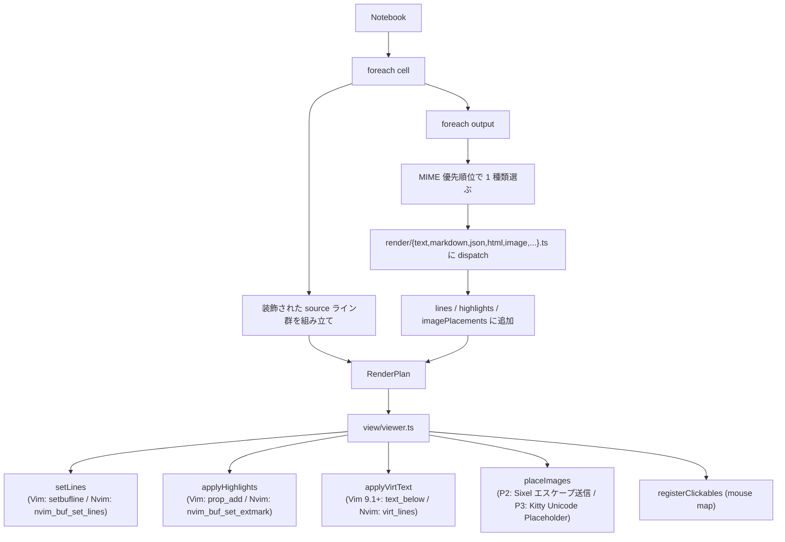

### 7.2 セル境界の表現

実 line 装飾を採用 (Vim/Neovim 両対応で安定):

```
╭─ In [3] ───────────────────────╮
import pandas as pd
df = pd.read_csv("data.csv")
df.head()
╰─ Out [3] ──────────────────────╯
   <DataFrame: 5 rows × 3 cols>
   ...
   [image: plot.png 640x480]
─────────────────────────────────
```

実 line を入れたうえで、その行に hl_eol 付き hl_group を当てる。これは md-render.nvim の Callout/Details と同じ流儀。

### 7.3 リッチ出力 MIME 戦略

| MIME | Phase 2 (MVP) | Phase 3 |
| --- | --- | --- |
| `text/plain` | バッファ行追加, ANSI strip | ANSI 色保持 |
| `stream` (stdout/stderr) | 連続同名 stream を結合, ANSI parse | 出力長制限 |
| `error` (traceback) | ANSI parse + ename 強調 | line jump |
| `text/markdown` | source as-is + 簡易見出しハイライト | md-render 風 inline render |
| `text/html` | タグストリップ | 別バッファで HTML / `pandoc` |
| `application/json` | pretty-print + treesitter | 折りたたみ |
| `image/png` `image/jpeg` | プレースホルダ + 外部ビューア (P2 既定、全端末同一) / `g:europa_image_backend = 'sixel'` で experimental Sixel | + Kitty Unicode Placeholder (P3) + Sixel 安定化 → snacks.image / image.nvim / iTerm2 (P4) |
| `image/svg+xml` | source 表示 | rsvg-convert で PNG 化 |
| `application/vnd.*` (Vega-Lite/Plotly) | プレースホルダ | vl-convert / kaleido |
| `application/vnd.jupyter.widget-view+json` | プレースホルダ | comm 対応 (Phase 5) |

### 7.4 画像描画戦略 (プレースホルダ既定 + Sixel experimental opt-in)

#### Phase 2 既定はプレースホルダ + 外部ビューア

Phase 2 の既定動作は、画像をテキストプレースホルダで表示し、必要なときにユーザーが `:EuropaPreviewOutput` で外部ビューアを起動する形にする。

Vim/Neovim 両対応の画像表示はいずれも環境依存が強い。MVP で画像を破綻なく動かすには、対応端末でも非対応端末でも挙動を揃えるのが現実的。Sixel は ImageMagick を要求し、文字位置の整合が弱く、再描画も手動で組まないといけない。Kitty Unicode Placeholder は対応端末が狭いので、Phase 2 の既定にはできない。これらを Phase 2 で抱えると MVP の完了条件が定まらない。

Sixel を試したいユーザーは `g:europa_image_backend = 'sixel'` で experimental opt-in として有効化できる (ImageMagick と対応端末が必要)。Phase 3 で Kitty Unicode Placeholder を追加し、Sixel 側も文字位置整合と再描画 hook を整える。

#### 画像プロトコル比較 (将来の選択肢)

| プロトコル | 主な対応端末 | 文字位置整合 | tmux 越し | Vim ネイティブ対応 |
| --- | --- | --- | --- | --- |
| **placeholder + 外部ビューア** (P2 既定) | 全端末 | ◎ (テキスト) | OK | OK |
| **Sixel** (P2 experimental opt-in / P3 安定化) | xterm / mlterm / foot (Wayland-native) / WezTerm / Konsole 22.04+ / iTerm2 3.5+ / mintty | △ (画像が他テキストと重なる) | tmux 3.4+ (`--enable-sixel`) | OK (`writefile([...], "/dev/tty", "b")`) |
| **Kitty Unicode Placeholder** (P3) | Kitty / Ghostty / WezTerm 一部 | ◎ (テキストとして書く) | passthrough 必要 | OK (テキスト書込み) |
| **iTerm2 OSC 1337** (P4) | iTerm2 / WezTerm | △ | 部分的 | OK |
| **image.nvim / snacks 連携** (P4, Neovim only) | Kitty/Sixel/Ueberzug++ | 中間ライブラリに委譲 | 部分的 | (Neovim 限定) |

#### Phase 別ロードマップ

| Phase | 既定動作 | opt-in 追加 | 補足 |
| --- | --- | --- | --- |
| 1 (MVP) | placeholder + `:EuropaPreviewOutput` | `g:europa_image_backend = 'sixel'` で experimental Sixel | ImageMagick は opt-in 時のみ要求 |
| 2 | placeholder 既定継続 + Sixel 安定化 | + Kitty Unicode Placeholder | Sixel の文字位置整合・再描画 hook を整備 |
| 3 | 端末検出で Sixel/Kitty を自動切替 | + image.nvim/snacks 連携 / iTerm2 OSC 1337 | エコシステム統合 |

#### 実装フロー (Phase 2: 既定 placeholder + opt-in Sixel)

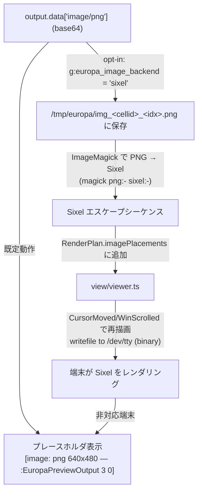

Phase 2 既定では `A → P` のみ動作する。`g:europa_image_backend = 'sixel'` を設定したユーザーのみ `A → B → ... → E` の経路に進む。Sixel 経路を選んだ場合は `view/viewer.ts` で:

- セル行に「rows 行ぶんの空白行」を確保 (実 line として `[image: <type> <bytes>]` プレースホルダを入れる)
- 描画タイミングで Sixel エスケープを `/dev/tty` にバイナリ書き込み (`writefile(escape_bytes, "/dev/tty", "b")` / Neovim は `vim.uv.new_tty(1)`)
- `WinScrolled` / `VimResized` / `BufEnter` で再描画 hook

#### 端末検出 (`schema/capabilities.ts` で型を SoT 化)

```typescript
import { Type, Static } from "@sinclair/typebox";

export const ImageProtocolSchema = Type.Union([
  Type.Literal("placeholder"),         // Phase 2 既定 (全端末)
  Type.Literal("sixel"),               // Phase 2 experimental opt-in / Phase 3 安定化
  Type.Literal("kitty_placeholder"),   // Phase 3
  Type.Literal("iterm2_osc1337"),      // Phase 4
]);
export type ImageProtocol = Static<typeof ImageProtocolSchema>;
```

検出戦略 (`denops/europa/capabilities.ts`):

1. 設定オーバーライド。`g:europa_image_backend = 'placeholder' | 'sixel' | 'kitty_placeholder' | 'iterm2_osc1337' | 'auto'` を解釈する
   - Phase 2 では `auto` は `placeholder` にフォールバック (Sixel は明示 opt-in が必要)
   - Phase 3 以降は `auto` で対応端末を検出して切替
2. 環境変数による静的検出 (Phase 3 以降)。`TERM` / `TERM_PROGRAM` / `KITTY_WINDOW_ID` / `GHOSTTY_RESOURCES_DIR` 等を見る
3. DA1 query (Phase 3 以降、明示 opt-in)。`\x1b[c` を `/dev/tty` に送る。TUI と干渉するリスクがあるため、`g:europa_da1_probe = v:true` のような明示 opt-in を経由する。Phase 2 では使わない

```typescript
// 概念コード (Phase 2 用、placeholder にフォールバックする実装)
async function detectImageProtocol(denops: Denops): Promise<ImageProtocol> {
  const override = await getConfig("image_backend");
  if (override === "sixel" || override === "kitty_placeholder" ||
      override === "iterm2_osc1337" || override === "placeholder") {
    return override;  // 明示 opt-in を尊重
  }
  // override === "auto"
  // Phase 2 では auto = placeholder に固定 (Sixel 自動選択しない)
  // Phase 3 以降ではここで env 検出 + DA1 query (opt-in 経由) を実装
  return "placeholder";
}
```

#### 非対応端末・既定でのフォールバック

```
[image: png 640x480 — :EuropaPreviewOutput 3 0]
```

`:EuropaPreviewOutput {cellIdx} {outputIdx}` で OS の `open` / `xdg-open` を起動して外部ビューアで表示。

#### Phase 2 完了条件

- 既定動作で画像が破綻せず、プレースホルダ + 外部ビューア起動が動作する (全端末で同一)
- `g:europa_image_backend = 'sixel'` opt-in で Sixel 出力が動作する (ImageMagick 必須、対応端末必須、experimental)
- 非対応環境でも Sixel opt-in 時にプレースホルダにフォールバックする (破綻しない)

#### tests/spec での検証ポイント

- `tests/spec/render/image_spec.ts`:
  - 既定で `image/png` がプレースホルダ + `:EuropaPreviewOutput` を出力する
  - `g:europa_image_backend = 'sixel'` 設定時のみ ImageMagick subprocess が呼ばれる (subprocess mock)
  - Sixel opt-in でも非対応端末なら placeholder にフォールバック
- `tests/spec/capabilities_spec.ts`:
  - `g:europa_image_backend` 設定が静的検出をオーバーライドする
  - Phase 2 では `auto` = `placeholder` (Sixel 自動選択しない)
  - `Value.Check(ImageProtocolSchema, result)` が PASS

### 7.5 Vim/Neovim 抽象化レイヤー

```typescript
// view/cell-marker.ts
export interface CellMarker {
  setHead(bufnr: number, line: number, label: string): Promise<MarkerId>;
  setOutputBoundary(bufnr: number, line: number): Promise<MarkerId>;
  clear(bufnr: number, ids?: MarkerId[]): Promise<void>;
}

// view/cell-marker-vim.ts        ← prop_type_add + prop_add
// view/cell-marker-nvim.ts       ← nvim_create_namespace + nvim_buf_set_extmark

export function createCellMarker(denops: Denops): CellMarker {
  return denops.meta.host === "vim"
    ? new VimCellMarker(denops)
    : new NvimCellMarker(denops);
}
```

popup/floating window は `@denops/std/popup` で吸収済み。

### 7.6 ハイライトグループ

`view/highlight.ts` で `Europa*` プレフィックスで定義:

```
EuropaCellHeader        ← cell 境界行 (In [N])
EuropaCellFooter        ← cell 境界行 (Out [N])
EuropaCellSource        ← code cell 内
EuropaCellMarkdown      ← markdown cell 内
EuropaOutput            ← 出力行
EuropaError             ← error traceback
EuropaStream            ← stdout/stderr (default)
EuropaStreamErr         ← stderr 強調
EuropaImagePlaceholder  ← 画像プレースホルダ (端末非対応時)
```

ユーザーが `:colorscheme` 後に上書きできるよう、`hi default link` で colorscheme 由来のグループに紐付ける。

## 8. ライフサイクル

### 8.1 プラグインロード

```
plugin/europa.vim:
  autocmd User DenopsPluginPost:europa call denops#notify('europa', 'init', [])
  
denops/europa/main.ts:
  export async function main(denops: Denops) {
    denops.dispatcher = {
      init: () => initialize(denops),
      open: (path) => openNotebook(denops, path),
      ...
    };
  }
```

`init` で重い処理 (ハイライト定義、コマンド登録、capability 検出) を実行。`main()` 自体は軽量に保つ。

### 8.2 Notebook open

```
1. autocmd BufReadCmd *.ipynb -> denops#notify('europa', 'open', [expand('<afile>')])
2. open(path):
     a. ファイル読み込み (Deno.readTextFile)
     b. parse -> Notebook
     c. session 作成 (bufnr 確保, modifiable=false)
     d. RenderPlan 生成
     e. viewer 反映
     f. (任意) kernel 起動を遅延実行
3. autocmd BufWriteCmd *.ipynb -> denops#notify('europa', 'save', [bufnr])
```

`BufReadCmd` / `BufWriteCmd` を取ることで、Vim 標準の `.ipynb` (= JSON) ロード/セーブを抑制し、Europa が完全制御する。

### 8.3 Kernel 起動 (Phase 3)

```
:EuropaStartKernel [kernel-name]
  -> kernel/server-process.ts: jupyter server を spawn (まだ無ければ)
  -> POST /api/sessions { ... kernel: { name } }
  -> WebSocket /api/kernels/{kid}/channels
  -> kernel_info_request
  -> session.kernel に紐付け
```

### 8.4 セル実行 (Phase 3)

```
:EuropaRunCell (cursor 位置)
  -> session から該当 cell を特定
  -> kernel.execute(cell.source) (AsyncIterable<KernelMessage>)
  -> for await msg of execute:
       parent_header.msg_id == 自分の execute_request.msg_id でフィルタ
       msg.msg_type に応じて cell.outputs を更新
       RenderPlan を再生成 (該当 cell 範囲のみ)
       viewer 部分更新 (denops_std batch でまとめる)
  -> status: idle で終了判定
```

iopub の流量 (大量 stream) を debounce する。`render/dispatcher.ts` で 16ms ごとにバッチ反映。

### 8.5 保存

```
:write
  -> BufWriteCmd 発火
  -> serialize: Notebook -> JSON (1-space indent, LF)
  -> Deno.writeTextFile(path, json)
  -> :setlocal nomodified
```

## 9. 設定・コマンド・キーマップ

### 9.1 設定 (g:europa_*)

```vim
" 接続
let g:europa_connection_mode      = 'auto'    " 'server' | 'zmq' | 'auto'
let g:europa_jupyter_url          = 'http://localhost:8888'
let g:europa_jupyter_token        = ''        " 空なら $JUPYTER_TOKEN
let g:europa_jupyter_ws_subprotocol = 'auto'  " 'default' | 'v1' | 'auto'

" Kernel
let g:europa_default_kernel       = 'python3'
let g:europa_auto_start_kernel    = v:false   " open 時に kernel 自動起動

" Python 環境 (Phase 3+ で利用、設定項目は Phase 1 で確保)
let g:europa_jupyter_executable   = ''        " 絶対パス指定。空なら自動検出 (6.5 参照)
let g:europa_python_env_detect    = 'auto'    " 'auto' | 'disabled' (PATH のみ)

" 描画
let g:europa_image_backend        = 'auto'    " 'sixel' | 'kitty_placeholder' | 'iterm2_osc1337' | 'placeholder' | 'auto'
let g:europa_mime_priority        = ['image/png', 'image/jpeg', 'text/html', 'text/plain']
let g:europa_max_output_lines     = 100       " cell ごとの出力行上限
let g:europa_cell_border_chars    = ['╭', '─', '╮', '╰', '╯']

" 動作
let g:europa_auto_save            = v:false
let g:europa_use_subprocess       = v:true    " ローカル jupyter server を spawn

" WebSocket 再接続 (Phase 3.2, Q3 clarification)
let g:europa_ws_reconnect_max_retries         = 5      " 0 = 再接続無効
let g:europa_ws_reconnect_initial_interval_ms = 1000   " 初回リトライ遅延 ms (100..30000)
let g:europa_ws_reconnect_multiplier          = 2.0    " exponential backoff 乗数 (1.0..5.0)
```

### 9.2 コマンド (`:Europa*`)

| コマンド | 用途 |
| --- | --- |
| `:EuropaOpen [path]` | Notebook を開く (BufReadCmd 経由でも自動) |
| `:EuropaInsertCell [code\|markdown\|raw]` | カーソル位置にセル挿入 |
| `:EuropaDeleteCell` | カーソル位置のセル削除 |
| `:EuropaMoveCellUp` / `:EuropaMoveCellDown` | セル移動 |
| `:EuropaEditCell` | カーソル位置のセル source を別バッファで編集 |
| `:EuropaJoinCell` | 上のセルと結合 |
| `:EuropaSplitCell` | カーソル位置で分割 |
| `:EuropaCellType {type}` | セル type 変更 |
| `:EuropaPreviewOutput {cellIdx} {outputIdx}` | 出力を外部ビューアで開く |
| `:EuropaStartKernel [name]` | 現在のバッファに Jupyter kernel を起動または attach (Phase 3.2) |
| `:EuropaShutdownKernel` | 現在のバッファに接続中の kernel を停止 (Phase 3.2) |
| `:EuropaKernelStatus` | kernel 接続状態を `:messages` に表示 (Phase 3.2) |
| `:EuropaRunCell` | カーソル位置の code cell を実行する (Phase 3.3) |
| `:EuropaRunAll` | 全 code cell を上から順に実行する (Phase 3.3) |
| `:EuropaInterrupt` | REST interrupt で実行中の cell を中断する (Phase 3.3) |
| `:EuropaRestartKernel` | Kernel を再起動し変数空間をクリアする (Phase 3.3) |
| `:EuropaCancelCell` | queued 状態の cell を pending-requests から drop する (Phase 3.3) |
| `:EuropaAttach {connection.json}` | 既存 kernel に attach (Phase 4, ZMQ) |

### 9.3 キーマップ (`<Plug>(europa-*)`)

以下の `<Plug>` 名は `plugin/mappings.vim` に定義された安定した公開 contract。
Europa は default keymap を一切インストールしない — ユーザーが自分の ftplugin でバインドする。

```vim
" Phase 3.1 (現在利用可能)
nnoremap <silent> <Plug>(europa-insert-code)     :<C-u>EuropaInsertCell code<CR>
nnoremap <silent> <Plug>(europa-insert-markdown) :<C-u>EuropaInsertCell markdown<CR>
nnoremap <silent> <Plug>(europa-insert-raw)      :<C-u>EuropaInsertCell raw<CR>
nnoremap <silent> <Plug>(europa-delete-cell)     :<C-u>EuropaDeleteCell<CR>
nnoremap <silent> <Plug>(europa-cell-up)         :<C-u>EuropaMoveCellUp<CR>
nnoremap <silent> <Plug>(europa-cell-down)       :<C-u>EuropaMoveCellDown<CR>
nnoremap <silent> <Plug>(europa-edit-cell)       :<C-u>EuropaEditCell<CR>
nnoremap <silent> <Plug>(europa-split-cell)      :<C-u>EuropaSplitCell<CR>
nnoremap <silent> <Plug>(europa-join-cell)       :<C-u>EuropaJoinCell<CR>

" Phase 3.3 (kernel 実行)
nnoremap <silent> <Plug>(europa-run-cell)        :<C-u>EuropaRunCell<CR>
nnoremap <silent> <Plug>(europa-run-all)         :<C-u>EuropaRunAll<CR>
nnoremap <silent> <Plug>(europa-interrupt)       :<C-u>EuropaInterrupt<CR>
nnoremap <silent> <Plug>(europa-restart-kernel)  :<C-u>EuropaRestartKernel<CR>
nnoremap <silent> <Plug>(europa-cancel-cell)     :<C-u>EuropaCancelCell<CR>
```

ユーザーは `nmap <buffer><silent> <localleader>ec <Plug>(europa-edit-cell)` のように好きにバインドする。

## 10. ロードマップ

### Phase 0 — 最小スパイク

このフェーズの目的は、動く土台と技術検証スパイクを最短で揃えることにある。Phase 2 の実コード着手前に技術的な障害がないことを確認する。

1. flake.nix の最小整備
   1. `devShells.default` に `deno` (既設)、`pandoc` (panvimdoc)、`nodejs` (npm:typedoc 用)、`typos` を入れる
   2. `git-hooks.nix` で `pre-commit.settings.hooks` を埋める (deno fmt / deno lint / typos / end-of-file-fixer / nixfmt)
2. 設定ファイルの最小雛形
   1. `deno.json` (tasks + imports + nodeModulesDir、依存は exact pin)
   2. `deno.lock` (初期 lock)
   3. `tsconfig.json` (typedoc 用 compilerOptions のみ)
   4. `typedoc.json` (entryPoints + plugin-markdown、最小)
   5. `panvimdoc.config` (最小)
3. CI の最小構成
   1. `.github/workflows/ci.yml` (`deno task check` 実行 + pandoc install のみ)
4. scripts の最小構成
   1. `scripts/gen-vimdoc.ts` 最小実装 (空 API Reference でも CI が通る)
5. 技術検証スパイク
   1. `.ipynb` smoke。単体 TS スクリプトで公式サンプル `hello.ipynb` を読み、Notebook 構造体へ変換し、`Notebook → RenderPlan → 文字列` まで CLI で出力できることを確認する (Vim 接続なし、純粋ロジックの動作検証)
   2. Sixel spike (Sixel を Phase 2 に残す場合のみ)。ImageMagick 経由で PNG → Sixel エスケープを生成し、対応端末の `/dev/tty` に流すことで画像が描画される最小確認 (Vim/Neovim 経由なし)
6. 空ディレクトリの作成
   1. `schema/` `tests/spec/` `tests/golden/` `tests/fixtures/` `denops/europa/` `plugin/` `autoload/` `ftdetect/` `syntax/` `doc/` を `.gitkeep` で作成

完了基準は次の通り。`nix develop` で環境が立ち上がり、`deno task check` が空 PASS、`scripts/gen-vimdoc.ts` が空 `doc/europa-api.txt` を生成し、`.ipynb` smoke が動作する。

### Phase 1 — Phase 2 着手前の整備

Phase 0 が完了し、Phase 2 着手の見通しが立った後に進める。Phase 2 と並行で進めても良いが、Phase 2 の終盤までには完了させる。

1. renovate の整備
   1. `renovate.json` (groupName + major manual review + post-upgrade hook で `doc/europa-api.txt` 自動再生成)
2. 自前 lint の雛形
   1. `scripts/lint-no-handwritten-types.ts` 雛形 (Phase 2 で本格実装)
   2. `scripts/concat-md.ts` 雛形 (typedoc 出力の章順整形)
3. ドキュメント雛形
   1. `CONTRIBUTING.md` (`deno task` 一覧 + 開発フロー + ガイド章編集ルール + spec/TSDoc 対応の `@spec-id` 運用)
   2. `doc/europa-introduction.txt` ~ `doc/europa-faq.txt`、`doc/europa-about.txt` の空テンプレート (vim help タグ付きスケルトン + TODO コメント)

完了基準は次の通り。`pre-commit run --all-files` が PASS、`git diff --exit-code` で `doc/europa-api.txt` が確認できる、renovate 自動 PR で `doc/europa-api.txt` の再生成が確認できる。

### Phase 2 (MVP) — 閲覧

1. `.ipynb` 読み込み (nbformat v4 parse)
2. Notebook → RenderPlan → Viewer (Vim/Neovim 両対応)
3. セル境界の実 line 装飾 + hl_group
4. text/plain, stream, error, application/json の表示
5. image/png, image/jpeg はプレースホルダ + `:EuropaPreviewOutput` で外部ビューア起動 (全端末で同一動作)
6. (任意 / experimental) `g:europa_image_backend = 'sixel'` で Sixel 出力 (ImageMagick 要、対応端末必須)
7. `:write` でファイル書き戻し
8. capabilities detection (host / terminal)
9. `:help europa.txt`

### Phase 3 — 編集 + 実行

1. cell 操作コマンド (Insert/Delete/Move/Edit/Split/Join)
2. Jupyter Server spawn + 接続
3. WebSocket v1 protocol 実装
4. kernel_info / execute / interrupt / restart
5. iopub stream のリアルタイム反映 (debounce)
6. image/svg+xml の rsvg-convert 経由 PNG 化
7. text/markdown の inline rendering 強化 (md-render.nvim 風)
8. error traceback の line jump
9. LSP 連携 (cell バッファごとに `pyright` 等を起動、`:EuropaEditCell` で開いた個別バッファに適用)

### Phase 4 — 拡張 MIME + ZMQ

1. ZeroMQ 直結 (`:EuropaAttach`) — npm:zeromq 採用
2. Vega-Lite (vl-convert)
3. PDF (pdftoppm)
4. LaTeX (mathjax-node 経由 PNG)
5. Vim での Sixel 直送モード (実験的)

### Phase 5 — ipywidgets + 高度な統合

1. comm_open / comm_msg / comm_close
2. ipywidgets の限定的な対応 (slider/text/button 等)
3. ddu/ddc 統合 (cell ジャンプ, complete)

## 11. 既知のリスクとハマりどころ

### 11.1 WebSocket ライフサイクル

Deno の `WebSocket` は再接続を持たない。kernel restart や idle 検知でリコネクトロジックを Deno 側に持つ必要がある。

```typescript
// kernel/server-client.ts
class KernelWebSocket {
  private retries = 0;
  private maxRetries = 5;
  
  async ensureConnected() {
    if (this.ws?.readyState === WebSocket.OPEN) return;
    await this.connect();
  }
  
  private async onClose() {
    if (this.retries < this.maxRetries) {
      await sleep(2 ** this.retries * 1000);
      this.retries++;
      await this.connect();
    }
  }
}
```

### 11.2 iopub の流量制御

大量 stream 出力 (例: ループ内 print) を 1 行ずつ Vim/Neovim に流すと描画が詰まる。`@denops/std/batch` を使い 16ms ごとにバッチ反映。

### 11.3 nbformat シリアライズの揺れ

- `source` / `text` の string vs string[]: 内部は string で正規化、書き戻し時は string で
- 改行コード LF 固定 (jupyter 純正と同じ)
- インデントは 1-space (`JSON.stringify(_, null, 1)`)
- `outputs[].data` の MIME キー順は jupyter 純正に合わせる

### 11.4 Vim text property type の衝突

`prop_type_add` は同名で 2 度呼ぶとエラー。冪等ガード必須:

```typescript
const types = await denops.call("prop_type_list") as string[];
if (!types.includes("EuropaCellHead")) {
  await denops.call("prop_type_add", "EuropaCellHead", { highlight: "EuropaCellHeader" });
}
```

### 11.5 Neovim extmark namespace のキャッシュ

`nvim_create_namespace('Europa')` は冪等だが、毎回呼ぶと無駄。Deno 側でキャッシュ:

```typescript
let cachedNs: number | null = null;
async function getNamespace(denops: Denops) {
  if (cachedNs == null) {
    cachedNs = await denops.call("nvim_create_namespace", "Europa") as number;
  }
  return cachedNs;
}
```

### 11.6 画像描画 (Sixel + Kitty Placeholder) の落とし穴

#### Sixel (Phase 2)

- 画像が他テキストと重なる。`view/viewer.ts` でセル領域 (rows × cols) を空白行として予約しておく。
- 再描画は手動。`CursorMoved`、`WinScrolled`、`VimResized` で TTY へ再送する。
- ImageMagick が要る。`magick` か `convert` がないと PNG から Sixel に変換できないので、`Deno.Command` で存在確認してエラーガイダンスを出す。
- Vim から TTY に書くときは `writefile([escape_string], "/dev/tty", "b")` のバイナリモードを忘れない。テキストモードだと改行が変換される。
- tmux 越しに使うなら tmux 3.4 以降で `--enable-sixel` 付きビルドが要る。Homebrew の既定では対応していないことがあるので `tmux -V` で確認する。

#### Kitty Unicode Placeholder (Phase 3)

- `Sec-WebSocket-Protocol` v1 とは無関係。混同しない。
- tmux 越しでは `set -g allow-passthrough on` が要る。
- placeholder の row/col diacritics が Vim の `&conceal` と干渉することがある。viewer バッファには `setlocal conceallevel=0` を強制する。
- 画像 ID の重複に注意。複数バッファで同じ画像を表示するときに衝突する。

### 11.7 ローカル jupyter server の生存管理

`Deno.Command` で spawn したプロセスは Deno が終了すると孤児になる可能性。`addEventListener("unload", ...)` または `Deno.addSignalListener("SIGTERM", ...)` で確実に kill する。

### 11.8 大規模 .ipynb のレンダリング

数千 cell の Notebook では RenderPlan 全部を一度に流すと固まる。viewport (見えている範囲) のみ render し、scroll で順次反映する lazy rendering を採用。md-render.nvim の `LAZY_PADDING` (viewport ± 10 行) に倣う。

## 12. 設計判断の根拠

この章は Europa.vim の主要設計判断 (接続方式、ファイルモデル、画像プロトコル、Python 依存方針) の根拠となる比較データと事実を載せる。`tmp/research-*.md` は gitignore されていてリポジトリに残らないので、根拠の SoT はここに置く。

### 12.1 既存 Jupyter 系プラグイン比較

| プラグイン | 接続方式 | Python 依存 | 描画方式 | ファイルモデル | セル境界 | 対応エディタ |
| --- | --- | --- | --- | --- | --- | --- |
| **molten-nvim** | jupyter_client (ZMQ) + REST+WS | pynvim, jupyter_client 必須 / cairosvg 等任意 | virtual text + floating + 画像 (image.nvim) | `.ipynb` import/export | 2 つの extmark | Neovim 0.9.4+ |
| **magma-nvim** | jupyter_client (ZMQ) | pynvim, jupyter_client / ueberzug 等 | floating + ueberzug/kitty 画像 | JSON セッション保存、ipynb 直接編集ではない | 2 つの extmark | Neovim 0.5+ |
| **vim-jukit** | shell プロセス送信 (`ipython3` 等) | python3 host, IPython, matplotlib, ueberzug | 別 split + 履歴 split + ueberzug 画像 | `.ipynb` <-> `.py` 変換、`.jukit/` メタ保存 | コメントマーカー | Vim 8.2+ / Neovim 0.4+ |
| **jupyter-vim** | ZMQ で外部 `jupyter qtconsole` に接続 | python3 host + jupyter | 出力は外部 qtconsole (Vim には来ない) | 通常 `.py` ファイル | `# %%` 系 | Vim 8+ / Neovim |
| **jupytext.vim/nvim** | (実行は他プラグイン) jupytext CLI で変換のみ | jupytext CLI | バッファ表示のみ (実行/出力なし) | `.ipynb` を md/py 化、保存時に逆変換 | percent format `# %%` | Vim/Nvim |
| **jupynium.nvim** | Selenium で Jupyter Web UI 自動操縦 | python3.9+, jupyter_client, selenium, Firefox | 出力はブラウザ側 (片方向同期) | `.ju.py` (percent format) | `# %%` | Neovim 0.8+ |
| **nvim-ipy** | Jupyter 4.x ZMQ 接続 | python3 host, jupyter | 専用 nvim バッファ + ANSI ハイライト | `.py`、regex で cell 定義 | regex (`^##`) | Neovim |
| Europa.vim (本件) | REST + WS (P3) → ZMQ 直結 (P4 opt-in)。P2 は kernel 接続なし (ローカル閲覧のみ) | ユーザー既存の `jupyter` のみ。プラグイン側は pip install しない | プレースホルダ既定 (P2) + Sixel experimental opt-in → Kitty Placeholder (P3) → image.nvim (P4) | `.ipynb` 一級市民 (Deno が SoT) + 仮想ビュー (案 a) | 実 line 装飾 + text-prop / extmark 抽象化 | Vim/Neovim 両対応 |

### 12.2 接続方式の比較 (Europa は B 案を採用)

| 方式 | 利点 | 欠点 | Denops 相性 |
| --- | --- | --- | --- |
| A. ZMQ 直結 | レイテンシ最小、kernelspec から起動可 | Deno で ZMQ ライブラリが弱い、5 ソケットの ser/de 自前 | 不利 (npm:zeromq 経由で Node native 依存になる) |
| **B. Jupyter Server REST + WS** | Deno 標準 fetch + WebSocket、UTF-8 JSON、ローカル/リモート両対応 | サーバ起動が前提、`v1.kernel.websocket.jupyter.org` 準拠が要 | 最有力 |
| C. Jupyter Kernel Gateway | B と同等 + headless で軽い | 別プロダクトの install 必要 | 良いが必須化したくない |
| D. ブラウザ自動化 (jupynium 方式) | Notebook 拡張がそのまま使える | Selenium/Playwright 必須、片方向 | 不向き |
| E. shell 送信 (jukit 方式) | 実装軽い | MIME bundle が壊れる、状態管理薄い | 差別化にならない |

### 12.3 画像プロトコル比較

| プロトコル | エンコード方式 | 主な対応端末 | 文字整合 | tmux 透過 | Vim 互換 |
| --- | --- | --- | --- | --- | --- |
| **Sixel** | DCS Pq...ST RGB | xterm / mlterm / foot / WezTerm / Konsole / iTerm2 / mintty | △ | tmux 3.4+ `--enable-sixel` | OK (TTY 直書き) |
| **Kitty graphics** | APC base64 PNG | Kitty / Ghostty / WezTerm 一部 | △ (default) | passthrough 必要 | OK |
| **Kitty Unicode Placeholder** | Kitty graphics + U+10EEEE diacritics テキスト | Kitty / Ghostty | ◎ | テキストとして透過 | OK |
| **iTerm2 OSC 1337** | OSC 1337 base64 | iTerm2 / WezTerm | △ | 部分的 | OK |
| **Ueberzug++** | X11/Wayland window overlay | 任意端末 (overlay) | ◎ (window) | 不可 | (端末非依存) |
| **chafa / catimg** | Unicode block + ANSI 色 | 任意端末 | ◎ (テキスト) | OK | OK |

### 12.4 ZeroMQ 直結の Deno 実装可否 (Phase 4 評価)

| 候補 | 実現性 | 配布リスク | 推奨度 |
| --- | --- | --- | --- |
| `npm:zeromq` (zeromq.js v6) | Deno 2 の Node-API で動く、prebuilt あり | ARM Linux 等 prebuilt 欠落で source build 走る、`node_modules` 配置必要 | 中〜低 |
| `jszmq` / `deno.land/x/zmq` | Pure JS、軽量 | TCP transport 不可 (WebSocket only)、Kernel 直結に使えない | 不適 |
| `jjeffcaii/deno-zeromq` | Pure Deno ZMTP の試み | 未完成 (REQ/REP のみ、DEALER 未実装) | 不適 |
| Deno FFI + libzmq | 技術的に可能 | 自前 ZMTP ラッパ実装、libzmq バイナリ配布 | 中 (本気でやるならこれか npm:zeromq) |
| WebAssembly libzmq | WASI sockets が未成熟 | TCP socket が張れない | 不適 |

結論として Phase 2 は B 案 (REST+WS) のみで動かし、Phase 4 で `npm:zeromq` を opt-in として導入する。

### 12.5 Python 依存削減の戦略

| コンポーネント | 削れるか | 理由 |
| --- | --- | --- |
| `jupyter_server` (Notebook server) | ✓ 削れる | REST/WS 機能は Plugin 側で直接実装、または kernel_gateway で代替 |
| `jupyter_client` (Python lib) | ✓ 削れる | `jupyter kernel` を spawn するだけにする |
| `ipykernel` | ✗ 削れない | Python kernel を動かすために必須 (ユーザー既存環境で OK) |
| `jupyter` CLI | ✗ 削れない (kernel 起動に使う) | jupyter_core ベースで軽い |
| `jupytext` | ✓ 削れる | `.ipynb` 読み書きを Deno 側で nbformat JSON 直接処理 |
| `nbformat` (Python) | ✓ 削れる | TypeBox スキーマで Deno 側に再実装 |
| `nbconvert` | ✓ 削れる | エクスポート機能は Phase 5 以降で必要なら別途 |

Plugin は Python パッケージを一切 install しない。ユーザー既存環境の `jupyter kernel` を `Deno.Command` で spawn するだけにする。ここで言うユーザー既存環境はグローバル install に限らず、cwd 配下の `.venv/` / `venv/`、環境変数 `VIRTUAL_ENV` / `CONDA_PREFIX` も含む (検出順序は 6.5 を参照)。

### 12.6 主要参考リンク (公式仕様 / 参考実装 / ツール)

#### Jupyter / nbformat

- nbformat v4 仕様: <https://nbformat.readthedocs.io/en/latest/format_description.html>
- nbformat schema (JSON): <https://github.com/jupyter/nbformat/blob/main/nbformat/v4/nbformat.v4.schema.json>
- Jupyter Server REST API: <https://jupyter-server.readthedocs.io/en/latest/developers/rest-api.html>
- Jupyter Server WebSocket Protocols: <https://jupyter-server.readthedocs.io/en/latest/developers/websocket-protocols.html>
- Jupyter Client Messaging Spec: <https://jupyter-client.readthedocs.io/en/stable/messaging.html>
- Jupyter Wire Protocol: <https://jupyter-client.readthedocs.io/en/stable/messaging.html>
- Connection file (JEP 106): <https://jupyter.org/enhancement-proposals/106-connectionfile-spec/connectionfile-spec.html>
- ipywidgets messaging: <https://github.com/jupyter-widgets/ipywidgets/blob/main/packages/schema/messages.md>

#### 画像プロトコル

- Kitty graphics protocol: <https://sw.kovidgoyal.net/kitty/graphics-protocol/>
- Kitty Unicode placeholders: <https://sw.kovidgoyal.net/kitty/graphics-protocol/#unicode-placeholders>
- iTerm2 inline images: <https://iterm2.com/documentation-images.html>
- Sixel (Wikipedia): <https://en.wikipedia.org/wiki/Sixel>
- Are We Sixel Yet?: <https://www.arewesixelyet.com/>
- Ueberzug++: <https://github.com/jstkdng/ueberzugpp>
- chafa: <https://hpjansson.org/chafa/>

#### Denops エコシステム

- denops.vim: <https://github.com/vim-denops/denops.vim>
- denops-documentation: <https://vim-denops.github.io/denops-documentation/>
- @denops/std (JSR): <https://jsr.io/@denops/std>

#### スキーマ / SoT パイプラインのツール

- @sinclair/typebox: <https://github.com/sinclairzx81/typebox>
- typedoc: <https://typedoc.org/>
- typedoc-plugin-markdown: <https://typedoc-plugin-markdown.org/>
- panvimdoc: <https://github.com/kdheepak/panvimdoc>
- pandoc: <https://pandoc.org/>
- renovate: <https://docs.renovatebot.com/>
- git-hooks.nix: <https://github.com/cachix/git-hooks.nix>
- flake-parts: <https://flake.parts/>

#### 参考実装 (既存 Jupyter プラグイン)

- molten-nvim: <https://github.com/benlubas/molten-nvim>
- magma-nvim: <https://github.com/dccsillag/magma-nvim>
- vim-jukit: <https://github.com/luk400/vim-jukit>
- jupyter-vim: <https://github.com/jupyter-vim/jupyter-vim>
- jupytext.nvim: <https://github.com/goerz/jupytext.nvim>
- jupynium.nvim: <https://github.com/kiyoon/jupynium.nvim>
- md-render.nvim: <https://github.com/delphinus/md-render.nvim>
- 3rd/image.nvim: <https://github.com/3rd/image.nvim>
- folke/snacks.nvim image: <https://github.com/folke/snacks.nvim/blob/main/docs/image.md>

#### ZeroMQ (Phase 4 評価用)

- zeromq.js: <https://github.com/zeromq/zeromq.js>
- jszmq: <https://github.com/zeromq/jszmq>
- deno.land/x/zmq: <https://deno.land/x/zmq>
- Deno Node 互換 (Node-API addons): <https://docs.deno.com/runtime/fundamentals/node/>
