# Europa.vim Design Document (English version)

> [!NOTE]
> If there is a discrepancy with the [Japanese version](./DESIGN.ja.md), the English version is the authoritative description.

## 1. Overview

### 1.1 Differentiators

| Axis | Europa's choice | Difference from existing plugins |
| --- | --- | --- |
| Target | Both Vim/Neovim | molten-nvim/magma-nvim/jupynium.nvim are Neovim-only |
| Host language | Deno (TypeScript) | molten/magma/jupyter-vim require Python runtime on the host |
| Kernel connection | Jupyter Server REST + WebSocket (Phase 3) -> direct ZMQ (Phase 4 opt-in) | molten/magma use jupyter_client (ZMQ + Python lib); Phase 2 has no kernel connection (local viewing only) |
| File format | `.ipynb` first-class citizen | jupytext is conversion-only; jukit uses a side-effect `.jukit/` directory |
| Image rendering | Placeholder by default + external viewer (Phase 2) + Sixel experimental opt-in -> Kitty Unicode Placeholder (Phase 3) -> image.nvim integration (Phase 4) | image.nvim/snacks.image are Neovim-only; jukit/jupyter-vim do not support images |
| Python dependency | Only spawn `jupyter kernel` from the user's environment (auto-detects `.venv/` / `venv/` under cwd, `VIRTUAL_ENV`, `CONDA_PREFIX`; see 6.5). Does not `pip install` on its own | molten requires `pip install pynvim jupyter_client` etc. |

### 1.2 Feature Scope (per Phase)

- Phase 0: Minimum spike (flake.nix / pre-commit basics / deno.json / minimum CI / empty vimdoc generation / `.ipynb` smoke)
- Phase 1: Pre-Phase 2 setup (renovate / in-house lint / `doc/sources` chapter templates for all chapters / CONTRIBUTING / operational preparation for spec <-> TSDoc correspondence)
- Phase 2: Open `.ipynb` and view cell structure and rich outputs (no kernel connection, local view/save only)
- Phase 3: Cell execution, Kernel management, full inline image rendering
- Phase 4: ZMQ direct mode (attach to existing connection_file), advanced MIMEs such as Vega-Lite/PDF
- Phase 5: ipywidgets (comm support), editing extensions

### 1.3 Design Principles (SoT)

Europa.vim adopts a hierarchical Source of Truth design. Changing an upper SoT mechanically propagates to lower ones; if upper SoT does not change, lower ones do not change either. TypeScript types, comments, and generated vimdoc are derivatives, and we do not directly edit them to enforce consistency.

#### SoT Hierarchy

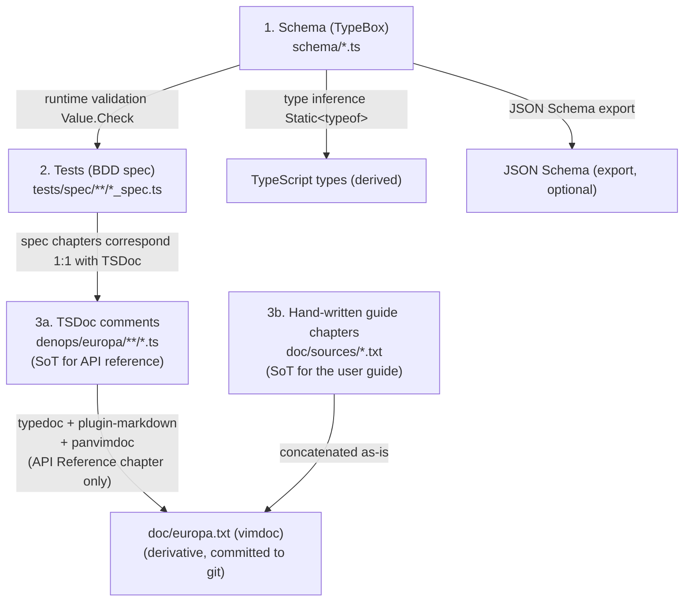

| Rank | SoT type | Location | Derivative | Validation method |
| --- | --- | --- | --- | --- |
| 1 | TypeBox schema | `schema/*.ts` | TS types (inferred), JSON Schema (export optional) | `Value.Check` runtime validation |
| 2 | BDD spec | `tests/spec/**/*_spec.ts` | (CI presents PASS/FAIL) | `deno test` |
| 3a | TSDoc comments (API reference) | `denops/europa/**/*.ts` | API Reference chapter of `doc/europa.txt` | typedoc + panvimdoc + golden file diff |
| 3b | Hand-written guide chapters | `doc/sources/*.txt` (vim help format) | First half of `doc/europa.txt` (Introduction ~ FAQ) | golden file diff |

#### Six Principles

1. Do not hand-write data types. Data types for persistence, wire, RenderPlan, etc. are inferred from TypeBox schemas via `Static<typeof Schema>`. Behavioral contracts such as `KernelClient`, `CellMarker`, and `Dispatcher` cannot be expressed in TypeBox, so they are consolidated under `contracts/*.ts`. Defining new `interface` or `type X = ...` outside of these places will trigger a lint warning. Exceptions are only allowed via a whitelist.
2. Tests serve as the specification. BDD spec and TSDoc chapters correspond via `@spec-id`. Heading-name matching is prone to false positives, so it is not used. Write a comment like `@spec-id europa.notebook.parse.normalize` on the spec side and embed the same ID in the corresponding TSDoc. The correspondence is mechanically verified in CI. Implementation does not start for specs that do not have tests.
3. Comments should only contain why and the API specification. TSDoc tags such as `@param`, `@returns`, `@example`, and `@throws` are kept as the SoT for the API specification. Other in-code comments are limited to "why" for complex logic.
4. Hand-written documentation is placed only at the repository root: `README.md`, `DESIGN.md`, `CONTRIBUTING.md`, and the vim help guide chapters under `doc/sources/*.txt`. Hand-written md and txt files outside of these locations are forbidden. The API reference is auto-generated from TSDoc. Denops itself also hand-writes `doc/denops.txt`. We separate the readers into two: a hand-written user-facing guide aligned with vim culture, and an auto-generated developer-facing API from TSDoc.
5. Generated artifacts are committed to git, and CI enforces the diff. Generated artifacts such as `doc/europa.txt` are placed in the repository, and CI runs `deno task gen:vimdoc && git diff --exit-code doc/europa.txt`. PRs whose generated artifacts have drifted are failed.
6. Dependency updates are operated assuming renovate/dependabot. typedoc, typedoc-plugin-markdown, and TypeBox have pinned versions. Minor and patch updates are bundled by groupName for automatic PRs, while majors are reviewed manually. The impact of bumps is detected by golden file tests for generated artifacts.

#### Implementation Policy

- New features are written in the order: schema, tests, then TSDoc-annotated implementation. The reverse order is forbidden.
- Vim help has a two-tier structure. User-facing guide chapters (Introduction, Requirements, Setup, Configuration, Commands, Mappings, Examples, FAQ, About) are hand-written under `doc/sources/*.txt`, while API reference chapters are auto-generated from TSDoc of the corresponding TS modules and concatenated. `@packageDocumentation`, `@module`, and `@category` are used for chapter organization on the API reference side, not for the user guide.
- The generation and validation pipelines are consolidated under `deno task`. `gen:vimdoc`, `test:spec`, `test:golden`, `validate`, and `ci` are bundled in `deno.json` tasks. No manual steps are created.
- The automated PR workflow runs `deno task check` in `.github/workflows/ci.yml`, checking both generated artifact diffs and golden file diffs. When typedoc or panvimdoc bumps change the output, a human approves it as an intentional fixture-update PR.

## 2. Overall Architecture

### 2.1 Three-Layer Structure

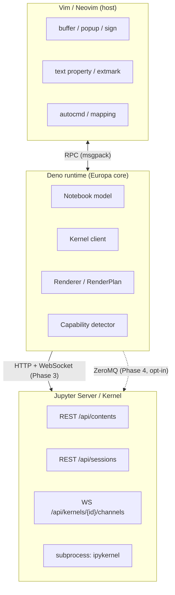

### 2.2 Runtime Requirements

| Layer | Requirement |
| --- | --- |
| Vim | 9.1.1646+ (version supporting text property `text_below`) |
| Neovim | 0.11.3+ |
| Deno | 2.3.0+ |
| Denops | denops.vim itself + `@denops/std` |
| User environment | `jupyter` command (= an implementation containing `jupyter_server` + `ipykernel`) |

From the Deno side, external processes are launched via `Deno.Command("jupyter", ["server", "--no-browser", ...])` or `Deno.Command("jupyter", ["kernel", "--kernel=python3"])`.

### 2.3 Connection Strategy (Plan C = Both supported, phased)

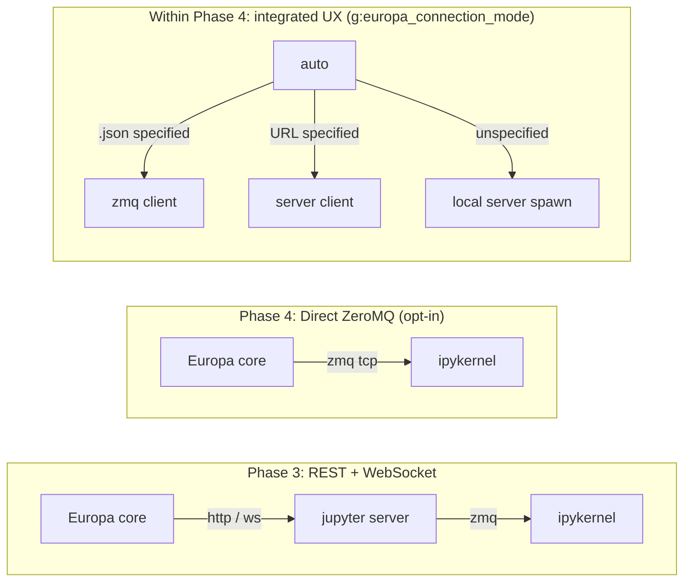

- In Phase 2, no kernel connection is performed; only local `.ipynb` viewing/saving is provided (kernel-related modules are unimplemented).
- Phase 3: Spawn jupyter server at plugin startup (or connect to an existing server). Python dependency is only the user's existing environment.
- Phase 4: Use npm:zeromq (v6) via Deno's Node compatibility. For the use case of "attaching to an existing connection_file". Direct connection to a remote kernel is also possible (be careful with HMAC key handling).
- Within Phase 4: Connection mode is unified into a configurable option (`g:europa_connection_mode = 'server' | 'zmq' | 'auto'`).

## 3. Module Composition

### 3.1 Directory Tree

To match the SoT hierarchy (1 schema, 2 tests, 3 TSDoc), `schema/`, `tests/`, and `scripts/` are placed directly at the top level. This keeps Deno code, tests, and generation scripts equidistant from the schemas, and supports the constraint that types exist only under `schema/` via the physical layout.

```
schema/                        <- SoT 1: TypeBox schema (data types only, inferred via Static<typeof>)
  notebook.ts                  <- nbformat v4 (NotebookSchema, *CellSchema, OutputSchema, MimeBundleSchema)
  message.ts                   <- Jupyter wire protocol (HeaderSchema, ExecuteRequestSchema, ...)
  config.ts                    <- g:europa_* options
  capabilities.ts              <- host / terminal capability
  render-plan.ts               <- RenderPlan intermediate representation
  session.ts                   <- Session, KernelInfo
contracts/                     <- behavioral contracts (interfaces, runtime contracts not expressible in TypeBox)
  kernel-client.ts             <- KernelClient interface (Phase 3)
  cell-marker.ts               <- CellMarker interface (Vim/Neovim abstraction)
  dispatcher.ts                <- Dispatcher interface (supports static P2 / dynamic P3)
  session-runtime.ts           <- SessionRuntime (augmented type of Session + WebSocket?/ZmqClient?)
tests/                         <- SoT 2: BDD spec + golden fixture
  spec/                        <- describe/it format, chapters correspond 1:1 with TSDoc
    notebook/{parse,serialize,cell}_spec.ts
    kernel/{client,server-client,wire}_spec.ts
    render/{builder,dispatcher,text,markdown,json,html,image,ansi}_spec.ts
    view/{cell-marker,viewer,popup,highlight}_spec.ts
    session/{state,events}_spec.ts
  golden/                      <- expected-value fixtures (.ipynb only)
    ipynb/                     <- official .ipynb samples + in-house fixtures
      hello.ipynb
      multi-line-source.ipynb
      pandas-output.ipynb
      kitty-image.ipynb
  (vimdoc uses doc/europa.txt itself as the expected value via diff check; no separate expected file)
  fixtures/                    <- test helpers
    mock-host.ts               <- Vim/Neovim host mock (mocks the Denops type from denops)
    mock-kernel.ts             <- Jupyter Server mock (including WebSocket)
denops/europa/                 <- SoT 3: TSDoc-annotated implementation
  main.ts                      <- @packageDocumentation: Introduction + Quick Start
  config.ts                    <- @module config: configuration loading
  capabilities.ts              <- @module capabilities: host / terminal detection
  notebook/
    parse.ts                   <- @category Notebook: .ipynb -> Notebook (validated via Value.Check)
    serialize.ts               <- @category Notebook: Notebook -> .ipynb (1-space indent, LF)
    cell.ts                    <- @category Notebook: Cell operations (id assignment, source joining, ...)
  kernel/                      <- (newly created from Phase 3)
    client.ts                  <- @module kernel: KernelClient interface
    server-client.ts           <- @category Kernel: REST + WebSocket implementation
    zmq-client.ts              <- @category Kernel: ZeroMQ implementation (Phase 4)
    server-process.ts          <- @category Kernel: jupyter server process management
    auth.ts                    <- @category Kernel: token / subprotocol
    wire/
      protocol-v1.ts           <- @category Kernel: v1.kernel.websocket.jupyter.org
      protocol-default.ts     <- @category Kernel: default protocol
  render/
    builder.ts                 <- @module render: assembling Notebook -> RenderPlan
    dispatcher.ts              <- @category Render: MIME -> renderer dispatch
    text.ts                    <- @category Render: text/plain, stream, error
    markdown.ts                <- @category Render: text/markdown
    json.ts                    <- @category Render: application/json
    html.ts                    <- @category Render: text/html (tag stripping)
    image.ts                   <- @category Render: images (Sixel/Kitty/Placeholder)
    ansi.ts                    <- @category Render: ANSI escape -> hl_group conversion
  view/
    cell-marker.ts             <- @module view: cell boundary interface
    cell-marker-vim.ts         <- @category View: text property implementation
    cell-marker-nvim.ts        <- @category View: extmark implementation
    viewer.ts                  <- @category View: viewer buffer (modifiable=false)
    popup.ts                   <- @category View: @denops/std/popup wrapper
    highlight.ts               <- @category View: hl group definitions (Europa* prefix)
  session/
    state.ts                   <- @module session: SessionState management
    events.ts                  <- @category Session: autocmd / mapping handlers
plugin/
  europa.vim                   <- init notify on User DenopsPluginPost:europa
  commands.vim                 <- :Europa* (TSDoc consolidated under main.ts as @category Commands)
  mappings.vim                 <- <Plug>(europa-*) (TSDoc consolidated under main.ts as @category Mappings)
autoload/
  europa.vim                   <- helper functions (via denops#request)
ftdetect/
  ipynb.vim                    <- *.ipynb -> filetype=europa
syntax/
  europa.vim                   <- cell boundary syntax (auxiliary)
doc/
  europa.txt                   <- final vimdoc (generated artifact, committed to git, diff enforced in CI)
  sources/                     <- SoT 3b: hand-written sources for user-facing guide chapters (vim help format .txt)
    01-introduction.txt        <- overview, use cases
    02-requirements.txt        <- Vim/Neovim/Deno/jupyter requirements
    03-setup.txt               <- installation steps
    04-configuration.txt       <- g:europa_* settings
    05-commands.txt            <- :Europa* command list
    06-mappings.txt            <- <Plug>(europa-*) mappings
    07-examples.txt            <- a series of usage examples
    08-faq.txt                 <- frequently asked questions
    99-about.txt               <- License / Credits
scripts/                       <- generation pipeline
  gen-vimdoc.ts                <- deno script integrating typedoc + concat-md + panvimdoc
  gen-schema-json.ts           <- TypeBox -> JSON Schema export (optional, generated as needed)
  validate-fixtures.ts         <- validates that tests/golden/ipynb/* conforms to schema/notebook.ts
  concat-md.ts                 <- formats chapter order of typedoc-output *.md
.github/workflows/
  ci.yml                       <- deno test + gen:vimdoc diff + golden file consistency
deno.json                      <- tasks + imports (denops, typebox, std, npm:typedoc)
deno.lock                      <- dependency lock (subject to renovate)
tsconfig.json                  <- for typedoc (compilerOptions only, Deno itself ignores it)
typedoc.json                   <- typedoc settings (entryPoints, plugin)
panvimdoc.config               <- panvimdoc settings (toc, doc-mapping, vim-version)
renovate.json                  <- renovate config (groupName, automerge rules)
.gitignore
README.md                      <- entry point, link list
DESIGN.md                      <- SoT for the design (this file)
CONTRIBUTING.md                <- development participation guide (including deno task list)
```

#### Layout Principles

1. schema/ at the top level: equidistant from Deno code / tests / generation scripts. Do not place under `denops/europa/`.
2. Type definitions exist only under schema/: `denops/europa/**/*.ts` must not export types (forbidden via lint).
3. Markdown only at the repository root (3 files): `README.md` / `DESIGN.md` / `CONTRIBUTING.md`.
4. Commit `doc/europa.txt` to git: although a generated artifact, it is committed so diff review is possible in PRs. Do not place in `.gitignore`.
5. `tests/golden/` is treated close to SoT: when generated artifacts change due to typedoc/panvimdoc/TypeBox bumps, create a fixture-update PR for human approval.

### 3.2 Per-Phase Implementation Map

This organizes how far each module needs to go in Phase 2 (MVP / viewing) / 2 (execution + editing) / 3 (ZMQ + extended MIME) / 4 (widgets).

Legend:
- `O` = initial implementation in that Phase
- `+ ...` = feature addition/extension in that Phase
- blank = not touched in that Phase

#### schema/ (SoT 1)

| File | P2 (MVP) | P3 (execute) | P4 (extension) | P5 (widgets) |
| --- | --- | --- | --- | --- |
| `notebook.ts` | O (nbformat v4 TypeBox) | | | + widget types |
| `message.ts` | | O (Jupyter wire protocol) | | + comm |
| `config.ts` | O | + kernel-related | + zmq-related | |
| `capabilities.ts` | O | | | |
| `render-plan.ts` | O | | | |
| `session.ts` | O (viewer-only) | + kernel | + zmq attach | + comm |

#### tests/spec/ (SoT 2)

| File | P2 | P3 | P4 | P5 |
| --- | --- | --- | --- | --- |
| `notebook/*_spec.ts` | O | + edit ops | | |
| `kernel/*_spec.ts` | | O | + zmq | + comm |
| `render/*_spec.ts` | O (static) | + dynamic update | + Sixel->Kitty switching | |
| `view/*_spec.ts` | O | + writable | | |
| `session/*_spec.ts` | O | + kernel binding | | |

#### tests/golden/ + tests/fixtures/

| File | P2 | P3 | P4 | P5 |
| --- | --- | --- | --- | --- |
| `golden/ipynb/*.ipynb` | O (official + in-house) | + executed | | + widget |
| `fixtures/mock-host.ts` | O | + writable mode | | |
| `fixtures/mock-kernel.ts` | | O (WebSocket mock) | + ZMQ mock | + comm |

#### scripts/

| File | P2 | P3 | P4 | P5 |
| --- | --- | --- | --- | --- |
| `gen-vimdoc.ts` | O (typedoc + concat-md + panvimdoc) | | | |
| `gen-schema-json.ts` | O (optional export) | | | |
| `validate-fixtures.ts` | O (validates ipynb fixtures conform to schema/notebook.ts) | | | |
| `concat-md.ts` | O (formats chapter order of typedoc-output *.md) | | | |

#### infra (deno.json, tsconfig.json, typedoc.json, panvimdoc.config, renovate.json, .github/workflows/)

| File | P2 | P3 | P4 | P5 |
| --- | --- | --- | --- | --- |
| `deno.json` | O (tasks + imports) | + kernel deps | + zmq deps | |
| `deno.lock` | O | + bump | + bump | |
| `tsconfig.json` | O (compilerOptions for typedoc) | | | |
| `typedoc.json` | O (entryPoints + plugin-markdown) | + chapter additions | | |
| `panvimdoc.config` | O | | | |
| `renovate.json` | O (groupName + automerge rules) | | | |
| `.github/workflows/ci.yml` | O (test + gen:vimdoc diff check) | + integration test | | |

#### Root

| File | P2 (MVP) | P3 (execute) | P4 (extension) | P5 (widgets) |
| --- | --- | --- | --- | --- |
| `main.ts` | O (init / open / dispatcher) | + execute / kernel ops | + attach (zmq) | + comm |
| `config.ts` | O (basic options) | + kernel-related | + zmq-related | |
| `capabilities.ts` | O (host / terminal / version) | | | |

#### denops/europa/notebook/ (implementation, with TSDoc)

| File | P2 | P3 | P4 | P5 |
| --- | --- | --- | --- | --- |
| `parse.ts` | O (schema validation via `Value.Check(NotebookSchema, ...)`) | | | |
| `serialize.ts` | O | | | |
| `cell.ts` | id assignment / source joining | + insert / delete / move / split / join | | |

(Types are imported from `schema/notebook.ts`. Hand-written `interface` is forbidden.)

#### kernel/

| File | P2 | P3 | P4 | P5 |
| --- | --- | --- | --- | --- |
| `client.ts` | | O (interface) | | |
| `server-client.ts` | | O (REST + WebSocket) | | |
| `zmq-client.ts` | | | O (ZeroMQ) | |
| `server-process.ts` | | O (jupyter server spawn) | | |
| `auth.ts` | | O (token / subprotocol) | | |
| `wire/protocol-v1.ts` | | O (offset table, imports `schema/message.ts`) | | |
| `wire/protocol-default.ts` | | O (text JSON, imports `schema/message.ts`) | | |

#### render/

| File | P2 | P3 | P4 | P5 |
| --- | --- | --- | --- | --- |
| `builder.ts` | O (assembling Notebook -> RenderPlan) | + dynamic updates | | + comm |
| `dispatcher.ts` | O (static) | + dynamic updates (iopub batch) | | + comm |
| `text.ts` | O (text/plain, stream, error) | + ANSI color | | |
| `markdown.ts` | basic (heading colors only) | + inline rendering | | |
| `json.ts` | O (pretty + treesitter) | | | |
| `html.ts` | O (tag strip) | | + pandoc / w3m | |
| `image.ts` | O (Sixel) | + Kitty Unicode Placeholder | + image.nvim / snacks integration / iTerm2 | |
| `ansi.ts` | strip only | + full color -> hl_group | | |

#### view/

| File | P2 | P3 | P4 | P5 |
| --- | --- | --- | --- | --- |
| `cell-marker.ts` | O (interface) | | | |
| `cell-marker-vim.ts` | O (text property) | | | |
| `cell-marker-nvim.ts` | O (extmark) | | | |
| `viewer.ts` | viewer (read-only) | + writable mode | | |
| `popup.ts` | O (denops_std/popup wrapper) | | | |
| `highlight.ts` | O (hl group definitions) | | | |

#### session/

| File | P2 | P3 | P4 | P5 |
| --- | --- | --- | --- | --- |
| `state.ts` | viewer-only | + kernel binding | + zmq attach | + comm |
| `events.ts` | BufReadCmd / BufWriteCmd | + execute commands | | |

#### plugin / autoload / others

| File | P2 | P3 | P4 | P5 |
| --- | --- | --- | --- | --- |
| `plugin/europa.vim` | O | | | |
| `plugin/commands.vim` | view commands | + exec commands | + attach | + widgets |
| `plugin/mappings.vim` | O (`<Plug>(europa-*)` definitions) | + run-cell | | |
| `autoload/europa.vim` | O (helper functions) | | | |
| `ftdetect/ipynb.vim` | O | | | |
| `syntax/europa.vim` | basic (cell separators) | | | |
| `doc/europa.txt` | O | + execution | + ZMQ | + widgets |

### 3.3 Minimum File Set for the Phase 2 MVP

Files are organized to align with the SoT hierarchy (1 schema / 2 tests / 3 TSDoc).

#### SoT 1: Schema (5 files)

```
schema/{notebook,capabilities,config,render-plan,session}.ts
```
(`schema/message.ts` is added in Phase 3)

#### SoT 2: Tests (about 25 specs + golden + fixtures)

```
tests/
  spec/
    notebook/{parse,serialize,cell}_spec.ts
    render/{builder,dispatcher,text,markdown,json,html,image,ansi}_spec.ts
    view/{cell-marker,cell-marker-vim,cell-marker-nvim,viewer,popup,highlight}_spec.ts
    session/{state,events}_spec.ts
    capabilities_spec.ts
    config_spec.ts
  golden/
    ipynb/*.ipynb              (official samples + in-house fixtures, 5-10 files)
    (vimdoc diffs against doc/europa.txt itself as the expected value, so no separate expected file)
  fixtures/
    mock-host.ts
```

#### SoT 3: TSDoc-annotated implementation (22 files)

```
denops/europa/
  main.ts                                  (@packageDocumentation)
  config.ts capabilities.ts                (@module config / capabilities)
  notebook/{parse,serialize,cell}.ts
  render/{builder,dispatcher,text,markdown,json,html,image,ansi}.ts
  view/{cell-marker,cell-marker-vim,cell-marker-nvim,viewer,popup,highlight}.ts
  session/{state,events}.ts
plugin/{europa,commands,mappings}.vim
autoload/europa.vim
ftdetect/ipynb.vim
syntax/europa.vim
```

#### Derivatives + pipeline (12 files)

```
doc/europa.txt                             (generated artifact, committed to git)
scripts/{gen-vimdoc,concat-md,validate-fixtures,gen-schema-json}.ts
deno.json deno.lock tsconfig.json typedoc.json panvimdoc.config renovate.json
.github/workflows/ci.yml
```

#### Not built in Phase 2 (first appears in Phase 3 or later)

- Everything under `denops/europa/kernel/` (7 files in Phase 3)
- `schema/message.ts` (Phase 3)
- `tests/spec/kernel/` (Phase 3)
- `tests/fixtures/mock-kernel.ts` (Phase 3)
- `denops/europa/kernel/zmq-client.ts` (Phase 4)

### 3.4 Implementation Order Within Phase 2 (SoT-driven)

Each functional block proceeds in the order: "write the schema -> write the BDD spec (failing) -> write the implementation (make it PASS) -> regenerate vimdoc". The reverse order is forbidden.

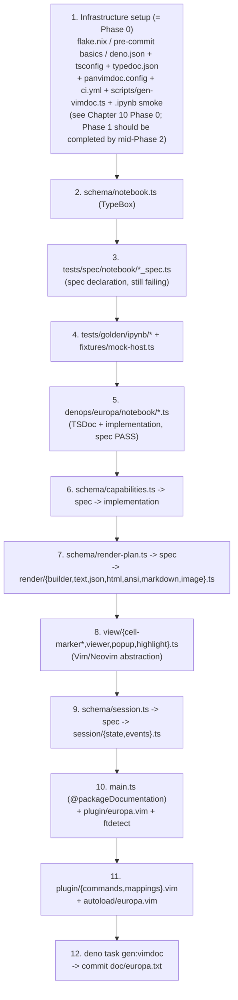

SoT operations and completion criteria of each step:

| Step | SoT operation | Completion criteria (= "what works at this point") |
| --- | --- | --- |
| 1 | (infrastructure only; assumes Phase 0 is complete; Phase 1 is to be completed by mid-Phase 2) | `nix develop` boots the environment, `deno task check` PASSes empty, `.ipynb` smoke works, `deno task gen:vimdoc` generates an empty vimdoc, `git diff --exit-code doc/europa.txt` PASSes |
| 2 | add schema/notebook.ts | TypeBox schema can infer types like `Static<typeof CodeCellSchema>`; JSON Schema can be exported via `gen-schema-json.ts` |
| 3 | add tests/spec/notebook/ | `deno test` has 5-10 specs that "fail because of unimplemented" (Test-First) |
| 4 | add tests/golden/ipynb/ | Express the parse/serialize round-trip diff-0 expectation for official Jupyter samples in spec |
| 5 | implement notebook/ | spec PASSes, round-trip on golden files holds |
| 6 | capabilities.ts | host (vim/nvim) and terminal protocol can be detected |
| 7 | implement render/ | RenderPlan can be assembled; stream/error/json/markdown are produced |
| 8 | implement view/ | RenderPlan can be reflected to the Vim/Neovim buffer (the first running thing in the MVP) |
| 9 | implement session/ | bufnr <-> notebook <-> kernel relationship can be managed (in Phase 2, kernel = none) |
| 10 | main.ts + plugin entry | `:edit foo.ipynb` opens a Notebook; `@packageDocumentation` is picked up by typedoc |
| 11 | commands + mappings | `:Europa*` commands work |
| 12 | vimdoc generation | `:help europa` works; CI PASSes via `git diff --exit-code doc/europa.txt` |

The shortest path for the MVP is up to step 8 (= "open `.ipynb` and see cell structure with text outputs + simple markdown"). Rich MIMEs (image, full markdown rendering) and session management (9) are gradual additions.

### 3.5 SoT Pipeline (deno task)

Europa.vim's generation/validation pipelines are all consolidated under `tasks` in `deno.json`. No manual steps are created. CI and pre-commit hooks just call `deno task check`.

#### deno task list

| task name | content | input | output |
| --- | --- | --- | --- |
| `gen:types` | Export JSON Schema from TypeBox schemas (optional) | `schema/*.ts` | `tmp/schema/*.json` |
| `gen:vimdoc` | Run typedoc -> concat-md -> panvimdoc as an integrated step | TSDoc comments | `doc/europa.txt` |
| `test:spec` | Run BDD specs | `tests/spec/**/*_spec.ts` | PASS / FAIL |
| `test:golden` | Golden file consistency check (ipynb round-trip + `doc/europa.txt` diff) | `tests/golden/ipynb/*` + `doc/europa.txt` | PASS / FAIL |
| `test:fixtures` | Validate that `tests/golden/ipynb/*` conforms to `schema/notebook.ts` | `tests/golden/ipynb/*` | PASS / FAIL |
| `test:conformance` (Phase 3+) | Start a real Jupyter Server and validate wire-protocol conformance | `tests/conformance/**/*` | PASS / FAIL |
| `validate` | Full schema consistency check (cyclic references, undefined references) | `schema/*.ts` | PASS / FAIL |
| `lint` | `deno lint` + the rule "types only exist under schema/" + the rule "comments are only why" | `**/*.ts` | PASS / FAIL |
| `fmt:check` | `deno fmt --check` | `**/*.ts` | PASS / FAIL |
| `ci` | Run all of the above sequentially + `git diff --exit-code doc/europa.txt` | (everything) | PASS / FAIL |

#### Anticipated `deno.json` (excerpt)

```jsonc
{
  "tasks": {
    "gen:types":     "deno run -A scripts/gen-schema-json.ts",
    "gen:vimdoc":    "deno run -A scripts/gen-vimdoc.ts",
    "test:spec":         "deno test -A tests/spec/",
    "test:golden":       "deno test -A tests/spec/ --filter 'golden'",
    "test:fixtures":     "deno run -A scripts/validate-fixtures.ts",
    "test:conformance":  "deno test -A tests/conformance/",
    "validate":      "deno check schema/ && deno run -A scripts/validate-schema.ts",
    "lint":          "deno lint && deno run -A scripts/lint-no-handwritten-types.ts",
    "fmt:check":     "deno fmt --check",
    "ci": "deno task fmt:check && deno task lint && deno task validate && deno task gen:vimdoc && deno task test:fixtures && deno task test:spec && deno task test:golden && git diff --exit-code doc/europa.txt"
  },
  "imports": {
    // Dependencies are exact-pinned (no caret). Assumes renovate creates fully automatic PRs including minor/patch.
    "@sinclair/typebox":         "npm:@sinclair/typebox@0.34.0",
    "@denops/std":               "jsr:@denops/std@7.6.0",
    "@std/assert":               "jsr:@std/assert@1.0.0",
    "@std/testing/bdd":          "jsr:@std/testing@1.0.0/bdd",
    "typedoc":                   "npm:typedoc@0.27.0",
    "typedoc-plugin-markdown":   "npm:typedoc-plugin-markdown@4.4.0"
  },
  "nodeModulesDir": "auto"
}
```

#### Flow of `scripts/gen-vimdoc.ts`

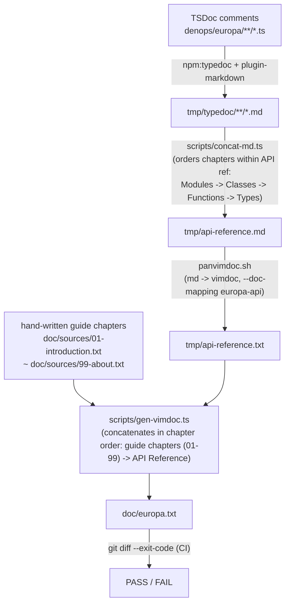

#### CI workflow (key points of `.github/workflows/ci.yml`)

```yaml
name: CI
on: [push, pull_request]
jobs:
  ci:
    runs-on: ubuntu-latest
    steps:
      - uses: actions/checkout@v4
      - uses: denoland/setup-deno@v2
        with:
          deno-version: "2.x"
      - name: Install pandoc (for panvimdoc)
        run: sudo apt-get install -y pandoc
      - name: Cache deno deps
        uses: actions/cache@v4
        with:
          path: ~/.deno
          key: ${{ runner.os }}-deno-${{ hashFiles('deno.lock') }}
      - run: deno task check
```

#### Coordination with renovate / dependabot

When a bot PR for dependency updates arrives:

1. CI runs `deno task check`
2. `deno task gen:vimdoc` generates a fresh `doc/europa.txt`
3. If a diff appears in the generated artifact, `git diff --exit-code` fails
4. The PR becomes unmergeable
5. Branching action:
   - bump is non-breaking (output format unchanged) -> renovate's post-upgrade hook regenerates `doc/europa.txt` and auto-commits
   - bump is breaking -> human approves it as a fixture-update PR (updates `tests/golden/vimdoc/europa.txt.expected`)

Example post-upgrade hook in `renovate.json`:

```json
{
  "postUpgradeTasks": {
    "commands": ["deno task gen:vimdoc"],
    "fileFilters": ["doc/europa.txt"],
    "executionMode": "branch"
  },
  "packageRules": [
    {
      "groupName": "vimdoc-toolchain",
      "matchPackageNames": ["typedoc", "typedoc-plugin-markdown", "@sinclair/typebox"],
      "matchUpdateTypes": ["minor", "patch"],
      "automerge": false
    },
    {
      "groupName": "vimdoc-toolchain-major",
      "matchPackageNames": ["typedoc", "typedoc-plugin-markdown"],
      "matchUpdateTypes": ["major"],
      "automerge": false,
      "addLabels": ["needs-manual-review"]
    }
  ]
}
```

#### Lint rule (in-house)

`scripts/lint-no-handwritten-types.ts` detects the following:

1. `interface` or `type X = ...` (not derived from TypeBox) being exported under `denops/europa/**/*.ts`
2. Non-TSDoc comments (`//` `/* */`) of 3 or more consecutive lines must contain "why" (not empty, not starting with `@`)
3. Additions under the `docs/` directory (the existence of the `docs/` directory itself is also forbidden). Hand-written vim help is allowed only under `doc/sources/*.txt`.

These are failed via lint, and CI stops the build. In other words, "design principles can be enforced mechanically" is the essence of SoT design.

### 3.6 Responsibilities of Each Module

This section is a high-level overview of module responsibilities. Detailed specifications of each module (function `@param` / `@returns` / `@example`, etc.) reside in the corresponding TSDoc as the SoT and are referenced from `doc/europa.txt`. To avoid duplicate management, details are not redescribed here.

#### SoT 1: schema/

| Module | Responsibility | Main exports | Dependencies | Corresponding spec |
| --- | --- | --- | --- | --- |
| `notebook.ts` | nbformat v4 schema | `NotebookSchema`, `*CellSchema`, `OutputSchema`, `MimeBundleSchema` | `@sinclair/typebox` | (indirectly validated at usage sites) |
| `session.ts` | Session/Kernel state schema | `SessionSchema`, `KernelInfoSchema`, `KernelStateSchema` | `notebook.ts` | (at usage sites) |
| `render-plan.ts` | RenderPlan intermediate-representation schema | `RenderPlanSchema`, `HighlightSchema`, `VirtTextSchema`, `ImagePlacementSchema`, `ClickableSchema` | `@sinclair/typebox` | (at usage sites) |
| `config.ts` | `g:europa_*` options schema | `EuropaConfigSchema` | `@sinclair/typebox` | `tests/spec/config_spec.ts` |
| `capabilities.ts` | host/terminal capability schema | `CapabilitiesSchema`, `ImageProtocolSchema`, `HostKindSchema` | `@sinclair/typebox` | `tests/spec/capabilities_spec.ts` |
| `message.ts` (P3) | Jupyter wire protocol schema | `KernelMessageSchema`, `HeaderSchema`, `ExecuteRequestSchema`, ... | `@sinclair/typebox` | `tests/spec/kernel/wire_spec.ts` |

Notes:
- All are schema definitions only. Logic / I/O is forbidden (rejected by lint).
- TSDoc is not attached to `*Schema` (write it in the TSDoc of the consuming function).
- Each `*Schema` exports a corresponding `Static<typeof>` type as well.

#### SoT 3: denops/europa/ (root)

| Module | Responsibility | Main exports | Dependencies | TSDoc tags |
| --- | --- | --- | --- | --- |
| `main.ts` | Plugin entry point + dispatcher definition + Introduction/Quick Start documented in `@packageDocumentation` | `main(denops)`, dispatcher record | `@denops/std`, facade of each module | `@packageDocumentation` |
| `config.ts` | Loading `g:europa_*` and constructing Config. Configuration chapter cover | `loadConfig(denops)` | `@denops/std/variable`, `schema/config.ts` | `@module config` |
| `capabilities.ts` | Detection of host (vim/nvim) and terminal protocol. DA1 query timeout fallback | `detectCapabilities(denops)` | `@denops/std`, `schema/capabilities.ts` | `@module capabilities` |

#### SoT 3: denops/europa/notebook/

| Module | Responsibility | Main exports | Dependencies | TSDoc tags |
| --- | --- | --- | --- | --- |
| `parse.ts` | `.ipynb` string -> Notebook (normalization + `Value.Check`) | `parseNotebook(content)` | `schema/notebook.ts`, `@sinclair/typebox/value` | `@category Notebook` |
| `serialize.ts` | Notebook -> `.ipynb` string (1-space indent, LF, trailing LF) | `serializeNotebook(nb)` | `schema/notebook.ts` | `@category Notebook` |
| `cell.ts` | Cell operations (id assignment, source joining / insert/delete/move/split/join in Phase 3) | `assignCellId`, `joinSource`, ... | `schema/notebook.ts` | `@category Notebook` |

Notes:
- `parse.ts` requires TypeBox validation. If `Value.Check(NotebookSchema, normalized)` is false, throw `NotebookParseError`.
- Phase 2 exports of `cell.ts` are only `assignCellId` and `joinSource`. Editing operations are in Phase 3.

#### SoT 3: denops/europa/kernel/ (Phase 3 onward)

| Module | Responsibility | Main exports | Dependencies | TSDoc tags |
| --- | --- | --- | --- | --- |
| `client.ts` | KernelClient interface definition (exception for runtime-object augmented type) | `KernelClient` interface | `schema/message.ts`, `schema/session.ts` | `@module kernel` |
| `server-client.ts` | REST + WebSocket implementation | `ServerKernelClient` class | `client.ts`, `wire/`, `auth.ts` | `@category Kernel` |
| `zmq-client.ts` (P4) | Direct ZeroMQ implementation | `ZmqKernelClient` class | `client.ts`, `wire/`, `npm:zeromq` | `@category Kernel` |
| `server-process.ts` | Spawn / liveness management of `jupyter server` (reliable kill via SIGTERM) | `spawnJupyterServer`, `shutdownJupyterServer` | `Deno.Command` | `@category Kernel` |
| `auth.ts` | Token management / WebSocket subprotocol construction | `buildSubprotocols(token)`, `buildAuthHeader(token)` | `schema/config.ts` | `@category Kernel` |
| `wire/protocol-v1.ts` | encode/decode for `v1.kernel.websocket.jupyter.org` | `encodeV1`, `decodeV1` | `schema/message.ts` | `@category Kernel` |
| `wire/protocol-default.ts` | encode/decode for the default protocol (text JSON) | `encodeDefault`, `decodeDefault` | `schema/message.ts` | `@category Kernel` |

Notes:
- The `KernelClient` interface in `client.ts` carries runtime method contracts (e.g., `AsyncIterable<KernelMessage>`), which cannot be expressed in TypeBox; thus it is allowed as an exception in hand-written types.
- `server-process.ts` reliably kills the process on Deno termination via `Deno.addSignalListener("SIGTERM" | "SIGINT", ...)`.

#### SoT 3: denops/europa/render/

| Module | Responsibility | Main exports | Dependencies | TSDoc tags |
| --- | --- | --- | --- | --- |
| `builder.ts` | Assembling Notebook -> RenderPlan | `buildRenderPlan(notebook, capabilities)` | `schema/render-plan.ts`, `dispatcher.ts` | `@module render` |
| `dispatcher.ts` | output -> MIME dispatch, priority selection | `dispatchOutput(output, capabilities)` | each renderer | `@category Render` |
| `text.ts` | Texturing of text/plain, stream, error | `renderText`, `renderStream`, `renderError` | `ansi.ts` | `@category Render` |
| `markdown.ts` | Simple text/markdown rendering (P2: heading colors only; P3: full inline rendering) | `renderMarkdown` | (md parser added in P3) | `@category Render` |
| `json.ts` | application/json pretty print | `renderJson` | (none) | `@category Render` |
| `html.ts` | text/html tag stripping (P4: via pandoc) | `renderHtml` | (none) | `@category Render` |
| `image.ts` | image/* (P2: Sixel; P3: Kitty Unicode Placeholder; P4: image.nvim/iTerm2) | `renderImage` | `capabilities.ts`, ImageMagick subprocess | `@category Render` |
| `ansi.ts` | ANSI escape parsing + hl_group conversion (P2: strip; P3: full color) | `stripAnsi`, `parseAnsi` (P3) | (none) | `@category Render` |

Notes:
- Phase 2 of `dispatcher.ts` is static (single Notebook scan -> RenderPlan). Phase 3 adds dynamic processing (partial updates from iopub batches).
- `image.ts` calls ImageMagick subprocesses (`sips` / `ffmpeg` / `magick` fallbacks), so `Deno.Command` permission is required.

#### SoT 3: denops/europa/view/

| Module | Responsibility | Main exports | Dependencies | TSDoc tags |
| --- | --- | --- | --- | --- |
| `cell-marker.ts` | Vim/Neovim abstraction interface for cell boundaries | `CellMarker` interface, `createCellMarker` factory | `@denops/std` | `@module view` |
| `cell-marker-vim.ts` | Implementation via Vim text properties | `VimCellMarker` class | `cell-marker.ts`, `@denops/std/function/vim` | `@category View` |
| `cell-marker-nvim.ts` | Implementation via Neovim extmarks | `NvimCellMarker` class | `cell-marker.ts`, `@denops/std/function/nvim` | `@category View` |
| `viewer.ts` | Reflecting RenderPlan onto Vim/Neovim buffers (P2: read-only; P3: writable) | `applyRenderPlan(bufnr, plan)` | `cell-marker.ts`, `popup.ts`, `highlight.ts` | `@category View` |
| `popup.ts` | `@denops/std/popup` wrapper for popup/floating windows | `openViewerPopup`, `closePopup` | `@denops/std/popup` | `@category View` |
| `highlight.ts` | hl group definitions (`Europa*` prefix, `hi default link`) | `defineHighlights(denops)` | `@denops/std` | `@category View` |

Notes:
- `cell-marker.ts` is interface only. Implementations are split into separate Vim/Neovim files (the `createCellMarker` factory branches on `denops.meta.host`).
- Phase 2 of `viewer.ts` is a viewer-only buffer with `modifiable=false`.

#### SoT 3: denops/europa/session/

| Module | Responsibility | Main exports | Dependencies | TSDoc tags |
| --- | --- | --- | --- | --- |
| `state.ts` | Manage bufnr <-> notebook <-> kernel correspondence (`SessionRuntime` type) | `SessionStore` class, `SessionRuntime` type | `schema/session.ts` | `@module session` |
| `events.ts` | Vim-side autocmd / mapping handlers | `setupAutocmds(denops)`, `setupMappings(denops)` | `@denops/std/autocmd`, `state.ts` | `@category Session` |

Notes:
- `SessionRuntime` in `state.ts` is `Session` (TypeBox) + `WebSocket?` / `ZmqClient?` augmented (an exceptional hand-written type as described in 4.4).
- Phase 2 of `events.ts` is only `BufReadCmd *.ipynb` / `BufWriteCmd *.ipynb`. Phase 3 adds `:Europa*` commands.

#### plugin/, autoload/, ftdetect/, syntax/

| File | Responsibility | TSDoc consolidation target |
| --- | --- | --- |
| `plugin/europa.vim` | `init` notify on `User DenopsPluginPost:europa` | (Vim script; no TSDoc) |
| `plugin/commands.vim` | `:Europa*` command definitions | `@category Commands` in `denops/europa/main.ts` |
| `plugin/mappings.vim` | `<Plug>(europa-*)` definitions | `@category Mappings` in `denops/europa/main.ts` |
| `autoload/europa.vim` | Helper functions for responding via `denops#request` | (Vim script) |
| `ftdetect/ipynb.vim` | `*.ipynb` -> `filetype=europa` | (Vim script) |
| `syntax/europa.vim` | Cell-boundary syntax (auxiliary, optional) | (Vim script) |

Notes:
- Vim script comments are not included in the vimdoc generation pipeline (Phase 2).
- Mappings / Commands explanations are consolidated in the TSDoc on the TS side (`main.ts`), keeping the SoT in a single place.

#### scripts/ (generation pipeline)

| Script | Responsibility | Input | Output |
| --- | --- | --- | --- |
| `gen-vimdoc.ts` | Generate the API Reference via typedoc -> concat-md -> panvimdoc, then concatenate with `doc/sources/*.txt` (hand-written guide chapters) to produce the final vimdoc | TSDoc + hand-written guide chapters | `doc/europa.txt` |
| `gen-schema-json.ts` | TypeBox -> JSON Schema export | `schema/*.ts` | `tmp/schema/*.json` |
| `concat-md.ts` | Format typedoc-output *.md into the API Reference chapter order (Modules -> Classes -> Functions -> Types) | `tmp/typedoc/**/*.md` | `tmp/api-reference.md` |
| `validate-fixtures.ts` | Validate that `tests/golden/ipynb/*` conforms to `schema/notebook.ts` | fixtures | PASS / FAIL |
| `lint-no-handwritten-types.ts` | In-house lint: "types only exist under schema/" / "comments are only why" | `**/*.ts` | PASS / FAIL |

#### infra (configuration files)

| File | Responsibility |
| --- | --- |
| `deno.json` | tasks + imports + nodeModulesDir (subject to renovate) |
| `deno.lock` | dependency lock (subject to renovate) |
| `tsconfig.json` | compilerOptions for typedoc (Deno's own type-check is not the target) |
| `typedoc.json` | typedoc settings (entryPoints, plugin-markdown options) |
| `panvimdoc.config` | panvimdoc settings (toc, doc-mapping, vim-version) |
| `renovate.json` | renovate config (groupName, automerge, post-upgrade hook) |
| `.github/workflows/ci.yml` | runs `deno task check` |

#### SoT-ness of the responsibility description

What this section's tables can describe is limited to the high-level overview of responsibilities (which file is responsible for what / which spec corresponds / which TSDoc tags to attach). The behavior, arguments, and return values of individual functions are SoT'd in TSDoc, referenced from `doc/europa.txt`. Do not write them in DESIGN.md.

### 3.7 TypeScript Signatures of Major I/Fs

This section is a design-level contract declaration. Detailed specifications (`@param` / `@returns` / `@throws` / `@example`) are SoT'd in TSDoc; here we make explicit "which interfaces / functions / RPCs exist". When implementation begins, these declarations are moved into TS files and TSDoc is attached.

#### 3.7.1 dispatcher RPC (Vim <-> Deno contract)

The RPC exposed via `denops.dispatcher` in `denops/europa/main.ts`:

```typescript
// Arguments are received as unknown and validated internally via TypeBox's Value.Check
export type EuropaDispatcher = {
  init():                                                                   Promise<void>;
  open(path: unknown):                                                      Promise<void>;
  save(bufnr: unknown):                                                     Promise<void>;
  previewOutput(bufnr: unknown, cellIdx: unknown, outputIdx: unknown):      Promise<void>;
  // Phase 3 (editing + execution)
  insertCell(bufnr: unknown, type: unknown, position: unknown):             Promise<void>;
  deleteCell(bufnr: unknown, cellId: unknown):                              Promise<void>;
  moveCell(bufnr: unknown, cellId: unknown, direction: unknown):            Promise<void>;
  splitCell(bufnr: unknown, cellId: unknown, line: unknown):                Promise<void>;
  joinCell(bufnr: unknown, cellId: unknown):                                Promise<void>;
  editCell(bufnr: unknown, cellId: unknown):                                Promise<void>;
  runCell(bufnr: unknown, cellId: unknown):                                 Promise<void>;
  runAll(bufnr: unknown):                                                   Promise<void>;
  startKernel(bufnr: unknown, name: unknown):                               Promise<void>;
  restartKernel(bufnr: unknown):                                            Promise<void>;
  interruptKernel(bufnr: unknown):                                          Promise<void>;
  // Phase 4 (ZMQ attach)
  attachKernel(connectionFile: unknown):                                    Promise<void>;
};
```

How to call:
- Synchronous wait: `let v = denops#request('europa', 'open', ['foo.ipynb'])`
- Asynchronous: `call denops#notify('europa', 'open', ['foo.ipynb'])`

#### 3.7.2 KernelClient interface (Phase 3)

A runtime method contract (TypeBox is not feasible because it includes `AsyncIterable`). An exceptional hand-written interface (see 4.4):

```typescript
import type {
  KernelMessage,
  ExecuteOptions,
  KernelInfoReply,
  CompleteReply,
  InspectReply,
} from "../../schema/message.ts";

export interface KernelClient {
  start(opts: { kernelName: string; cwd?: string }):                       Promise<void>;
  shutdown():                                                              Promise<void>;
  restart():                                                               Promise<void>;
  interrupt():                                                             Promise<void>;
  execute(code: string, opts?: ExecuteOptions):                            AsyncIterable<KernelMessage>;
  kernelInfo():                                                            Promise<KernelInfoReply>;
  complete(code: string, cursorPos: number):                               Promise<CompleteReply>;
  inspect(code: string, cursorPos: number, detail: 0 | 1):                 Promise<InspectReply>;
  onMessage(handler: (msg: KernelMessage) => void):                        () => void;  // unsubscribe
}
```

Implementations:
- `ServerKernelClient` (Phase 3): via REST + WebSocket
- `ZmqKernelClient` (Phase 4): via npm:zeromq

#### 3.7.3 CellMarker interface (Vim/Neovim abstraction)

```typescript
import type { Denops } from "@denops/std";

export type MarkerId = string | number;

export interface CellMarker {
  init(denops: Denops):                                                    Promise<void>;
  setHead(bufnr: number, line: number, label: string):                     Promise<MarkerId>;
  setOutputBoundary(bufnr: number, line: number, label?: string):          Promise<MarkerId>;
  clear(bufnr: number, ids?: MarkerId[]):                                  Promise<void>;
  refresh(bufnr: number):                                                  Promise<void>;
}

// factory: dispatch via denops.meta.host
export function createCellMarker(denops: Denops): CellMarker;
```

#### 3.7.4 SessionStore (`denops/europa/session/state.ts`)

```typescript
import type { Session, KernelInfo } from "../../schema/session.ts";

// SoT (Session) + runtime-object augment (see 4.4)
export type SessionRuntime = Session & {
  kernelRuntime?: {
    info: KernelInfo;
    socket?: WebSocket;        // Phase 3
    zmq?: ZmqClient;           // Phase 4
  };
};

export class SessionStore {
  get(bufnr: number):                                                      SessionRuntime | undefined;
  add(session: SessionRuntime):                                            void;
  update(bufnr: number, patch: Partial<SessionRuntime>):                   void;
  remove(bufnr: number):                                                   void;
  byKernel(kernelId: string):                                              SessionRuntime[];   // many-to-many
  all():                                                                   readonly SessionRuntime[];
}
```

#### 3.7.5 Quick reference of major function signatures

```typescript
// Type imports from schema/*
import type { Notebook, Cell, Output } from "../../schema/notebook.ts";
import type { RenderPlan, ImagePlacement } from "../../schema/render-plan.ts";
import type { Capabilities } from "../../schema/capabilities.ts";
import type { EuropaConfig } from "../../schema/config.ts";

// notebook/
export function parseNotebook(content: string):                            Notebook;            // throws NotebookParseError
export function serializeNotebook(nb: Notebook):                           string;
export function assignCellId():                                            string;              // uuid v4
export function joinSource(source: string | string[]):                     string;

// capabilities.ts
export function detectCapabilities(denops: Denops):                        Promise<Capabilities>;

// config.ts
export function loadConfig(denops: Denops):                                Promise<EuropaConfig>;

// render/
export function buildRenderPlan(nb: Notebook, caps: Capabilities):         RenderPlan;
export function dispatchOutput(output: Output, caps: Capabilities):        RenderFragment;
export function renderText(text: string):                                  RenderFragment;
export function renderStream(name: "stdout" | "stderr", text: string):     RenderFragment;
export function renderError(traceback: string[]):                          RenderFragment;
export function renderJson(value: unknown):                                RenderFragment;
export function renderHtml(html: string):                                  RenderFragment;
export function renderMarkdown(source: string):                            RenderFragment;
export function renderImage(
  data: string,                  // base64
  mime: string,
  caps: Capabilities,
):                                                                         Promise<{ placeholder: string[]; placement?: ImagePlacement }>;
export function stripAnsi(text: string):                                   string;
export function parseAnsi(text: string):                                   ParsedAnsi;          // Phase 3

// view/
export function applyRenderPlan(denops: Denops, bufnr: number, plan: RenderPlan): Promise<void>;
export function defineHighlights(denops: Denops):                          Promise<void>;
export function openViewerPopup(denops: Denops, opts: ViewerOpts):         Promise<number>;
```

`RenderFragment` is an internal type (a component of RenderPlan): `{ lines: string[]; highlights: Highlight[]; virtText: VirtText[]; imagePlacements?: ImagePlacement[]; clickables?: Clickable[] }`.

#### 3.7.6 autoload functions (Vim script side, `autoload/europa.vim`)

```vim
" autoload/europa.vim
function! europa#open(path) abort                                                  " calls denops#notify('europa', 'open', [a:path])
function! europa#save() abort
function! europa#preview_output(cell_idx, output_idx) abort
function! europa#insert_cell(type, position) abort                                 " Phase 3
function! europa#delete_cell() abort                                                " Phase 3
function! europa#run_cell() abort                                                   " Phase 3
function! europa#run_all() abort                                                    " Phase 3
function! europa#start_kernel(name) abort                                           " Phase 3
function! europa#restart_kernel() abort                                             " Phase 3
function! europa#interrupt_kernel() abort                                           " Phase 3
function! europa#attach_kernel(connection_file) abort                               " Phase 4
```

These are called from `:Europa*` commands and `<Plug>(europa-*)`. The list and meanings are consolidated in the `@category Commands` / `@category Mappings` TSDoc in `denops/europa/main.ts`.

#### 3.7.7 Rules when changing contracts

- When changing a function signature, TSDoc must also be updated in the same PR. CI-based static consistency check is not yet in place in Phase 2, so it is covered by human review.
- When adding a new dispatcher RPC, update Section 3.7.1's table, the TSDoc in `main.ts`, `autoload`, and `plugin/commands.vim` together in a single PR.
- The correspondence between TypeBox schemas and TS interfaces is verified by `tests/spec/contract_spec.ts` (e.g., `Static<typeof NotebookSchema>` matches the return type of `parseNotebook`).

### 3.8 Module Dependency Graph

#### 3.8.1 Principles of dependency direction

1. The lower layer does not know the upper layer: schema does not know notebook, notebook does not know render.
2. Dependencies within the same layer are minimized: e.g., `notebook/parse.ts` does not depend on `notebook/serialize.ts`.
3. schema/* has zero dependencies (only `@sinclair/typebox`).
4. plugin (Vim script) depends on denops/europa/* but not the other way around.
5. tests/ depends on schema/ + denops/europa/* but not the other way around (the implementation does not know the tests).
6. scripts/ depends on schema/ + denops/europa/* but not the other way around (the generators read the implementation, but the implementation does not know the generators).

#### 3.8.2 Layer structure of Phase 2

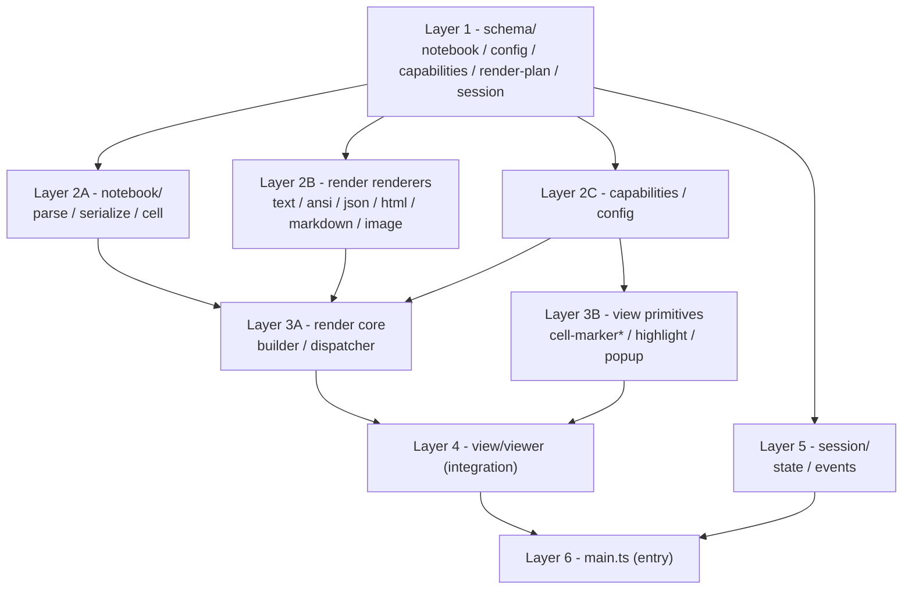

#### 3.8.3 Layers added in Phase 3 (delta)

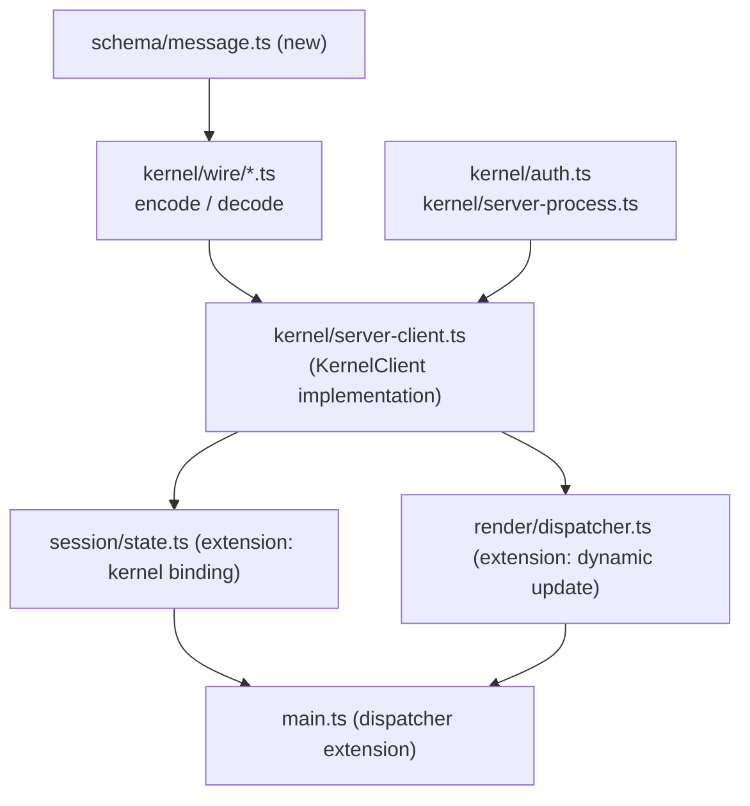

#### 3.8.4 Mechanisms to prevent circular references

| Mechanism | Detection target | Timing |
| --- | --- | --- |
| `deno check` | TypeScript compile-time circular import warnings | `deno task validate` |
| `scripts/validate-schema.ts` | Whether schema-to-schema references contain cycles | `deno task validate` |
| `scripts/lint-no-handwritten-types.ts` | "Do not write types outside of schema" (detects cross-layer type leakage) | `deno task lint` |
| layer convention (PR review) | Imports in directions not listed in 3.8.5's table | Human review |

#### 3.8.5 Dependency direction matrix

Cells with "OK" indicate permitted dependency directions. Blank means forbidden.

| down from / right to | schema | notebook | renderers | caps/config | render core | view primitives | viewer | session | main |
| --- | :---: | :---: | :---: | :---: | :---: | :---: | :---: | :---: | :---: |
| **schema** | - | | | | | | | | |
| **notebook** | OK | - | | | | | | | |
| **renderers** | OK | | - | | | | | | |
| **caps/config** | OK | | | - | | | | | |
| **render core** | OK | OK | OK | OK | - | | | | |
| **view primitives** | OK | | | OK | | - | | | |
| **viewer** | OK | | | OK | OK | OK | - | | |
| **session** | OK | OK | | | | | OK | - | |
| **main** | OK | OK | | OK | OK | OK | OK | OK | - |

For example, importing `view/viewer.ts` from `notebook/parse.ts` is NG (the notebook row x viewer column is blank). Conversely, importing `notebook/*` from `view/viewer.ts` is valid as a dependency direction, but design-wise it should go through render core (avoid touching notebook directly).

#### 3.8.6 Correspondence with the SoT hierarchy

The dependency graph in 3.8 is consistent with the SoT hierarchy in 1.3:

| SoT layer | Corresponding Layer |
| --- | --- |
| SoT 1 (schema) | Layer 1 (schema/) |
| SoT 2 (tests) | (cross-layer, depends on every implementation) |
| SoT 3 (TSDoc-annotated implementation) | Layer 2-6 |
| Derivative (vimdoc) | (scripts/gen-vimdoc.ts that reads the entire layer set) |

The relationship "an upper SoT generates the lower derivative" and the relationship "an upper Layer depends on a lower Layer" point in the same direction (SoT on top, dependency target below).

### 3.9 Test Composition (SoT 2)

#### 3.9.1 Four test tiers

| Tier | Purpose | Framework | Location |
| --- | --- | --- | --- |
| **Unit (BDD spec)** | Behavior of public functions of each module | `@std/testing/bdd` + `@std/assert` | `tests/spec/**/*_spec.ts` |
| **Schema validation** | Correspondence between schema and implementation | TypeBox `Value.Check` | `tests/spec/contract_spec.ts` |
| **Golden file** | `.ipynb` round-trip + vimdoc generated artifacts | diff check | `tests/golden/**/*` + `*_golden_spec.ts` |
| **Conformance** (P3+) | Conformance to Jupyter wire protocol | Real Jupyter server boot | `tests/conformance/` |

#### 3.9.2 BDD spec conventions

Each spec file is structured into chapters via `describe` / `it`, corresponding 1:1 with TSDoc chapters (this is the essence of SoT 2).

```typescript
// tests/spec/notebook/parse_spec.ts
import { describe, it } from "@std/testing/bdd";
import { assertEquals, assertThrows } from "@std/assert";
import { parseNotebook } from "../../../denops/europa/notebook/parse.ts";
import { Value } from "@sinclair/typebox/value";
import { NotebookSchema } from "../../../schema/notebook.ts";

describe("notebook/parse", () => {
  describe("Source normalization", () => {
    // Corresponds to: "Source normalization" chapter in TSDoc of denops/europa/notebook/parse.ts
    it("connects multi-line source array into single string", async () => {
      const content = await Deno.readTextFile(
        "tests/golden/ipynb/multi-line-source.ipynb",
      );
      const result = parseNotebook(content);
      assertEquals(result.cells[0].source, "import os\nprint('hi')\n");
    });
  });

  describe("Cell ID assignment (nbformat 4.5+)", () => {
    it("auto-assigns missing cell.id (uuid v4)",   () => { /* ... */ });
    it("preserves existing cell.id",               () => { /* ... */ });
    it("rejects invalid cell.id pattern",          () => { /* ... */ });
  });

  describe("Schema validation", () => {
    it("throws NotebookParseError on invalid nbformat", () => {
      assertThrows(() => parseNotebook("{}"), NotebookParseError);
    });
    it("passes Value.Check(NotebookSchema, ...) on valid input", () => {
      const nb = parseNotebook(validContent);
      assertEquals(Value.Check(NotebookSchema, nb), true);
    });
  });
});
```

Conventions:
- Filename: `<module>_spec.ts` (Ruby/RSpec style)
- Top-level `describe` label: module name (`notebook/parse`)
- Second-tier `describe`: exact match with TSDoc chapter name (corresponds to typedoc-output md headings)
- `it`: a single behavior only, AAA (Arrange-Act-Assert) pattern

#### 3.9.3 Golden file tests (`.ipynb` round-trip + vimdoc)

```typescript
// tests/spec/notebook/golden_spec.ts
import { describe, it } from "@std/testing/bdd";
import { assertEquals } from "@std/assert";
import {
  parseNotebook,
  serializeNotebook,
} from "../../../denops/europa/notebook/...";

const goldenIpynbDir = new URL("../../golden/ipynb/", import.meta.url);

// Verify semantic equivalence (structural match after canonicalization), not byte-equality.
// Because the canonicalization at parse time (source[]->string concatenation / cell.id completion / nbformat_minor promotion)
// makes byte-equal with the original file impossible.
describe("golden:notebook/canonicalize-roundtrip", () => {
  for await (const entry of Deno.readDir(goldenIpynbDir)) {
    if (!entry.name.endsWith(".ipynb")) continue;
    it(`semantically equivalent after round-trip: ${entry.name}`, async () => {
      const original = await Deno.readTextFile(
        new URL(entry.name, goldenIpynbDir),
      );
      // First parse (with canonicalization)
      const nb1 = parseNotebook(original);
      // Second pass: serialize -> parse
      const serialized = serializeNotebook(nb1);
      const nb2 = parseNotebook(serialized);
      // The canonical form is idempotent: nb1 and nb2 match exactly
      assertEquals(nb2, nb1);
    });
  }
});
```

vimdoc treats `doc/europa.txt` itself as the expected value (no separate expected file). In the flow of `deno task check`, `gen:vimdoc` regenerates `doc/europa.txt`, and `git diff --exit-code` verifies a 0 diff against the repo's `doc/europa.txt`:

```bash
# CI order (consistent with the SoT pipeline of 3.5)
deno task gen:vimdoc                      # regenerate doc/europa.txt (before test:golden)
deno task test:fixtures && deno task test:spec && deno task test:golden
git diff --exit-code doc/europa.txt       # verify 0 diff against the expected value
```

This way, when typedoc / panvimdoc bumps change the output, CI fails and a human-approved `doc/europa.txt` update PR is required. The `tests/golden/vimdoc/` directory is not created (avoids duplication because `doc/europa.txt` itself is the SoT).

#### 3.9.4 Sources of .ipynb fixtures

| Type | Source | Examples |
| --- | --- | --- |
| Official Jupyter samples | Samples in the `jupyter/notebook` repository | `hello.ipynb`, `index.ipynb` |
| Official nbformat tests | `tests/data/` of `jupyter/nbformat` | `test4plus.ipynb`, `test5.ipynb` |
| In-house fixtures | Europa-specific edge cases | `multi-line-source.ipynb`, `error-cell.ipynb`, `sixel-image.ipynb` |
| Edge cases | Per-phase additions | `huge-output-cell.ipynb`, `widget-view.ipynb` (P5) |

`scripts/validate-fixtures.ts` confirms in CI that all fixtures pass `Value.Check(NotebookSchema, ...)`.

#### 3.9.5 Vim/Neovim host mock (`tests/fixtures/mock-host.ts`)

Since `Denops` does RPC with the actual Vim/Neovim, unit tests use a mock.

```typescript
// tests/fixtures/mock-host.ts (interface example, runtime contract not expressible in TypeBox)
import type { Denops } from "@denops/std";

export interface MockHost extends Denops {
  callLog:    Array<{ fn: string; args: unknown[] }>;
  cmdLog:     string[];
  evalLog:    string[];

  expectCall(fn: string, args: unknown[], result: unknown):  void;
  expectCmd(cmd: string):                                    void;
  expectEval(expr: string, result: unknown):                 void;

  setHost(host: "vim" | "nvim", version?: string):           void;
}

export function createMockHost(opts?: { host?: "vim" | "nvim" }): MockHost;
```

Usage example:

```typescript
import { createMockHost } from "../../fixtures/mock-host.ts";

it("opens a notebook viewer buffer with modifiable=false", async () => {
  const denops = createMockHost({ host: "nvim" });
  denops.expectCall("nvim_create_buf",     [false, true],                  42);
  denops.expectCall("nvim_buf_set_option", [42, "modifiable", false],      null);

  await openViewer(denops, "foo.ipynb");

  assertEquals(denops.callLog.length, 2);
});
```

#### 3.9.6 Jupyter Server mock (`tests/fixtures/mock-kernel.ts`, Phase 3)

In Phase 3, prepare a WebSocket + REST mock for testing `kernel/server-client.ts`:

```typescript
// tests/fixtures/mock-kernel.ts (Phase 3)
export interface MockJupyterServer {
  start(port?: number):  Promise<{ url: string; token: string }>;
  stop():                Promise<void>;

  // Queue expected messages from tests
  queueIopubMessage(msg: KernelMessage):                      void;
  queueShellReply(parentMsgId: string, reply: KernelMessage): void;

  // Verification of received messages such as execute_request
  receivedMessages: KernelMessage[];
}

export function createMockJupyterServer(): MockJupyterServer;
```

In Phase 3, in parallel with this, conformance tests (`tests/conformance/`) that boot a real Jupyter Server are also prepared.

#### 3.9.7 1:1 correspondence between spec and TSDoc (important)

As the core of SoT 2, the `describe` chapters of specs and the chapters of TSDoc (`@module` / `@category` / major headings) are enforced to correspond 1:1.

Verification methods:

| Method | Phase 2 | Phase 3+ |
| --- | --- | --- |
| Human review | check | check |
| `scripts/validate-spec-tsdoc-mapping.ts` (automated) | x (gauge manual workload first) | check |

The automation script:
1. Extracts chapter names from TSDoc in `denops/europa/**/*.ts` (via typedoc JSON)
2. Extracts `describe` labels from `tests/spec/**/*_spec.ts` via AST
3. Fails CI on mismatch

#### 3.9.8 Per-phase test additions

| Phase | New tests |
| --- | --- |
| 1 | Unit (notebook / capabilities / render / view / session) + Golden (ipynb / vimdoc) + Schema validation |
| 2 | Unit (kernel / wire) + Conformance (real Jupyter server) + dynamic dispatcher tests + mock-kernel |
| 3 | ZMQ client unit + Sixel->Kitty Unicode Placeholder switching tests + iTerm2 OSC1337 |
| 4 | comm message tests + ipywidgets flow (mock + real widget) |

#### 3.9.9 Test runner deno tasks (consistent with 3.5)

| task | Scope | Expected time (Phase 2 assumption) |
| --- | --- | --- |
| `deno task test:spec` | Unit + Schema validation | < 5s |
| `deno task test:golden` | Golden file diff | < 10s |
| `deno task test:fixtures` | fixtures conform to schema | < 2s |
| `deno task check` | Everything + gen:vimdoc + git diff | < 30s |

The goal is for `deno task check` to finish within 30s on CI (= speed of the development feedback loop). With the addition of Conformance tests in Phase 3, this is expected to extend to 1-2 minutes.

## 4. Data Model (SoT 1: TypeBox Schema)

All data types are defined as TypeBox schemas under `schema/*.ts`, and TS types are inferred via `Static<typeof XxxSchema>`. Targets are persistence, wire, RenderPlan, Config, Capabilities, etc. Defining new hand-written `interface` or `type X = ...` under `schema/` is forbidden, and detected by lint.

Behavioral contracts are separated under `contracts/*.ts`. Runtime method contracts that include `AsyncIterable<...>`, such as `KernelClient`, `CellMarker`, and `Dispatcher`, cannot be expressed in TypeBox, so they are placed in a separate directory. The intent is to physically separate the data SoT (schema) from the behavior SoT (contracts).

Augment types that mix in runtime objects (such as `SessionRuntime = Session & { socket?: WebSocket }`) are also placed under `contracts/session-runtime.ts`.

### 4.1 Notebook (`schema/notebook.ts`)

A TypeBox schema corresponding to `nbformat v4.x`.

```typescript
import { Type, Static } from "@sinclair/typebox";

export const MimeBundleSchema = Type.Record(
  Type.String(),
  Type.Union([Type.String(), Type.Record(Type.String(), Type.Unknown())]),
);
export type MimeBundle = Static<typeof MimeBundleSchema>;

export const StreamOutputSchema = Type.Object({
  output_type: Type.Literal("stream"),
  name: Type.Union([Type.Literal("stdout"), Type.Literal("stderr")]),
  text: Type.String(),  // string[] is concatenated at parse time
});

export const DisplayDataOutputSchema = Type.Object({
  output_type: Type.Literal("display_data"),
  data: MimeBundleSchema,
  metadata: Type.Record(Type.String(), Type.Unknown()),
  transient: Type.Optional(
    Type.Object({ display_id: Type.Optional(Type.String()) }),
  ),
});

export const ExecuteResultOutputSchema = Type.Object({
  output_type: Type.Literal("execute_result"),
  execution_count: Type.Integer(),
  data: MimeBundleSchema,
  metadata: Type.Record(Type.String(), Type.Unknown()),
});

export const ErrorOutputSchema = Type.Object({
  output_type: Type.Literal("error"),
  ename: Type.String(),
  evalue: Type.String(),
  traceback: Type.Array(Type.String()),  // includes ANSI escapes
});

export const OutputSchema = Type.Union([
  StreamOutputSchema,
  DisplayDataOutputSchema,
  ExecuteResultOutputSchema,
  ErrorOutputSchema,
]);
export type Output = Static<typeof OutputSchema>;

export const CellMetadataSchema = Type.Object({
  collapsed: Type.Optional(Type.Boolean()),
  scrolled: Type.Optional(
    Type.Union([Type.Boolean(), Type.Literal("auto")]),
  ),
  format: Type.Optional(Type.String()),
}, { additionalProperties: true });

const CellIdSchema = Type.String({
  minLength: 1,
  maxLength: 64,
  pattern: "^[A-Za-z0-9_-]+$",
});

export const CodeCellSchema = Type.Object({
  cell_type: Type.Literal("code"),
  id: CellIdSchema,
  source: Type.String(),  // the internal representation is normalized to string
  metadata: CellMetadataSchema,
  execution_count: Type.Union([Type.Integer(), Type.Null()]),
  outputs: Type.Array(OutputSchema),
});
export type CodeCell = Static<typeof CodeCellSchema>;

export const MarkdownCellSchema = Type.Object({
  cell_type: Type.Literal("markdown"),
  id: CellIdSchema,
  source: Type.String(),
  metadata: CellMetadataSchema,
  attachments: Type.Optional(Type.Record(Type.String(), MimeBundleSchema)),
});
export type MarkdownCell = Static<typeof MarkdownCellSchema>;

export const RawCellSchema = Type.Object({
  cell_type: Type.Literal("raw"),
  id: CellIdSchema,
  source: Type.String(),
  metadata: CellMetadataSchema,
});
export type RawCell = Static<typeof RawCellSchema>;

export const CellSchema = Type.Union([
  CodeCellSchema,
  MarkdownCellSchema,
  RawCellSchema,
]);
export type Cell = Static<typeof CellSchema>;

export const NotebookMetadataSchema = Type.Object({
  kernelspec: Type.Optional(Type.Object({
    name: Type.String(),
    display_name: Type.String(),
    language: Type.Optional(Type.String()),
  })),
  language_info: Type.Optional(Type.Record(Type.String(), Type.Unknown())),
}, { additionalProperties: true });

export const NotebookSchema = Type.Object({
  nbformat: Type.Literal(4),
  nbformat_minor: Type.Integer({ minimum: 0 }),
  metadata: NotebookMetadataSchema,
  cells: Type.Array(CellSchema),
});
export type Notebook = Static<typeof NotebookSchema>;
```

Implementation notes (parse / serialize side, `denops/europa/notebook/`):

- Normalization at load time (`parse.ts`, before TypeBox validation):
  - If `source` is string[], concatenate with empty strings into a single string
  - Same for `outputs[].text`
  - If `cell.id` is missing, assign a uuid v4 (promote `nbformat_minor` to 5)
  - After normalization, validate via `Value.Check(NotebookSchema, normalized)` (throw `NotebookParseError` on false)
- Write back (`serialize.ts`):
  - Use `JSON.stringify(notebook, null, 1)` (1-space indent, LF)
  - Trailing LF required
- Make normalization idempotent (canonicalize idempotency). The result of `parse(original)` and the result of `parse(serialize(parse(original)))` match exactly. Verified in the round-trip test (3.9.3). Because `source[]->string` and `cell.id` completion prevent byte-equal with the original, byte-equal round-trip is not required; semantic equivalence is verified instead.
- MIME bundle:
  - `application/json` is left as object (no double-encoding)
  - `image/png` etc. are base64 strings
  - Respect `metadata[mime].width`, `metadata[mime].height` (image dimensions)

### 4.2 Session (`schema/session.ts`)

Manages the correspondence among buffer, notebook, and kernel.

```typescript
import { Type, Static } from "@sinclair/typebox";
import { NotebookSchema } from "./notebook.ts";

export const KernelStateSchema = Type.Union([
  Type.Literal("starting"),
  Type.Literal("idle"),
  Type.Literal("busy"),
  Type.Literal("dead"),
]);
export type KernelState = Static<typeof KernelStateSchema>;

export const KernelInfoSchema = Type.Object({
  id: Type.String({ format: "uuid" }),       // kernel id from jupyter server
  name: Type.String(),                       // python3, etc.
  state: KernelStateSchema,
  // socket / zmq client are runtime objects, hence outside the schema
});
export type KernelInfo = Static<typeof KernelInfoSchema>;

export const CellMapEntrySchema = Type.Object({
  cellIndex: Type.Integer({ minimum: 0 }),
  bufLineStart: Type.Integer({ minimum: 0 }),
  bufLineEnd: Type.Integer({ minimum: 0 }),
});
export type CellMapEntry = Static<typeof CellMapEntrySchema>;

export const SessionSchema = Type.Object({
  id: Type.String({ format: "uuid" }),
  bufnr: Type.Integer(),
  notebookPath: Type.String(),
  notebook: NotebookSchema,                  // SoT on the Deno side (in-memory)
  kernel: Type.Optional(KernelInfoSchema),
  cellMap: Type.Array(CellMapEntrySchema),
});
export type Session = Static<typeof SessionSchema>;
```

Runtime accompanying objects (an exceptional hand-written type, `denops/europa/session/state.ts`):

```typescript
import type { Session, KernelInfo } from "../../schema/session.ts";
import type { ZmqClient } from "../kernel/zmq-client.ts";  // Phase 4

// SoT (Session) + runtime objects
export type SessionRuntime = Session & {
  kernelRuntime?: {
    info: KernelInfo;
    socket?: WebSocket;        // Phase 2
    zmq?: ZmqClient;           // Phase 4
  };
};
```

Multiple buffers can be bound to a single kernel, or a single buffer can be bound to multiple kernels (many-to-many in the molten-nvim style).

### 4.3 RenderPlan (`schema/render-plan.ts`)

An intermediate representation after MIME interpretation of cell outputs and before reflection in the buffer. Follows md-render.nvim's `MdRender.Content`.

```typescript
import { Type, Static } from "@sinclair/typebox";

export const HighlightSchema = Type.Object({
  line: Type.Integer({ minimum: 0 }),
  col: Type.Integer({ minimum: 0 }),
  endCol: Type.Integer(),                    // -1 means end of line
  hlGroup: Type.String(),                    // e.g., "EuropaCellHeader"
  hlEol: Type.Optional(Type.Boolean()),
});
export type Highlight = Static<typeof HighlightSchema>;

export const VirtTextPositionSchema = Type.Union([
  Type.Literal("right_align"),
  Type.Literal("eol"),
  Type.Literal("below"),
  Type.Literal("above"),
]);

export const VirtTextSchema = Type.Object({
  line: Type.Integer({ minimum: 0 }),
  text: Type.String(),
  position: VirtTextPositionSchema,
  hlGroup: Type.Optional(Type.String()),
});
export type VirtText = Static<typeof VirtTextSchema>;

export const ImagePlacementSchema = Type.Object({
  line: Type.Integer({ minimum: 0 }),
  col: Type.Integer({ minimum: 0 }),
  rows: Type.Integer({ minimum: 1 }),        // number of cell rows to reserve
  cols: Type.Integer({ minimum: 1 }),
  path: Type.String(),                       // PNG file path
  sourceMime: Type.String(),
});
export type ImagePlacement = Static<typeof ImagePlacementSchema>;

export const ClickActionSchema = Type.Union([
  Type.Object({
    type: Type.Literal("open_url"),
    payload: Type.String(),
  }),
  Type.Object({
    type: Type.Literal("scroll_to_cell"),
    payload: Type.String(),
  }),
  Type.Object({
    type: Type.Literal("toggle_fold"),
    payload: Type.String(),
  }),
]);

export const ClickableSchema = Type.Object({
  line: Type.Integer({ minimum: 0 }),
  colStart: Type.Integer({ minimum: 0 }),
  colEnd: Type.Integer(),
  action: ClickActionSchema,
});
export type Clickable = Static<typeof ClickableSchema>;

export const RenderPlanSchema = Type.Object({
  lines: Type.Array(Type.String()),          // finished text (including cell decorations)
  highlights: Type.Array(HighlightSchema),
  virtText: Type.Array(VirtTextSchema),
  imagePlacements: Type.Array(ImagePlacementSchema),
  clickables: Type.Array(ClickableSchema),
  cellMap: Type.Array(Type.Object({
    cellIndex: Type.Integer({ minimum: 0 }),
    bufLineStart: Type.Integer({ minimum: 0 }),
    bufLineEnd: Type.Integer({ minimum: 0 }),
  })),
});
export type RenderPlan = Static<typeof RenderPlanSchema>;
```

Built in `render/builder.ts`, consolidated here as the result of MIME-based dispatch in `render/dispatcher.ts`. `view/viewer.ts` receives it and reflects it onto the buffer using Vim/Neovim-specific APIs.

### 4.4 Summary of Derived TS Types

| Schema file | Major schemas | Inferred TS types |
| --- | --- | --- |
| `schema/notebook.ts` | `NotebookSchema`, `*CellSchema`, `OutputSchema`, `MimeBundleSchema` | `Notebook`, `Cell`, `CodeCell`, `MarkdownCell`, `RawCell`, `Output`, `MimeBundle` |
| `schema/session.ts` | `SessionSchema`, `KernelInfoSchema`, `KernelStateSchema` | `Session`, `KernelInfo`, `KernelState`, `CellMapEntry` |
| `schema/render-plan.ts` | `RenderPlanSchema`, `HighlightSchema`, `VirtTextSchema`, `ImagePlacementSchema`, `ClickableSchema` | `RenderPlan`, `Highlight`, `VirtText`, `ImagePlacement`, `Clickable` |
| `schema/config.ts` | `EuropaConfigSchema` | `EuropaConfig` |
| `schema/capabilities.ts` | `CapabilitiesSchema`, `ImageProtocolSchema`, `HostKindSchema` | `Capabilities`, `ImageProtocol`, `HostKind` |
| `schema/message.ts` (Phase 3) | `KernelMessageSchema`, `HeaderSchema`, ... | `KernelMessage`, `Header`, ... |

#### Behavioral contracts (`contracts/*.ts`)

Interfaces with method contracts that cannot be expressed as data types are consolidated under the `contracts/` directory.

| File | Type | Reason |
| --- | --- | --- |
| `contracts/session-runtime.ts` | `SessionRuntime` | `WebSocket` / `ZmqClient` are runtime objects, not feasible in TypeBox |
| `contracts/kernel-client.ts` (Phase 3) | `KernelClient` interface | Method contracts such as `AsyncIterable<KernelMessage>` are hard to express in schema |
| `contracts/cell-marker.ts` | `CellMarker` interface | Implementation contract per Vim/Neovim host |
| `contracts/dispatcher.ts` | `Dispatcher` interface | Behavioral contract supporting both static (P2) and dynamic (P3) |

Hand-written interfaces are not newly defined under `schema/` or `denops/europa/` (rejected by lint). When a new behavioral contract is needed, add it under `contracts/` and update both 3.7 and this table simultaneously.

### 4.5 EuropaConfig (`schema/config.ts`)

All `g:europa_*` settings are defined in TypeBox. `loadConfig(denops)` reads variables on the Vim side, validates via `Value.Check(EuropaConfigSchema, ...)`, and fills missing values with defaults.

```typescript
import { Type, Static } from "@sinclair/typebox";

export const ConnectionModeSchema = Type.Union([
  Type.Literal("server"),
  Type.Literal("zmq"),
  Type.Literal("auto"),
]);

export const EuropaConfigSchema = Type.Object({
  // Connection (Phase 3+)
  connection_mode:           ConnectionModeSchema,
  jupyter_url:               Type.String({ format: "uri" }),
  jupyter_token:             Type.String({ default: "" }),
  jupyter_ws_subprotocol:    Type.Union([
                               Type.Literal("default"),
                               Type.Literal("v1"),
                               Type.Literal("auto"),
                             ]),
  // Kernel (Phase 3+)
  default_kernel:            Type.String({ default: "python3" }),
  auto_start_kernel:         Type.Boolean({ default: false }),
  // Python environment (used in Phase 3+, settings reserved in schema in Phase 1)
  jupyter_executable:        Type.String({ default: "" }),   // absolute path. Empty means auto-detect (see 6.5)
  python_env_detect:         Type.Union([
                               Type.Literal("auto"),         // auto-detect (default)
                               Type.Literal("disabled"),     // PATH only
                             ]),
  // Rendering
  image_backend:             Type.Union([
                               Type.Literal("placeholder"),
                               Type.Literal("sixel"),
                               Type.Literal("kitty_placeholder"),
                               Type.Literal("iterm2_osc1337"),
                               Type.Literal("auto"),
                             ]),
  mime_priority:             Type.Array(Type.String()),
  max_output_lines:          Type.Integer({ minimum: 1, default: 100 }),
  cell_border_chars:         Type.Array(Type.String(), { minItems: 5, maxItems: 5 }),
  // Behavior
  auto_save:                 Type.Boolean({ default: false }),
  use_subprocess:            Type.Boolean({ default: true }),
  da1_probe:                 Type.Boolean({ default: false }),  // explicit opt-in in Phase 3+
});
export type EuropaConfig = Static<typeof EuropaConfigSchema>;
```

### 4.6 Capabilities (`schema/capabilities.ts`)

A schema representing detection results of host (Vim/Neovim) and terminal protocol. `detectCapabilities(denops)` retrieves `host` from denops, and detects `imageProtocol` via `Deno.env` (in Phase 2, `imageProtocol = 'placeholder'` is fixed; from Phase 3 onward, env detection + explicit opt-in DA1 query).

```typescript
import { Type, Static } from "@sinclair/typebox";

export const HostKindSchema = Type.Union([
  Type.Literal("vim"),
  Type.Literal("nvim"),
]);
export type HostKind = Static<typeof HostKindSchema>;

export const ImageProtocolSchema = Type.Union([
  Type.Literal("placeholder"),         // Phase 2 default
  Type.Literal("sixel"),               // Phase 2 experimental opt-in / stabilized in Phase 3
  Type.Literal("kitty_placeholder"),   // Phase 3
  Type.Literal("iterm2_osc1337"),      // Phase 4
]);
export type ImageProtocol = Static<typeof ImageProtocolSchema>;

export const CapabilitiesSchema = Type.Object({
  host:                  HostKindSchema,
  hostVersion:           Type.Object({
                           major: Type.Integer(),
                           minor: Type.Integer(),
                           patch: Type.Integer(),
                         }),
  imageProtocol:         ImageProtocolSchema,
  cellPx:                Type.Optional(Type.Object({
                           width:  Type.Integer({ minimum: 1 }),
                           height: Type.Integer({ minimum: 1 }),
                         })),
  osc8:                  Type.Boolean(),
  hasVirtTextBelow:      Type.Boolean(),     // Vim 9.1+ or Neovim
  hasFloatingWindow:     Type.Boolean(),     // popup_create or nvim_open_win
});
export type Capabilities = Static<typeof CapabilitiesSchema>;
```

## 5. File Operation Model

### 5.1 Plan a: `.ipynb` directly + virtual view (recommended)

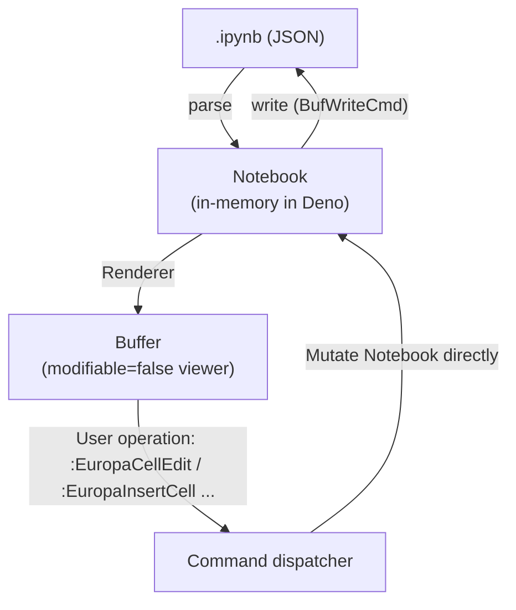

Characteristics:
- Deno is the source of truth, Vim is a display-only viewer
- Even large `.ipynb` need not be loaded into Vim (= virtual document approach)
- Editing is via commands (per-cell add/delete/move/edit)
- Editing the source within a cell uses a separate buffer (`:EuropaEditCell` opens a `__europa_cell_<id>__` buffer); on save, it is written back to Notebook

Pros:
- Fully preserves outputs / metadata / attachments
- Lives the differentiator of "treating ipynb as a first-class citizen"
- A molten-style extmark cell-boundary UX can be built

Cons:
- Editing UX is unique (not standard Vim editing)
- The intuition of "use gg/G/dd over the whole file in vim" breaks down

Major operations:

| Operation | Command | Internal processing |
| --- | --- | --- |
| Open file | `:edit foo.ipynb` (autocmd) | parse -> Notebook -> RenderPlan -> Buffer |
| Edit cell | `:EuropaEditCell` (cell at cursor) | open separate buffer, update source on save, redraw parent buffer |
| Add cell | `:EuropaInsertCell [code\|markdown\|raw]` | push to Notebook.cells, redraw |
| Delete cell | `:EuropaDeleteCell` | remove from Notebook.cells |
| Move cell | `:EuropaMoveCellUp/Down` | swap |
| Join cell | `:EuropaJoinCell` | concatenate sources |
| Save file | `:write` (autocmd) | Notebook -> JSON -> write file |

### 5.2 Plan b: jupytext-style conversion

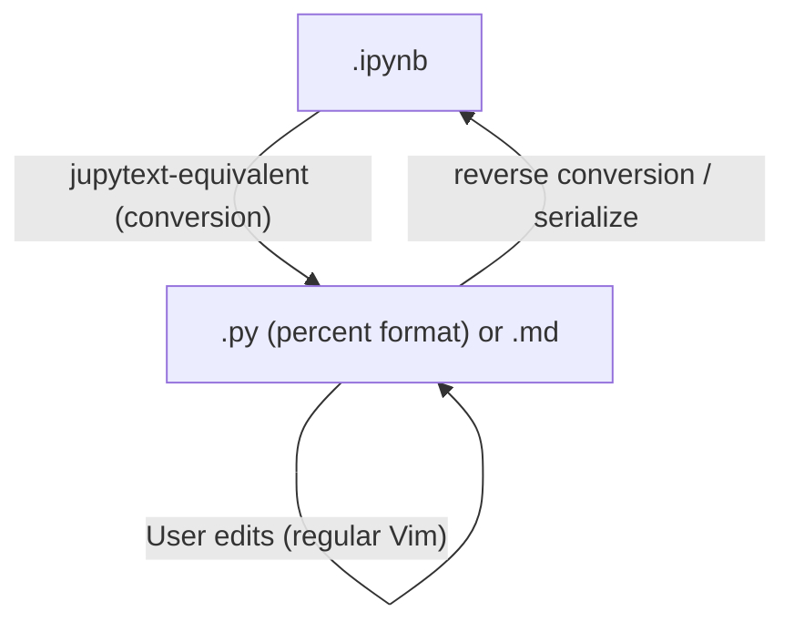

Characteristics:
- Show the user a `.py` or `.md` (regular Vim edit UX)
- On save, reverse-convert into `.ipynb`
- Either invoke the jupytext CLI, or implement the conversion logic on the Deno side

Pros:
- Editing UX is regular Vim
- Existing Vim plugins (LSP, treesitter, fold) still work

Cons:
- Need to retain outputs on the `.ipynb` side while managing source as `.py`, forcing a two-file workflow or discarding `.ipynb` outputs
- Feature overlap with jupytext.nvim (weaker differentiation)
- Cannot fully express markdown cell attachments and `cell.metadata.collapsed/scrolled`

Implementation policy (not adopted, but recorded):
- When opening `.ipynb`, create a temporary `.europa.py` and show that to Vim
- On save, write the `.europa.py` content back to the corresponding code cell's source in Notebook
- Do not touch `.ipynb` outputs (= execution is a separate path in Phase 3)

### 5.3 Plan c: virtual buffers (one per cell)

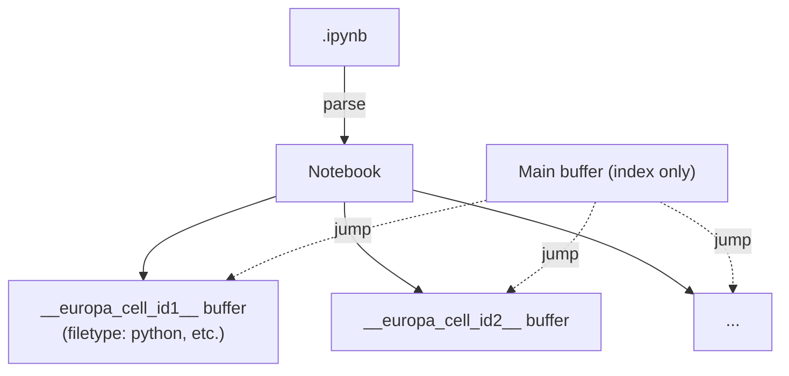

Characteristics:
- Cells exist as Vim's "individual buffers"
- Index buffer lists cells; jumping is buffer switching

Pros:
- Editing per cell is clearly separated (LSP works per cell)
- Each cell can be treated with a different filetype (`python` for code cell, `markdown` for markdown cell)

Cons:
- Buffer count explodes (dozens of buffers for medium-sized Notebooks)
- Inter-cell context (e.g., wanting to refer to imports of an upper cell) becomes hard to see
- Cell ordering management is complex (buffers do not have an order concept)

### 5.4 Comparison and Recommendation

| Axis | Plan a (direct + virtual view) | Plan b (jupytext-style) | Plan c (virtual buffers) |
| --- | --- | --- | --- |
| Output preservation | excellent | acceptable (two-file workflow) | excellent |
| metadata preservation | excellent | acceptable | excellent |
| Editing UX | acceptable (unique) | excellent (regular Vim) | good (regular per-cell) |
| LSP / treesitter integration | acceptable (need separate buffer per cell) | excellent | excellent |
| Performance with large ipynb | excellent (virtual document) | good | acceptable (many buffers) |
| Image / rich output display | excellent (consolidated in viewer) | acceptable (no outputs in .py) | acceptable (separate cell buffers) |
| Differentiation | excellent (does not overlap with jupytext.nvim) | acceptable (overlaps with jupytext.nvim) | good |
| Implementation complexity | medium | low (reuses jupytext) | high |

Plan a is adopted.

Reasons:
1. For the user requirement "view cell structure and rich outputs", Plan a's viewer model is the most direct
2. Outputs / metadata / attachments are fully preserved only in Plans a and c
3. Plan c has complex buffer management and is poorly compatible with standard Vim operations
4. Plan b overlaps with jupytext.nvim and dilutes Europa's uniqueness

However, within Plan a, by adopting the hybrid of "per-cell editing in a separate buffer (opened by `:EuropaEditCell`)", Plan c's advantage (per-cell LSP) is also picked up.

## 6. Kernel Connection Design

### 6.1 KernelClient Abstraction

```typescript
// kernel/client.ts
interface KernelClient {
  start(opts: { kernelName: string; cwd?: string }): Promise<void>;
  shutdown(): Promise<void>;
  restart(): Promise<void>;
  interrupt(): Promise<void>;
  execute(code: string, opts?: ExecuteOptions): AsyncIterable<KernelMessage>;
  kernelInfo(): Promise<KernelInfoReply>;
  complete(code: string, cursorPos: number): Promise<CompleteReply>;
  inspect(code: string, cursorPos: number, detail: 0 | 1): Promise<InspectReply>;
  onMessage(handler: (msg: KernelMessage) => void): () => void;  // unsubscribe fn
}
```

Implementations:
- `kernel/server-client.ts` (Phase 3): jupyter server's REST + WebSocket
- `kernel/zmq-client.ts` (Phase 4): 5-socket connection via npm:zeromq

### 6.2 Phase 3: REST + WebSocket

#### Notebook open flow

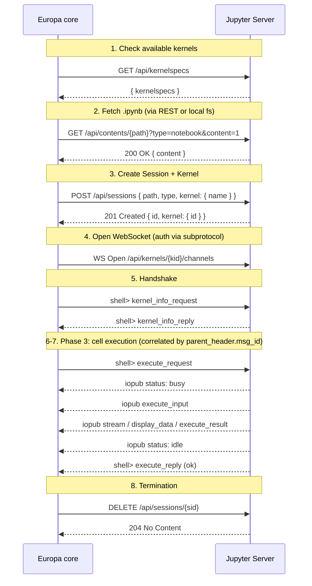

#### WebSocket subprotocol selection

JupyterLab-style fallback:

```typescript
const ws = new WebSocket(url, [
  "v1.kernel.websocket.jupyter.org",       // preferred (offset table format)
  "v1.token.websocket.jupyter.org",        // fallback (token authentication)
  `v1.token.websocket.jupyter.org.${TOKEN}`,
]);
ws.addEventListener("open", () => {
  // Get the agreed subprotocol via ws.protocol
  // If mismatched, behave with the default protocol (single text JSON)
});
```

#### Message send/receive

`wire/protocol-v1.ts` implements encoding/decoding for v1 protocol (offset table); `wire/protocol-default.ts` implements the default (single JSON). The shared message type is in `wire/message.ts`.

### 6.3 Phase 4: Direct ZeroMQ (opt-in)

```
:EuropaAttach /path/to/connection.json
```

- Read `connection_file` (JSON) and bind 5 sockets
- Use npm:zeromq v6 via Deno's Node compatibility (`--allow-ffi`, `nodeModulesDir: "auto"`)
- HMAC sha256 signature is computed via `node:crypto`'s `createHmac`
- Message frame is `[identities..., "<IDS|MSG>", hmac, header, parent, metadata, content, buffers...]`
- Distribution risk: on platforms without prebuilt artifacts, the user is required to `npm install` (= node-gyp build)

### 6.4 Authentication

Tokens are specified via `g:europa_jupyter_token`, or read from the environment variable `JUPYTER_TOKEN`. Priority:

1. `g:europa_jupyter_token` setting value
2. `$JUPYTER_TOKEN`
3. On local spawn, `--ServerApp.token=<random>` for randomly generated value

REST always attaches `Authorization: token <TOKEN>` (avoiding XSRF). WebSocket goes via subprotocol (does not expose the token in the URL).

### 6.5 Python Environment Detection (Phase 3+)

For data-science use cases, it is standard to install `ipykernel` into a project-specific venv (`.venv/`, `venv/`, conda env, venvs created by uv/poetry/pdm), not only globally. Europa preferentially detects venvs under the launch directory and falls back to global `jupyter` last.

#### Detection order

1. `g:europa_jupyter_executable` setting (absolute path, highest priority)
2. `.venv/bin/jupyter` directly under cwd (POSIX) or `.venv/Scripts/jupyter.exe` (Windows)
3. `venv/bin/jupyter` directly under cwd or `venv/Scripts/jupyter.exe`
4. If the environment variable `VIRTUAL_ENV` is set, `$VIRTUAL_ENV/bin/jupyter`
5. If the environment variable `CONDA_PREFIX` is set, `$CONDA_PREFIX/bin/jupyter`
6. `jupyter` on PATH (fallback)

`g:europa_python_env_detect = 'disabled'` skips 2-5 and refers only to 1 and 6. If detection fails, on `:EuropaStartKernel` execution, an error message is shown saying "please specify the absolute path with `g:europa_jupyter_executable`".

#### Roles between Phase 1 and Phase 3

| Phase | Scope |
| --- | --- |
| Phase 1 | Add `jupyter_executable` and `python_env_detect` to `EuropaConfigSchema` in `schema/config.ts`. Detection logic is unimplemented |
| Phase 3 | Implement detection logic in `denops/europa/kernel/server-process.ts`. Pass the detected path as the argument of `Deno.Command` |

#### Out of MVP scope

- Launch via environment-manager wrappers such as `uv run jupyter`, `poetry run jupyter`, `pdm run jupyter`. These are added in mid-Phase 3 or later if needs arise.
- Python version resolution via `pyenv`, `mise`, `asdf`. These are indirectly resolved via `jupyter` on PATH.

## 7. Rendering Strategy

### 7.1 RenderPlan Pipeline

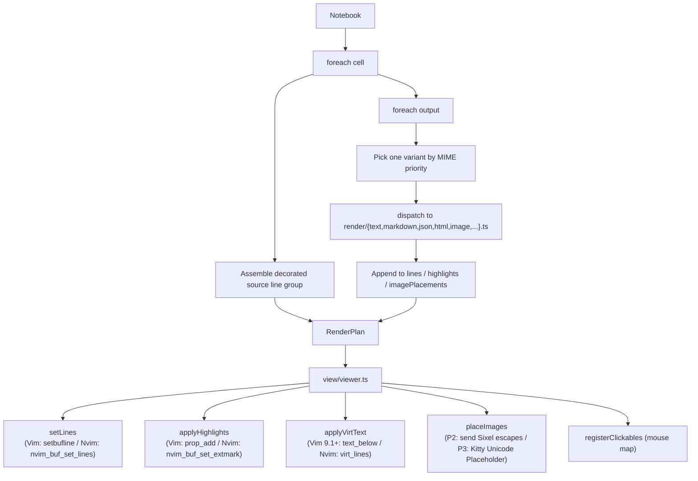

### 7.2 Cell Boundary Representation

Adopt real-line decoration (stable across Vim/Neovim):

```
╭─ In [3] ───────────────────────╮
import pandas as pd
df = pd.read_csv("data.csv")
df.head()
╰─ Out [3] ──────────────────────╯
   <DataFrame: 5 rows × 3 cols>
   ...
   [image: plot.png 640x480]
─────────────────────────────────
```

After inserting real lines, apply hl_eol-bearing hl_group on those lines. This follows the same style as md-render.nvim's Callout/Details.

### 7.3 Rich Output MIME Strategy

| MIME | Phase 2 (MVP) | Phase 3 |
| --- | --- | --- |
| `text/plain` | Append buffer lines, ANSI strip | Preserve ANSI color |
| `stream` (stdout/stderr) | Combine consecutive same-name streams, ANSI parse | Output length limit |
| `error` (traceback) | ANSI parse + ename emphasis | line jump |
| `text/markdown` | source as-is + simple heading highlight | md-render-style inline rendering |
| `text/html` | Tag stripping | Display HTML in a separate buffer / `pandoc` |
| `application/json` | pretty-print + treesitter | folding |
| `image/png` `image/jpeg` | Placeholder + external viewer (P2 default, identical across all terminals) / experimental Sixel via `g:europa_image_backend = 'sixel'` | + Kitty Unicode Placeholder (P3) + Sixel stabilization -> snacks.image / image.nvim / iTerm2 (P4) |
| `image/svg+xml` | Display source | rsvg-convert to PNG |
| `application/vnd.*` (Vega-Lite/Plotly) | Placeholder | vl-convert / kaleido |
| `application/vnd.jupyter.widget-view+json` | Placeholder | comm support (Phase 5) |

### 7.4 Image Rendering Strategy (Default Placeholder + Experimental Sixel Opt-in)

#### Phase 2 default is placeholder + external viewer

The default behavior in Phase 2 is to display images as text placeholders, and to launch an external viewer with `:EuropaPreviewOutput` when the user needs it.

Image display that supports both Vim/Neovim is highly environment-dependent. To make image rendering work without breakage in the MVP, it is realistic to keep the behavior identical between supported and unsupported terminals. Sixel requires ImageMagick, has weak character-position alignment, and requires manual repaint logic. Kitty Unicode Placeholder has a narrow set of supported terminals, so it cannot be the default in Phase 2. Bringing all of these into Phase 2 would prevent the MVP completion criteria from being defined.

Users who want to try Sixel can enable it as an experimental opt-in via `g:europa_image_backend = 'sixel'` (requires ImageMagick and a supported terminal). Phase 3 adds Kitty Unicode Placeholder and refines Sixel's character-position alignment and repaint hooks.

#### Image protocol comparison (future options)

| Protocol | Major supported terminals | Character position alignment | Through tmux | Native Vim support |
| --- | --- | --- | --- | --- |
| **placeholder + external viewer** (P2 default) | All terminals | excellent (text) | OK | OK |
| **Sixel** (P2 experimental opt-in / P3 stabilized) | xterm / mlterm / foot (Wayland-native) / WezTerm / Konsole 22.04+ / iTerm2 3.5+ / mintty | acceptable (image overlaps other text) | tmux 3.4+ (`--enable-sixel`) | OK (`writefile([...], "/dev/tty", "b")`) |
| **Kitty Unicode Placeholder** (P3) | Kitty / Ghostty / partial WezTerm | excellent (written as text) | requires passthrough | OK (text writing) |
| **iTerm2 OSC 1337** (P4) | iTerm2 / WezTerm | acceptable | partial | OK |
| **image.nvim / snacks integration** (P4, Neovim only) | Kitty/Sixel/Ueberzug++ | delegated to intermediate library | partial | (Neovim only) |

#### Per-phase roadmap

| Phase | Default behavior | Opt-in additions | Notes |
| --- | --- | --- | --- |
| 1 (MVP) | placeholder + `:EuropaPreviewOutput` | Experimental Sixel via `g:europa_image_backend = 'sixel'` | ImageMagick required only when opted in |
| 2 | Continue placeholder default + Sixel stabilization | + Kitty Unicode Placeholder | Refine Sixel's character-position alignment and repaint hooks |
| 3 | Auto-switch Sixel/Kitty by terminal detection | + image.nvim/snacks integration / iTerm2 OSC 1337 | Ecosystem integration |

#### Implementation flow (Phase 2: default placeholder + opt-in Sixel)

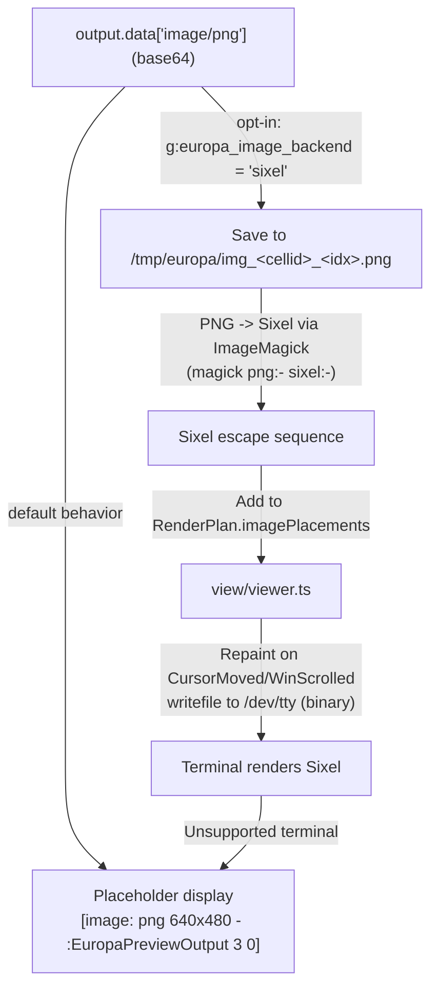

In the Phase 2 default, only `A -> P` works. Only users who set `g:europa_image_backend = 'sixel'` proceed with the path `A -> B -> ... -> E`. When the Sixel path is chosen, `view/viewer.ts`:

- Reserves "rows blank lines" on the cell row (places a `[image: <type> <bytes>]` placeholder as a real line)
- At drawing time, writes Sixel escapes binary to `/dev/tty` (`writefile(escape_bytes, "/dev/tty", "b")` / `vim.uv.new_tty(1)` for Neovim)
- Repaints on `WinScrolled` / `VimResized` / `BufEnter`

#### Terminal detection (`schema/capabilities.ts` SoT-ifies the type)

```typescript
import { Type, Static } from "@sinclair/typebox";

export const ImageProtocolSchema = Type.Union([
  Type.Literal("placeholder"),         // Phase 2 default (all terminals)
  Type.Literal("sixel"),               // Phase 2 experimental opt-in / stabilized in Phase 3
  Type.Literal("kitty_placeholder"),   // Phase 3
  Type.Literal("iterm2_osc1337"),      // Phase 4
]);
export type ImageProtocol = Static<typeof ImageProtocolSchema>;
```

Detection strategy (`denops/europa/capabilities.ts`):

1. Configuration override. Interpret `g:europa_image_backend = 'placeholder' | 'sixel' | 'kitty_placeholder' | 'iterm2_osc1337' | 'auto'`
   - In Phase 2, `auto` falls back to `placeholder` (Sixel requires explicit opt-in)
   - In Phase 3+, `auto` detects supported terminals and switches
2. Static detection via environment variables (Phase 3+). Look at `TERM` / `TERM_PROGRAM` / `KITTY_WINDOW_ID` / `GHOSTTY_RESOURCES_DIR`, etc.
3. DA1 query (Phase 3+, explicit opt-in). Send `\x1b[c` to `/dev/tty`. Because there is a risk of interfering with TUIs, this requires explicit opt-in such as `g:europa_da1_probe = v:true`. Not used in Phase 2

```typescript
// Concept code (Phase 2, implementation that falls back to placeholder)
async function detectImageProtocol(denops: Denops): Promise<ImageProtocol> {
  const override = await getConfig("image_backend");
  if (override === "sixel" || override === "kitty_placeholder" ||
      override === "iterm2_osc1337" || override === "placeholder") {
    return override;  // Respect explicit opt-in
  }
  // override === "auto"
  // In Phase 2, fix auto = placeholder (do not auto-select Sixel)
  // From Phase 3 onward, implement env detection + DA1 query (via opt-in) here
  return "placeholder";
}
```

#### Fallback for unsupported terminals or by default

```
[image: png 640x480 - :EuropaPreviewOutput 3 0]
```

Use `:EuropaPreviewOutput {cellIdx} {outputIdx}` to launch the OS's `open` / `xdg-open` and view in an external viewer.

#### Phase 2 completion criteria

- The default behavior renders images without breakage; placeholder + external viewer launch works (identical across all terminals)
- With `g:europa_image_backend = 'sixel'` opt-in, Sixel output works (ImageMagick required, supported terminal required, experimental)
- Even on unsupported environments under Sixel opt-in, falls back to placeholder (does not break)

#### Verification points in tests/spec

- `tests/spec/render/image_spec.ts`:
  - By default, `image/png` outputs placeholder + `:EuropaPreviewOutput`
  - The ImageMagick subprocess is invoked only when `g:europa_image_backend = 'sixel'` is set (subprocess mock)
  - With Sixel opt-in, falls back to placeholder on unsupported terminals
- `tests/spec/capabilities_spec.ts`:
  - The `g:europa_image_backend` setting overrides static detection
  - In Phase 2, `auto` = `placeholder` (Sixel is not auto-selected)
  - `Value.Check(ImageProtocolSchema, result)` PASSes

### 7.5 Vim/Neovim Abstraction Layer

```typescript
// view/cell-marker.ts
export interface CellMarker {
  setHead(bufnr: number, line: number, label: string): Promise<MarkerId>;
  setOutputBoundary(bufnr: number, line: number): Promise<MarkerId>;
  clear(bufnr: number, ids?: MarkerId[]): Promise<void>;
}

// view/cell-marker-vim.ts        <- prop_type_add + prop_add
// view/cell-marker-nvim.ts       <- nvim_create_namespace + nvim_buf_set_extmark

export function createCellMarker(denops: Denops): CellMarker {
  return denops.meta.host === "vim"
    ? new VimCellMarker(denops)
    : new NvimCellMarker(denops);
}
```

popup/floating windows are absorbed by `@denops/std/popup`.

### 7.6 Highlight Groups

Defined in `view/highlight.ts` with the `Europa*` prefix:

```
EuropaCellHeader        <- cell boundary line (In [N])
EuropaCellFooter        <- cell boundary line (Out [N])
EuropaCellSource        <- inside code cell
EuropaCellMarkdown      <- inside markdown cell
EuropaOutput            <- output line
EuropaError             <- error traceback
EuropaStream            <- stdout/stderr (default)
EuropaStreamErr         <- stderr emphasis
EuropaImagePlaceholder  <- image placeholder (when terminal is unsupported)
```

To allow users to override after `:colorscheme`, link to colorscheme-derived groups via `hi default link`.

## 8. Lifecycle

### 8.1 Plugin Load

```
plugin/europa.vim:
  autocmd User DenopsPluginPost:europa call denops#notify('europa', 'init', [])
  
denops/europa/main.ts:
  export async function main(denops: Denops) {
    denops.dispatcher = {
      init: () => initialize(denops),
      open: (path) => openNotebook(denops, path),
      ...
    };
  }
```

In `init`, perform heavy work (highlight definitions, command registration, capability detection). Keep `main()` itself lightweight.

### 8.2 Notebook Open

```
1. autocmd BufReadCmd *.ipynb -> denops#notify('europa', 'open', [expand('<afile>')])
2. open(path):
     a. Read file (Deno.readTextFile)
     b. parse -> Notebook
     c. Create session (allocate bufnr, modifiable=false)
     d. Generate RenderPlan
     e. Apply to viewer
     f. (optional) Defer kernel startup
3. autocmd BufWriteCmd *.ipynb -> denops#notify('europa', 'save', [bufnr])
```

By taking `BufReadCmd` / `BufWriteCmd`, Vim's standard `.ipynb` (= JSON) load/save is suppressed and Europa fully controls them.

### 8.3 Kernel Startup (Phase 3)

```
:EuropaStartKernel [kernel-name]
  -> kernel/server-process.ts: spawn jupyter server (if not yet present)
  -> POST /api/sessions { ... kernel: { name } }
  -> WebSocket /api/kernels/{kid}/channels
  -> kernel_info_request
  -> bind to session.kernel
```

### 8.4 Cell Execution (Phase 3)

```
:EuropaRunCell (cursor location)
  -> Identify the cell in the session
  -> kernel.execute(cell.source) (AsyncIterable<KernelMessage>)
  -> for await msg of execute:
       Filter by parent_header.msg_id == own execute_request.msg_id
       Update cell.outputs based on msg.msg_type
       Regenerate RenderPlan (only the affected cell range)
       Partially update viewer (batch via denops_std)
  -> End on status: idle
```

Debounce iopub flow (massive streams). `render/dispatcher.ts` batches application every 16ms.

### 8.5 Save

```
:write
  -> BufWriteCmd fires
  -> serialize: Notebook -> JSON (1-space indent, LF)
  -> Deno.writeTextFile(path, json)
  -> :setlocal nomodified
```

## 9. Configuration / Commands / Key Mappings

### 9.1 Configuration (g:europa_*)

```vim
" Connection
let g:europa_connection_mode      = 'auto'    " 'server' | 'zmq' | 'auto'
let g:europa_jupyter_url          = 'http://localhost:8888'
let g:europa_jupyter_token        = ''        " empty means $JUPYTER_TOKEN
let g:europa_jupyter_ws_subprotocol = 'auto'  " 'default' | 'v1' | 'auto'

" Kernel
let g:europa_default_kernel       = 'python3'
let g:europa_auto_start_kernel    = v:false   " auto-start kernel on open

" Python environment (used in Phase 3+, settings reserved in Phase 1)
let g:europa_jupyter_executable   = ''        " absolute path. Empty means auto-detect (see 6.5)
let g:europa_python_env_detect    = 'auto'    " 'auto' | 'disabled' (PATH only)

" Rendering
let g:europa_image_backend        = 'auto'    " 'sixel' | 'kitty_placeholder' | 'iterm2_osc1337' | 'placeholder' | 'auto'
let g:europa_mime_priority        = ['image/png', 'image/jpeg', 'text/html', 'text/plain']
let g:europa_max_output_lines     = 100       " per-cell output line cap
let g:europa_cell_border_chars    = ['╭', '─', '╮', '╰', '╯']

" Behavior
let g:europa_auto_save            = v:false
let g:europa_use_subprocess       = v:true    " spawn local jupyter server
```

### 9.2 Commands (`:Europa*`)

| Command | Purpose |
| --- | --- |
| `:EuropaOpen [path]` | Open Notebook (also automatic via BufReadCmd) |
| `:EuropaInsertCell [code\|markdown\|raw]` | Insert cell at cursor location |
| `:EuropaDeleteCell` | Delete cell at cursor location |
| `:EuropaMoveCellUp` / `:EuropaMoveCellDown` | Move cell |
| `:EuropaEditCell` | Edit the source of the cell at cursor in a separate buffer |
| `:EuropaJoinCell` | Join with the cell above |
| `:EuropaSplitCell` | Split at cursor location |
| `:EuropaCellType {type}` | Change cell type |
| `:EuropaPreviewOutput {cellIdx} {outputIdx}` | Open output in external viewer |
| `:EuropaStartKernel [name]` | Start Kernel (Phase 3) |
| `:EuropaRestartKernel` | Restart Kernel (Phase 3) |
| `:EuropaInterrupt` | Interrupt execution (Phase 3) |
| `:EuropaRunCell` | Execute cell at cursor location (Phase 3) |
| `:EuropaRunAll` | Execute all cells (Phase 3) |
| `:EuropaAttach {connection.json}` | Attach to existing kernel (Phase 4, ZMQ) |

### 9.3 Key Mappings (`<Plug>(europa-*)`)

The following `<Plug>` names are stable public contracts defined in `plugin/mappings.vim`.
Europa does **not** install any default key mappings — users bind them in their own ftplugin.

```vim
" Phase 3.1 (available now)
nnoremap <silent> <Plug>(europa-insert-code)     :<C-u>EuropaInsertCell code<CR>
nnoremap <silent> <Plug>(europa-insert-markdown) :<C-u>EuropaInsertCell markdown<CR>
nnoremap <silent> <Plug>(europa-insert-raw)      :<C-u>EuropaInsertCell raw<CR>
nnoremap <silent> <Plug>(europa-delete-cell)     :<C-u>EuropaDeleteCell<CR>
nnoremap <silent> <Plug>(europa-cell-up)         :<C-u>EuropaMoveCellUp<CR>
nnoremap <silent> <Plug>(europa-cell-down)       :<C-u>EuropaMoveCellDown<CR>
nnoremap <silent> <Plug>(europa-edit-cell)       :<C-u>EuropaEditCell<CR>
nnoremap <silent> <Plug>(europa-split-cell)      :<C-u>EuropaSplitCell<CR>
nnoremap <silent> <Plug>(europa-join-cell)       :<C-u>EuropaJoinCell<CR>

" Phase 3 (run-cell, not yet implemented)
nnoremap <silent> <Plug>(europa-run-cell)        :<C-u>EuropaRunCell<CR>
```

Users bind freely, e.g., `nmap <buffer><silent> <localleader>ec <Plug>(europa-edit-cell)`.

## 10. Roadmap

### Phase 0 - Minimum Spike

The purpose of this phase is to put together a working foundation and a technical-validation spike as quickly as possible. Confirm there are no technical obstacles before starting Phase 2's actual code.

1. Minimum setup of flake.nix
   1. Add `deno` (already in place), `pandoc` (panvimdoc), `nodejs` (for npm:typedoc), and `typos` to `devShells.default`
   2. Fill `pre-commit.settings.hooks` via `git-hooks.nix` (deno fmt / deno lint / typos / end-of-file-fixer / nixfmt)
2. Minimum templates of configuration files
   1. `deno.json` (tasks + imports + nodeModulesDir; dependencies exact-pinned)
   2. `deno.lock` (initial lock)
   3. `tsconfig.json` (only compilerOptions for typedoc)
   4. `typedoc.json` (entryPoints + plugin-markdown, minimum)
   5. `panvimdoc.config` (minimum)
3. Minimum CI configuration
   1. `.github/workflows/ci.yml` (just runs `deno task check` + installs pandoc)
4. Minimum scripts
   1. Minimum implementation of `scripts/gen-vimdoc.ts` (concatenates an empty `doc/sources/` and an empty API Reference; CI passes even if empty)
5. Technical-validation spike
   1. `.ipynb` smoke. With a single TS script, read the official sample `hello.ipynb`, convert into a Notebook structure, and confirm via CLI that `Notebook -> RenderPlan -> string` works (no Vim connection, pure logic verification)
   2. Sixel spike (only if Sixel remains in Phase 2). Generate PNG -> Sixel escapes via ImageMagick and confirm minimally that pushing them to the supported terminal's `/dev/tty` renders an image (no Vim/Neovim involvement)
6. Create empty directories
   1. Create `schema/`, `tests/spec/`, `tests/golden/`, `tests/fixtures/`, `denops/europa/`, `plugin/`, `autoload/`, `ftdetect/`, `syntax/`, `doc/`, `doc/sources/` with `.gitkeep`

The completion criteria are as follows. `nix develop` boots the environment, `deno task check` PASSes empty, `scripts/gen-vimdoc.ts` generates an empty `doc/europa.txt`, and `.ipynb` smoke works.

### Phase 1 - Pre-Phase 2 Setup

After Phase 0 is complete and a clear path to Phase 2 exists, proceed. May progress in parallel with Phase 2, but must be completed by the end of Phase 2.

1. Renovate setup
   1. `renovate.json` (groupName + manual review for major + post-upgrade hook auto-regenerating `doc/europa.txt`)
2. In-house lint scaffolds
   1. `scripts/lint-no-handwritten-types.ts` scaffold (full implementation in Phase 2)
   2. `scripts/concat-md.ts` scaffold (chapter-order formatting of typedoc output)
3. Documentation scaffolds
   1. `CONTRIBUTING.md` (`deno task` list + development flow + guide-chapter editing rules + `@spec-id` operation for spec/TSDoc correspondence)
   2. Empty templates of `doc/sources/01-introduction.txt` ~ `08-faq.txt` `99-about.txt` (vim-help-tagged skeletons + TODO comments)

The completion criteria are as follows. `pre-commit run --all-files` PASSes, `git diff --exit-code` confirms `doc/europa.txt`, and renovate's automatic PR can confirm regeneration of `doc/europa.txt`.

### Phase 2 (MVP) - Viewing

1. `.ipynb` reading (nbformat v4 parse)
2. Notebook -> RenderPlan -> Viewer (supports both Vim/Neovim)
3. Real-line decoration of cell boundaries + hl_group
4. Display of text/plain, stream, error, application/json
5. image/png and image/jpeg as placeholders + launch external viewer via `:EuropaPreviewOutput` (identical behavior across all terminals)
6. (Optional / experimental) Sixel output via `g:europa_image_backend = 'sixel'` (requires ImageMagick and a supported terminal)
7. Write back files via `:write`
8. capabilities detection (host / terminal)
9. `:help europa.txt`

### Phase 3 - Editing + Execution

1. Cell operation commands (Insert/Delete/Move/Edit/Split/Join)
2. Jupyter Server spawn + connection
3. WebSocket v1 protocol implementation
4. kernel_info / execute / interrupt / restart
5. Real-time reflection of iopub stream (debounce)
6. PNG conversion of image/svg+xml via rsvg-convert
7. Strengthened text/markdown inline rendering (md-render.nvim style)
8. Line jump for error traceback
9. LSP integration (start `pyright` etc. per cell buffer; apply to the individual buffer opened by `:EuropaEditCell`)

### Phase 4 - Extended MIME + ZMQ

1. Direct ZeroMQ (`:EuropaAttach`) - adopting npm:zeromq
2. Vega-Lite (vl-convert)
3. PDF (pdftoppm)
4. LaTeX (PNG via mathjax-node)
5. Direct Sixel mode in Vim (experimental)

### Phase 5 - ipywidgets + Advanced Integration

1. comm_open / comm_msg / comm_close
2. Limited ipywidgets support (slider/text/button, etc.)
3. ddu/ddc integration (cell jump, completion)

## 11. Known Risks and Pitfalls

### 11.1 WebSocket Lifecycle

Deno's `WebSocket` does not have reconnection. Reconnection logic must be held on the Deno side for kernel restart and idle detection.

```typescript
// kernel/server-client.ts
class KernelWebSocket {
  private retries = 0;
  private maxRetries = 5;
  
  async ensureConnected() {
    if (this.ws?.readyState === WebSocket.OPEN) return;
    await this.connect();
  }
  
  private async onClose() {
    if (this.retries < this.maxRetries) {
      await sleep(2 ** this.retries * 1000);
      this.retries++;
      await this.connect();
    }
  }
}
```

### 11.2 iopub Throughput Control

Streaming a large iopub output (e.g., printing in a loop) line-by-line to Vim/Neovim chokes the rendering. Use `@denops/std/batch` to batch every 16ms.

### 11.3 Variations in nbformat Serialization

- `source` / `text` string vs string[]: normalized internally as string; written back as string
- Newline code fixed to LF (matching pure jupyter)
- Indent is 1-space (`JSON.stringify(_, null, 1)`)
- MIME key order in `outputs[].data` matches pure jupyter

### 11.4 Vim text property type Conflicts

`prop_type_add` errors when called twice with the same name. Idempotency guard required:

```typescript
const types = await denops.call("prop_type_list") as string[];
if (!types.includes("EuropaCellHead")) {
  await denops.call("prop_type_add", "EuropaCellHead", { highlight: "EuropaCellHeader" });
}
```

### 11.5 Caching Neovim extmark Namespaces

`nvim_create_namespace('Europa')` is idempotent but wasteful to call every time. Cache on the Deno side:

```typescript
let cachedNs: number | null = null;
async function getNamespace(denops: Denops) {
  if (cachedNs == null) {
    cachedNs = await denops.call("nvim_create_namespace", "Europa") as number;
  }
  return cachedNs;
}
```

### 11.6 Image Rendering (Sixel + Kitty Placeholder) Pitfalls

#### Sixel (Phase 2)

- Images overlap with other text. In `view/viewer.ts`, reserve the cell area (rows x cols) as blank lines.
- Repaint is manual. Re-send to TTY on `CursorMoved`, `WinScrolled`, `VimResized`.
- ImageMagick is required. Without `magick` or `convert`, PNG cannot be converted to Sixel; check existence via `Deno.Command` and emit error guidance.
- When writing to TTY from Vim, do not forget binary mode `writefile([escape_string], "/dev/tty", "b")`. In text mode, newlines are converted.
- For tmux, a tmux 3.4+ build with `--enable-sixel` is required. Homebrew's default may not support it, so verify with `tmux -V`.

#### Kitty Unicode Placeholder (Phase 3)

- Unrelated to `Sec-WebSocket-Protocol` v1. Do not confuse them.
- Through tmux, `set -g allow-passthrough on` is required.
- Placeholder row/col diacritics may interfere with Vim's `&conceal`. Force `setlocal conceallevel=0` on the viewer buffer.
- Beware of image ID duplication. Conflicts arise when the same image is shown in multiple buffers.

### 11.7 Local jupyter server Liveness Management

A process spawned by `Deno.Command` may become an orphan when Deno terminates. Reliably kill via `addEventListener("unload", ...)` or `Deno.addSignalListener("SIGTERM", ...)`.

### 11.8 Rendering Large .ipynb

In Notebooks with thousands of cells, streaming the entire RenderPlan at once freezes. Adopt lazy rendering that renders only the viewport (visible range) and updates progressively on scroll. Follow the `LAZY_PADDING` (viewport +/- 10 lines) of md-render.nvim.

## 12. Rationale for Design Decisions

This chapter records the comparison data and facts behind Europa.vim's major design decisions (connection method, file model, image protocol, Python-dependency policy). Because `tmp/research-*.md` is gitignored and not retained in the repository, the SoT for the rationale is placed here.

### 12.1 Comparison of Existing Jupyter-related Plugins

| Plugin | Connection method | Python dependency | Rendering | File model | Cell boundary | Supported editor |
| --- | --- | --- | --- | --- | --- | --- |
| **molten-nvim** | jupyter_client (ZMQ) + REST+WS | pynvim, jupyter_client required / cairosvg etc. optional | virtual text + floating + image (image.nvim) | `.ipynb` import/export | Two extmarks | Neovim 0.9.4+ |
| **magma-nvim** | jupyter_client (ZMQ) | pynvim, jupyter_client / ueberzug, etc. | floating + ueberzug/kitty image | JSON session save, not direct ipynb editing | Two extmarks | Neovim 0.5+ |
| **vim-jukit** | shell process send (`ipython3` etc.) | python3 host, IPython, matplotlib, ueberzug | separate split + history split + ueberzug image | `.ipynb` <-> `.py` conversion, `.jukit/` meta save | Comment markers | Vim 8.2+ / Neovim 0.4+ |
| **jupyter-vim** | ZMQ connecting to external `jupyter qtconsole` | python3 host + jupyter | Output is on the external qtconsole (does not come into Vim) | Regular `.py` files | `# %%` style | Vim 8+ / Neovim |
| **jupytext.vim/nvim** | (execution by other plugins) jupytext CLI converts only | jupytext CLI | Buffer display only (no execution/output) | Convert `.ipynb` to md/py, reverse on save | percent format `# %%` | Vim/Nvim |
| **jupynium.nvim** | Selenium auto-piloting Jupyter Web UI | python3.9+, jupyter_client, selenium, Firefox | Output is on the browser side (one-way sync) | `.ju.py` (percent format) | `# %%` | Neovim 0.8+ |
| **nvim-ipy** | Jupyter 4.x ZMQ connection | python3 host, jupyter | Dedicated nvim buffer + ANSI highlight | `.py`, regex-defined cells | regex (`^##`) | Neovim |
| Europa.vim (this project) | REST + WS (P3) -> direct ZMQ (P4 opt-in). P2 has no kernel connection (local viewing only) | Only the user's existing `jupyter`. Plugin does not pip install | placeholder default (P2) + Sixel experimental opt-in -> Kitty Placeholder (P3) -> image.nvim (P4) | `.ipynb` first-class citizen (Deno is SoT) + virtual view (Plan a) | Real-line decoration + text-prop / extmark abstraction | Both Vim/Neovim |

### 12.2 Comparison of Connection Methods (Europa adopts Plan B)

| Method | Pros | Cons | Affinity with Denops |
| --- | --- | --- | --- |
| A. Direct ZMQ | Minimum latency, can launch from kernelspec | ZMQ libraries are weak in Deno; ser/de of 5 sockets is hand-rolled | Disadvantage (becomes a Node native dependency via npm:zeromq) |
| **B. Jupyter Server REST + WS** | Deno's standard fetch + WebSocket, UTF-8 JSON, supports both local/remote | Requires the server to be running; `v1.kernel.websocket.jupyter.org` compliance is needed | Most viable |
| C. Jupyter Kernel Gateway | Equivalent to B + headless and lighter | Requires installing a separate product | Good but we do not want to make it mandatory |
| D. Browser automation (jupynium-style) | Notebook extensions are usable as-is | Requires Selenium/Playwright, one-way | Unsuitable |
| E. Shell send (jukit-style) | Light implementation | MIME bundle breaks, weak state management | Does not differentiate |

### 12.3 Image Protocol Comparison

| Protocol | Encoding | Major supported terminals | Character alignment | tmux passthrough | Vim compatibility |
| --- | --- | --- | --- | --- | --- |
| **Sixel** | DCS Pq...ST RGB | xterm / mlterm / foot / WezTerm / Konsole / iTerm2 / mintty | acceptable | tmux 3.4+ `--enable-sixel` | OK (TTY direct write) |
| **Kitty graphics** | APC base64 PNG | Kitty / Ghostty / partial WezTerm | acceptable (default) | requires passthrough | OK |
| **Kitty Unicode Placeholder** | Kitty graphics + U+10EEEE diacritics text | Kitty / Ghostty | excellent | passes through as text | OK |
| **iTerm2 OSC 1337** | OSC 1337 base64 | iTerm2 / WezTerm | acceptable | partial | OK |
| **Ueberzug++** | X11/Wayland window overlay | Any terminal (overlay) | excellent (window) | not possible | (terminal-independent) |
| **chafa / catimg** | Unicode block + ANSI color | Any terminal | excellent (text) | OK | OK |

### 12.4 Feasibility of Direct ZeroMQ in Deno (Phase 4 Evaluation)

| Candidate | Feasibility | Distribution risk | Recommendation |
| --- | --- | --- | --- |
| `npm:zeromq` (zeromq.js v6) | Works on Deno 2's Node-API, prebuilt available | On ARM Linux etc. with missing prebuilts, source build is triggered; needs `node_modules` placement | Medium-low |
| `jszmq` / `deno.land/x/zmq` | Pure JS, lightweight | TCP transport unsupported (WebSocket only); cannot be used for direct kernel connection | Unsuitable |
| `jjeffcaii/deno-zeromq` | An attempt at pure Deno ZMTP | Incomplete (only REQ/REP, DEALER unimplemented) | Unsuitable |
| Deno FFI + libzmq | Technically possible | Hand-rolled ZMTP wrapper, libzmq binary distribution | Medium (this or npm:zeromq if going seriously) |
| WebAssembly libzmq | WASI sockets are immature | Cannot open a TCP socket | Unsuitable |

In conclusion, Phase 2 runs on Plan B (REST+WS) only, and Phase 4 introduces `npm:zeromq` as opt-in.

### 12.5 Strategy for Reducing Python Dependencies

| Component | Can it be dropped? | Reason |
| --- | --- | --- |
| `jupyter_server` (Notebook server) | Yes | REST/WS features are implemented directly on the plugin side, or substituted by kernel_gateway |
| `jupyter_client` (Python lib) | Yes | Just spawn `jupyter kernel` |
| `ipykernel` | No | Required to run the Python kernel (user's existing environment is OK) |
| `jupyter` CLI | No (used to start kernels) | Lightweight, based on jupyter_core |
| `jupytext` | Yes | Read/write `.ipynb` directly as nbformat JSON on the Deno side |
| `nbformat` (Python) | Yes | Reimplement on the Deno side as a TypeBox schema |
| `nbconvert` | Yes | Export functionality is added separately if needed in Phase 5 or later |

The plugin does not install any Python packages. Only spawn the user's existing environment's `jupyter kernel` via `Deno.Command`. The "user's existing environment" here is not limited to a global install; it includes `.venv/` / `venv/` under cwd, and environment variables `VIRTUAL_ENV` / `CONDA_PREFIX` (see 6.5 for the detection order).

### 12.6 Major Reference Links (Official specs / Reference implementations / Tools)

#### Jupyter / nbformat

- nbformat v4 specification: <https://nbformat.readthedocs.io/en/latest/format_description.html>
- nbformat schema (JSON): <https://github.com/jupyter/nbformat/blob/main/nbformat/v4/nbformat.v4.schema.json>
- Jupyter Server REST API: <https://jupyter-server.readthedocs.io/en/latest/developers/rest-api.html>
- Jupyter Server WebSocket Protocols: <https://jupyter-server.readthedocs.io/en/latest/developers/websocket-protocols.html>
- Jupyter Client Messaging Spec: <https://jupyter-client.readthedocs.io/en/stable/messaging.html>
- Jupyter Wire Protocol: <https://jupyter-client.readthedocs.io/en/stable/messaging.html>
- Connection file (JEP 106): <https://jupyter.org/enhancement-proposals/106-connectionfile-spec/connectionfile-spec.html>
- ipywidgets messaging: <https://github.com/jupyter-widgets/ipywidgets/blob/main/packages/schema/messages.md>

#### Image protocols

- Kitty graphics protocol: <https://sw.kovidgoyal.net/kitty/graphics-protocol/>
- Kitty Unicode placeholders: <https://sw.kovidgoyal.net/kitty/graphics-protocol/#unicode-placeholders>
- iTerm2 inline images: <https://iterm2.com/documentation-images.html>
- Sixel (Wikipedia): <https://en.wikipedia.org/wiki/Sixel>
- Are We Sixel Yet?: <https://www.arewesixelyet.com/>
- Ueberzug++: <https://github.com/jstkdng/ueberzugpp>
- chafa: <https://hpjansson.org/chafa/>

#### Denops ecosystem

- denops.vim: <https://github.com/vim-denops/denops.vim>
- denops-documentation: <https://vim-denops.github.io/denops-documentation/>
- @denops/std (JSR): <https://jsr.io/@denops/std>

#### Schema / SoT pipeline tools

- @sinclair/typebox: <https://github.com/sinclairzx81/typebox>
- typedoc: <https://typedoc.org/>
- typedoc-plugin-markdown: <https://typedoc-plugin-markdown.org/>
- panvimdoc: <https://github.com/kdheepak/panvimdoc>
- pandoc: <https://pandoc.org/>
- renovate: <https://docs.renovatebot.com/>
- git-hooks.nix: <https://github.com/cachix/git-hooks.nix>
- flake-parts: <https://flake.parts/>

#### Reference implementations (existing Jupyter plugins)

- molten-nvim: <https://github.com/benlubas/molten-nvim>
- magma-nvim: <https://github.com/dccsillag/magma-nvim>
- vim-jukit: <https://github.com/luk400/vim-jukit>
- jupyter-vim: <https://github.com/jupyter-vim/jupyter-vim>
- jupytext.nvim: <https://github.com/goerz/jupytext.nvim>
- jupynium.nvim: <https://github.com/kiyoon/jupynium.nvim>
- md-render.nvim: <https://github.com/delphinus/md-render.nvim>
- 3rd/image.nvim: <https://github.com/3rd/image.nvim>
- folke/snacks.nvim image: <https://github.com/folke/snacks.nvim/blob/main/docs/image.md>

#### ZeroMQ (Phase 4 evaluation)

- zeromq.js: <https://github.com/zeromq/zeromq.js>
- jszmq: <https://github.com/zeromq/jszmq>
- deno.land/x/zmq: <https://deno.land/x/zmq>
- Deno Node compatibility (Node-API addons): <https://docs.deno.com/runtime/fundamentals/node/>

## 13. Voice and Copy

External-facing language about Europa.vim follows a fixed metaphor and vocabulary so that README, vimdoc, GitHub repo metadata, and release/SNS posts stay coherent. Keep this section in sync whenever any of those surfaces are edited.

### 13.1 Tagline

> Your Vim/Neovim becomes a moon of Jupyter.

Three devices carry the meaning:

1. `Your` puts the reader's editor on stage as the subject.
2. `becomes` frames Europa.vim as a transformation of an editor the reader already has, not a new thing to learn.
3. `a moon of Jupyter` is a double pun: Europa is the second moon of Jupiter, and the Project Jupyter notebook system shares its name with the planet.

### 13.2 Per-surface copy

| Surface | Copy |
| --- | --- |
| README eyecatch image (under H1) | Tagline `Your Vim/Neovim becomes a moon of Jupyter.` (rendered as part of the eyecatch image, not as body text) |
| README body (under eyecatch) | Sub-tagline `A Vim/Neovim plugin that orbits Jupyter — running on Deno, no Python on the host, .ipynb as a first-class citizen.` + doc pointer `For details, see :help europa.` (linked to `./doc/europa.txt`) |
| GitHub repo About | `A Vim/Neovim plugin that orbits Jupyter — Deno-powered, .ipynb-native.` |
| OG description | `Your Vim/Neovim becomes a moon of Jupyter. Europa.vim is a Deno-powered Vim/Neovim plugin that opens .ipynb natively — no Python on the host.` |
| vimdoc Introduction | `Europa.vim turns your Vim/Neovim into a moon of Jupyter: a quiet orbit around the Jupyter kernels you already have. The plugin runs on Deno, requires no Python on the host, and treats .ipynb as a first-class citizen — no conversion, no side files.` |
| README "Why Europa?" | `Europa is the second moon of Jupiter — icy, quiet, and always close. Europa.vim is the same idea for your Vim/Neovim: a plugin that puts it in orbit around a Jupyter kernel, without dragging Python into the host or asking you to leave :edit. Notebooks stay .ipynb. Your Vim/Neovim stays your Vim/Neovim.` |
| Quick Start | `Open a notebook. Stay in orbit.` (alt: `:edit notebook.ipynb — and your Vim/Neovim is in orbit.`) |
| CONTRIBUTING | `Europa.vim is a Deno-based Vim/Neovim plugin that connects to Jupyter via REST + WebSocket (Phase 3) and ZeroMQ (Phase 4, opt-in). .ipynb is the wire format; the host stays Python-free.` |
| Release / SNS (a) | `Europa.vim is out. Your Vim/Neovim is now a moon of Jupyter.` |
| Release / SNS (b) | `One small plugin for Vim/Neovim, one new moon for Jupyter — Europa.vim.` (Apollo 11 quote homage; `small` is intentional, see the exception in 13.3) |
| Release / SNS (c) | `Open .ipynb in Vim/Neovim. Stay in orbit. — Europa.vim` |

### 13.3 Vocabulary rules

| Concept | Use | Avoid |
| --- | --- | --- |
| Plugin name | `Europa.vim` (with `.vim`) | `Europa` alone, except inside the moon metaphor |
| Target editor | `Vim/Neovim` (always paired) | `editor`, `(Neo)vim`, lowercase `vim`, `Neovim only` |
| Metaphor axis | `moon`, `orbit`, `Jupyter`, `icy` (Why Europa? only) | `satellite`, `world`, `circle` |
| Subject of tagline-style sentences | `Your Vim/Neovim` / `your Vim/Neovim` | `the editor`, `your editor` |
| Differentiators | `Deno-powered`, `no Python on the host`, `.ipynb`-native, `first-class citizen` | `Python-less`, `pure Deno` |
| Words for code volume or weight | (do not use) | `small`, `thin`, `lightweight`, `tiny`, `minimal` |

The last row exists because the codebase is not actually small; using these adjectives would mislead readers about the implementation scale.

#### Exception

The Release / SNS variant `One small plugin for Vim/Neovim, one new moon for Jupyter` is a deliberate homage to Neil Armstrong's Apollo 11 quote. The word `small` is preserved as part of the fixed quote and does not violate the rule above. Do not introduce other instances of `small` based on this exception.
